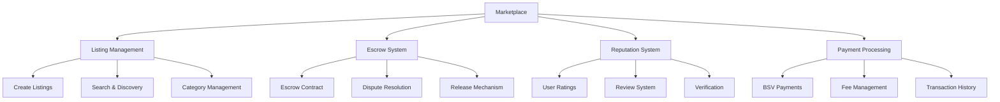

# Marketplace Example

This guide walks you through building a decentralized marketplace on BSV, complete with listing management, escrow and dispute resolution, reputation systems, and payment processing integration. This example demonstrates how to combine multiple BSV components into a comprehensive application.

## 🎯 Learning Objectives

By the end of this module, you'll understand:
- How to implement a decentralized marketplace architecture
- Building escrow and dispute resolution systems
- Creating reputation and review systems
- Integrating payment processing
- Best practices for marketplace security and scalability

## 🏗️ Project Architecture



## 📋 Project Overview

Our marketplace will include the following components:

1. **Listing Management**: Create, update, and search product/service listings
2. **Escrow System**: Secure transactions between buyers and sellers
3. **Reputation System**: User ratings and reviews with verification
4. **Payment Processing**: BSV payment integration with fee management
5. **Dispute Resolution**: Mechanism for resolving transaction disputes

## 🛠️ Step-by-Step Implementation

### Step 1: Project Setup

First, let's set up our project using LARS:

```bash
# Create a new project
lars init bsv-marketplace

# Navigate to the project directory
cd bsv-marketplace

# Install dependencies
npm install @bsv/sdk @bsv/overlay-services @bsv/wallet-sdk react react-dom react-router-dom
```

Create the project structure:

```
bsv-marketplace/
├── src/
│   ├── components/
│   │   ├── App.tsx
│   │   ├── Header.tsx
│   │   ├── Footer.tsx
│   │   ├── listings/
│   │   │   ├── ListingForm.tsx
│   │   │   ├── ListingCard.tsx
│   │   │   ├── ListingDetail.tsx
│   │   │   └── ListingSearch.tsx
│   │   ├── escrow/
│   │   │   ├── EscrowCreation.tsx
│   │   │   ├── EscrowStatus.tsx
│   │   │   └── DisputeForm.tsx
│   │   ├── reputation/
│   │   │   ├── UserRating.tsx
│   │   │   ├── ReviewForm.tsx
│   │   │   └── ReviewList.tsx
│   │   ├── payments/
│   │   │   ├── PaymentForm.tsx
│   │   │   └── TransactionHistory.tsx
│   │   └── auth/
│   │       ├── WalletConnect.tsx
│   │       └── UserProfile.tsx
│   ├── contracts/
│   │   ├── Escrow.scrypt
│   │   ├── Marketplace.scrypt
│   │   └── Reputation.scrypt
│   ├── services/
│   │   ├── listingService.ts
│   │   ├── escrowService.ts
│   │   ├── reputationService.ts
│   │   ├── paymentService.ts
│   │   ├── walletService.ts
│   │   └── overlayService.ts
│   ├── models/
│   │   ├── Listing.ts
│   │   ├── Escrow.ts
│   │   ├── Review.ts
│   │   ├── User.ts
│   │   └── Transaction.ts
│   ├── utils/
│   │   ├── validation.ts
│   │   ├── formatting.ts
│   │   └── helpers.ts
│   ├── pages/
│   │   ├── HomePage.tsx
│   │   ├── ListingsPage.tsx
│   │   ├── ListingDetailPage.tsx
│   │   ├── CreateListingPage.tsx
│   │   ├── UserProfilePage.tsx
│   │   ├── EscrowPage.tsx
│   │   └── DisputePage.tsx
│   ├── styles/
│   │   ├── main.css
│   │   └── components.css
│   └── index.tsx
├── public/
│   └── index.html
├── lars.config.js
└── package.json
```

### Step 2: Smart Contract Implementation

Let's start with the escrow contract in `src/contracts/Escrow.scrypt`:

```typescript
contract Escrow {
    // State variables
    bytes escrowId;
    PubKey buyer;
    PubKey seller;
    PubKey arbiter;
    int amount;
    bytes listingId;
    int creationTime;
    int timeoutPeriod;
    
    // Escrow status
    enum Status {
        CREATED,
        FUNDED,
        COMPLETED,
        REFUNDED,
        DISPUTED,
        RESOLVED
    }
    
    Status status;
    
    // Constructor
    public function constructor(
        bytes escrowId,
        PubKey buyerPubKey,
        PubKey sellerPubKey,
        PubKey arbiterPubKey,
        int escrowAmount,
        bytes listingId,
        int timeoutPeriod
    ) {
        this.escrowId = escrowId;
        this.buyer = buyerPubKey;
        this.seller = sellerPubKey;
        this.arbiter = arbiterPubKey;
        this.amount = escrowAmount;
        this.listingId = listingId;
        this.creationTime = Tx.time();
        this.timeoutPeriod = timeoutPeriod;
        this.status = Status.CREATED;
    }
    
    // Fund the escrow (buyer only)
    public function fund(Sig signature, SigHashPreimage txPreimage) {
        // Verify buyer's signature
        require(checkSig(signature, this.buyer));
        
        // Verify escrow is in CREATED state
        require(this.status == Status.CREATED);
        
        // Update status to FUNDED
        this.status = Status.FUNDED;
        
        // Ensure proper state transition
        bytes outputScript = this.getStateScript();
        require(Tx.checkOutputP2PKH(txPreimage, 0, outputScript, this.amount));
    }
    
    // Complete the escrow (buyer only)
    public function complete(Sig signature, SigHashPreimage txPreimage) {
        // Verify buyer's signature
        require(checkSig(signature, this.buyer));
        
        // Verify escrow is in FUNDED state
        require(this.status == Status.FUNDED);
        
        // Update status to COMPLETED
        this.status = Status.COMPLETED;
        
        // Ensure proper payment to seller
        bytes sellerScript = Util.buildPublicKeyHashScript(hash160(this.seller));
        require(Tx.checkOutputP2PKH(txPreimage, 0, sellerScript, this.amount));
    }
    
    // Refund the escrow (seller only or after timeout)
    public function refund(Sig signature, SigHashPreimage txPreimage) {
        // Verify escrow is in FUNDED state
        require(this.status == Status.FUNDED);
        
        // Check if seller is initiating refund
        bool isSellerRefund = checkSig(signature, this.seller);
        
        // Check if timeout has occurred
        bool isTimeout = Tx.time() > this.creationTime + this.timeoutPeriod;
        
        // Verify either seller is refunding or timeout has occurred
        require(isSellerRefund || isTimeout);
        
        // If timeout, verify buyer's signature
        if (isTimeout) {
            require(checkSig(signature, this.buyer));
        }
        
        // Update status to REFUNDED
        this.status = Status.REFUNDED;
        
        // Ensure proper payment to buyer
        bytes buyerScript = Util.buildPublicKeyHashScript(hash160(this.buyer));
        require(Tx.checkOutputP2PKH(txPreimage, 0, buyerScript, this.amount));
    }
    
    // Raise a dispute (buyer or seller only)
    public function dispute(Sig signature, SigHashPreimage txPreimage) {
        // Verify escrow is in FUNDED state
        require(this.status == Status.FUNDED);
        
        // Verify signature is from buyer or seller
        require(checkSig(signature, this.buyer) || checkSig(signature, this.seller));
        
        // Update status to DISPUTED
        this.status = Status.DISPUTED;
        
        // Ensure proper state transition
        bytes outputScript = this.getStateScript();
        require(Tx.checkOutputP2PKH(txPreimage, 0, outputScript, this.amount));
    }
    
    // Resolve a dispute (arbiter only)
    public function resolve(
        bool buyerFavor,
        Sig signature,
        SigHashPreimage txPreimage
    ) {
        // Verify arbiter's signature
        require(checkSig(signature, this.arbiter));
        
        // Verify escrow is in DISPUTED state
        require(this.status == Status.DISPUTED);
        
        // Update status to RESOLVED
        this.status = Status.RESOLVED;
        
        // Determine recipient based on arbiter's decision
        PubKey recipient = buyerFavor ? this.buyer : this.seller;
        bytes recipientScript = Util.buildPublicKeyHashScript(hash160(recipient));
        
        // Ensure proper payment to recipient
        require(Tx.checkOutputP2PKH(txPreimage, 0, recipientScript, this.amount));
    }
    
    // Get escrow status
    public function getStatus(): Status {
        return this.status;
    }
    
    // Get escrow details
    public function getDetails(): bytes {
        return this.escrowId + b':' + this.listingId + b':' + Util.toString(this.amount);
    }
}
```

Now, let's implement the marketplace contract in `src/contracts/Marketplace.scrypt`:

```typescript
contract Marketplace {
    // State variables
    PubKey admin;
    int feePercentage; // in basis points (1/100 of a percent)
    mapping(bytes, bytes) listings; // listingId -> listingData
    mapping(bytes, bytes) escrows; // escrowId -> escrowContractTxid
    int listingCount;
    int escrowCount;
    bool paused;
    
    // Constructor
    public function constructor(PubKey adminPubKey, int initialFeePercentage) {
        this.admin = adminPubKey;
        this.feePercentage = initialFeePercentage;
        this.listingCount = 0;
        this.escrowCount = 0;
        this.paused = false;
    }
    
    // Create a listing
    public function createListing(
        bytes listingId,
        bytes listingData,
        Sig signature,
        SigHashPreimage txPreimage
    ) {
        // Verify marketplace is not paused
        require(!this.paused);
        
        // Verify signature (any valid signature is allowed for creating listings)
        require(checkSig(signature, Tx.sigHashPubKey(txPreimage)));
        
        // Verify listing ID is not already used
        require(!this.listings.has(listingId));
        
        // Add listing
        this.listings[listingId] = listingData;
        this.listingCount++;
        
        // Ensure proper state transition
        bytes outputScript = this.getStateScript();
        require(Tx.checkOutputP2PKH(txPreimage, 0, outputScript, this.amount));
    }
    
    // Update a listing
    public function updateListing(
        bytes listingId,
        bytes newListingData,
        Sig signature,
        SigHashPreimage txPreimage
    ) {
        // Verify marketplace is not paused
        require(!this.paused);
        
        // Verify listing exists
        require(this.listings.has(listingId));
        
        // Verify signature (only the original creator can update)
        // In a real implementation, we would extract the creator's public key from the listing data
        require(checkSig(signature, Tx.sigHashPubKey(txPreimage)));
        
        // Update listing
        this.listings[listingId] = newListingData;
        
        // Ensure proper state transition
        bytes outputScript = this.getStateScript();
        require(Tx.checkOutputP2PKH(txPreimage, 0, outputScript, this.amount));
    }
    
    // Remove a listing
    public function removeListing(
        bytes listingId,
        Sig signature,
        SigHashPreimage txPreimage
    ) {
        // Verify listing exists
        require(this.listings.has(listingId));
        
        // Verify signature (only the original creator or admin can remove)
        // In a real implementation, we would extract the creator's public key from the listing data
        require(checkSig(signature, Tx.sigHashPubKey(txPreimage)) || checkSig(signature, this.admin));
        
        // Remove listing
        this.listings.delete(listingId);
        this.listingCount--;
        
        // Ensure proper state transition
        bytes outputScript = this.getStateScript();
        require(Tx.checkOutputP2PKH(txPreimage, 0, outputScript, this.amount));
    }
    
    // Register an escrow
    public function registerEscrow(
        bytes escrowId,
        bytes escrowContractTxid,
        Sig signature,
        SigHashPreimage txPreimage
    ) {
        // Verify marketplace is not paused
        require(!this.paused);
        
        // Verify signature (any valid signature is allowed for registering escrows)
        require(checkSig(signature, Tx.sigHashPubKey(txPreimage)));
        
        // Verify escrow ID is not already used
        require(!this.escrows.has(escrowId));
        
        // Register escrow
        this.escrows[escrowId] = escrowContractTxid;
        this.escrowCount++;
        
        // Ensure proper state transition
        bytes outputScript = this.getStateScript();
        require(Tx.checkOutputP2PKH(txPreimage, 0, outputScript, this.amount));
    }
    
    // Update fee percentage (admin only)
    public function updateFeePercentage(
        int newFeePercentage,
        Sig signature,
        SigHashPreimage txPreimage
    ) {
        // Verify admin's signature
        require(checkSig(signature, this.admin));
        
        // Verify fee percentage is reasonable (0-1000 basis points, or 0-10%)
        require(newFeePercentage >= 0 && newFeePercentage <= 1000);
        
        // Update fee percentage
        this.feePercentage = newFeePercentage;
        
        // Ensure proper state transition
        bytes outputScript = this.getStateScript();
        require(Tx.checkOutputP2PKH(txPreimage, 0, outputScript, this.amount));
    }
    
    // Pause/unpause marketplace (admin only)
    public function setPaused(
        bool newPausedState,
        Sig signature,
        SigHashPreimage txPreimage
    ) {
        // Verify admin's signature
        require(checkSig(signature, this.admin));
        
        // Update paused state
        this.paused = newPausedState;
        
        // Ensure proper state transition
        bytes outputScript = this.getStateScript();
        require(Tx.checkOutputP2PKH(txPreimage, 0, outputScript, this.amount));
    }
    
    // Get listing
    public function getListing(bytes listingId): bytes {
        require(this.listings.has(listingId));
        return this.listings[listingId];
    }
    
    // Get escrow contract
    public function getEscrowContract(bytes escrowId): bytes {
        require(this.escrows.has(escrowId));
        return this.escrows[escrowId];
    }
    
    // Get fee percentage
    public function getFeePercentage(): int {
        return this.feePercentage;
    }
    
    // Calculate fee amount
    public function calculateFee(int amount): int {
        return amount * this.feePercentage / 10000; // Convert basis points to percentage
    }
}
```

Finally, let's implement the reputation contract in `src/contracts/Reputation.scrypt`:

```typescript
contract Reputation {
    // State variables
    PubKey admin;
    mapping(bytes, int) userRatings; // userId -> total rating points
    mapping(bytes, int) userReviewCount; // userId -> number of reviews
    mapping(bytes, bool) reviewIds; // reviewId -> exists
    int reviewCount;
    
    // Constructor
    public function constructor(PubKey adminPubKey) {
        this.admin = adminPubKey;
        this.reviewCount = 0;
    }
    
    // Submit a review
    public function submitReview(
        bytes reviewId,
        bytes reviewerId,
        bytes targetId,
        int rating,
        bytes reviewData,
        Sig signature,
        SigHashPreimage txPreimage
    ) {
        // Verify reviewer's signature
        require(checkSig(signature, Tx.sigHashPubKey(txPreimage)));
        
        // Verify review ID is not already used
        require(!this.reviewIds.has(reviewId));
        
        // Verify rating is between 1 and 5
        require(rating >= 1 && rating <= 5);
        
        // Record the review
        this.reviewIds[reviewId] = true;
        
        // Update user ratings
        if (!this.userRatings.has(targetId)) {
            this.userRatings[targetId] = 0;
            this.userReviewCount[targetId] = 0;
        }
        
        this.userRatings[targetId] += rating;
        this.userReviewCount[targetId]++;
        this.reviewCount++;
        
        // Ensure proper state transition
        bytes outputScript = this.getStateScript();
        require(Tx.checkOutputP2PKH(txPreimage, 0, outputScript, this.amount));
    }
    
    // Remove a review (admin only)
    public function removeReview(
        bytes reviewId,
        bytes targetId,
        int rating,
        Sig signature,
        SigHashPreimage txPreimage
    ) {
        // Verify admin's signature
        require(checkSig(signature, this.admin));
        
        // Verify review exists
        require(this.reviewIds.has(reviewId));
        
        // Verify target user exists
        require(this.userRatings.has(targetId));
        require(this.userReviewCount[targetId] > 0);
        
        // Remove the review
        this.reviewIds[reviewId] = false;
        
        // Update user ratings
        this.userRatings[targetId] -= rating;
        this.userReviewCount[targetId]--;
        this.reviewCount--;
        
        // Ensure proper state transition
        bytes outputScript = this.getStateScript();
        require(Tx.checkOutputP2PKH(txPreimage, 0, outputScript, this.amount));
    }
    
    // Get user rating
    public function getUserRating(bytes userId): int {
        if (!this.userRatings.has(userId) || this.userReviewCount[userId] == 0) {
            return 0;
        }
        
        return this.userRatings[userId] / this.userReviewCount[userId];
    }
    
    // Get user review count
    public function getUserReviewCount(bytes userId): int {
        if (!this.userReviewCount.has(userId)) {
            return 0;
        }
        
        return this.userReviewCount[userId];
    }
    
    // Check if review exists
    public function reviewExists(bytes reviewId): bool {
        return this.reviewIds.has(reviewId) && this.reviewIds[reviewId];
    }
    
    // Get total review count
    public function getTotalReviewCount(): int {
        return this.reviewCount;
    }
}
```

### Step 3: Service Implementation

Let's implement the listing service in `src/services/listingService.ts`:

```typescript
import { Transaction, Script, KeyPair } from '@bsv/sdk';
import { Marketplace } from '../contracts/Marketplace';
import { walletService } from './walletService';
import { overlayService } from './overlayService';
import { Listing } from '../models/Listing';

export class ListingService {
  private marketplace?: Marketplace;
  private marketplaceTxid?: string;
  
  // Initialize marketplace
  async initialize(): Promise<boolean> {
    try {
      // Check if marketplace already exists
      const existingMarketplace = await this.findExistingMarketplace();
      
      if (existingMarketplace) {
        // Load existing marketplace
        await this.loadMarketplace(existingMarketplace);
      } else {
        // Deploy new marketplace
        await this.deployMarketplace();
      }
      
      return true;
    } catch (error) {
      console.error('Failed to initialize marketplace:', error);
      return false;
    }
  }
  
  // Find existing marketplace
  private async findExistingMarketplace(): Promise<string | null> {
    // This would typically query a database or blockchain explorer
    // For simplicity, we'll check the overlay service
    try {
      const marketplaceInfo = await overlayService.getMarketplaceInfo();
      return marketplaceInfo?.txid || null;
    } catch (error) {
      console.error('Failed to find existing marketplace:', error);
      return null;
    }
  }
  
  // Load existing marketplace
  private async loadMarketplace(txid: string): Promise<void> {
    try {
      // Compile the contract
      await Marketplace.compile();
      
      // Load the marketplace instance
      this.marketplace = await Marketplace.fromTx(txid);
      this.marketplaceTxid = txid;
      
      // Connect to wallet for signing
      await this.marketplace.connect(walletService);
      
      console.log(`Marketplace loaded: ${txid}`);
    } catch (error) {
      console.error('Failed to load marketplace:', error);
      throw error;
    }
  }
  
  // Deploy new marketplace
  private async deployMarketplace(): Promise<void> {
    try {
      // Check if wallet is connected
      if (!walletService.isWalletConnected()) {
        throw new Error('Wallet not connected');
      }
      
      const adminPubKey = walletService.getPublicKey();
      if (!adminPubKey) {
        throw new Error('Public key not available');
      }
      
      // Compile the contract
      await Marketplace.compile();
      
      // Create a new marketplace instance with 2.5% fee (250 basis points)
      this.marketplace = new Marketplace(adminPubKey, 250);
      
      // Connect to wallet for signing
      await this.marketplace.connect(walletService);
      
      // Deploy the contract
      const deployTx = await this.marketplace.deploy(1000); // 1000 satoshis
      this.marketplaceTxid = deployTx.id;
      
      console.log(`Marketplace deployed: ${this.marketplaceTxid}`);
      
      // Store marketplace info in overlay service
      await overlayService.setMarketplaceInfo({
        txid: this.marketplaceTxid,
        admin: adminPubKey,
        feePercentage: 250,
      });
    } catch (error) {
      console.error('Failed to deploy marketplace:', error);
      throw error;
    }
  }
  
  // Create a new listing
  async createListing(listing: Listing): Promise<string> {
    try {
      if (!this.marketplace) {
        throw new Error('Marketplace not initialized');
      }
      
      // Check if wallet is connected
      if (!walletService.isWalletConnected()) {
        throw new Error('Wallet not connected');
      }
      
      const sellerPubKey = walletService.getPublicKey();
      if (!sellerPubKey) {
        throw new Error('Public key not available');
      }
      
      // Generate a unique listing ID
      const listingId = this.generateListingId(listing.title, sellerPubKey);
      
      // Prepare listing data
      const listingData = JSON.stringify({
        ...listing,
        id: listingId,
        seller: sellerPubKey,
        createdAt: Date.now(),
        updatedAt: Date.now(),
        status: 'active',
      });
      
      // Create the listing on-chain
      const { tx } = await this.marketplace.methods.createListing(
        listingId,
        listingData,
        (sigResps) => findSig(sigResps, sellerPubKey),
        (sigHashType) => getSigHashPreimage(sigHashType)
      );
      
      console.log(`Listing created: ${tx.id}`);
      
      // Store listing in overlay service
      await overlayService.createListing({
        ...listing,
        id: listingId,
        seller: sellerPubKey,
        createdAt: Date.now(),
        updatedAt: Date.now(),
        status: 'active',
        txid: tx.id,
      });
      
      return listingId;
    } catch (error) {
      console.error('Failed to create listing:', error);
      throw error;
    }
  }
  
  // Update a listing
  async updateListing(listingId: string, updates: Partial<Listing>): Promise<boolean> {
    try {
      if (!this.marketplace) {
        throw new Error('Marketplace not initialized');
      }
      
      // Check if wallet is connected
      if (!walletService.isWalletConnected()) {
        throw new Error('Wallet not connected');
      }
      
      const sellerPubKey = walletService.getPublicKey();
      if (!sellerPubKey) {
        throw new Error('Public key not available');
      }
      
      // Get existing listing
      const existingListing = await overlayService.getListing(listingId);
      if (!existingListing) {
        throw new Error(`Listing ${listingId} not found`);
      }
      
      // Verify seller is the owner
      if (existingListing.seller !== sellerPubKey) {
        throw new Error('Only the seller can update this listing');
      }
      
      // Prepare updated listing data
      const updatedListing = {
        ...existingListing,
        ...updates,
        updatedAt: Date.now(),
      };
      
      // Update the listing on-chain
      const { tx } = await this.marketplace.methods.updateListing(
        listingId,
        JSON.stringify(updatedListing),
        (sigResps) => findSig(sigResps, sellerPubKey),
        (sigHashType) => getSigHashPreimage(sigHashType)
      );
      
      console.log(`Listing updated: ${tx.id}`);
      
      // Update listing in overlay service
      await overlayService.updateListing(listingId, updatedListing);
      
      return true;
    } catch (error) {
      console.error('Failed to update listing:', error);
      throw error;
    }
  }
  
  // Remove a listing
  async removeListing(listingId: string): Promise<boolean> {
    try {
      if (!this.marketplace) {
        throw new Error('Marketplace not initialized');
      }
      
      // Check if wallet is connected
      if (!walletService.isWalletConnected()) {
        throw new Error('Wallet not connected');
      }
      
      const sellerPubKey = walletService.getPublicKey();
      if (!sellerPubKey) {
        throw new Error('Public key not available');
      }
      
      // Get existing listing
      const existingListing = await overlayService.getListing(listingId);
      if (!existingListing) {
        throw new Error(`Listing ${listingId} not found`);
      }
      
      // Verify seller is the owner
      if (existingListing.seller !== sellerPubKey) {
        throw new Error('Only the seller can remove this listing');
      }
      
      // Remove the listing on-chain
      const { tx } = await this.marketplace.methods.removeListing(
        listingId,
        (sigResps) => findSig(sigResps, sellerPubKey),
        (sigHashType) => getSigHashPreimage(sigHashType)
      );
      
      console.log(`Listing removed: ${tx.id}`);
      
      // Remove listing from overlay service
      await overlayService.removeListing(listingId);
      
      return true;
    } catch (error) {
      console.error('Failed to remove listing:', error);
      throw error;
    }
  }
  
  // Search listings
  async searchListings(query: string, category?: string, page = 1, limit = 10): Promise<Listing[]> {
    try {
      return await overlayService.searchListings(query, category, page, limit);
    } catch (error) {
      console.error('Failed to search listings:', error);
      throw error;
    }
  }
  
  // Get listing by ID
  async getListing(listingId: string): Promise<Listing | null> {
    try {
      return await overlayService.getListing(listingId);
    } catch (error) {
      console.error('Failed to get listing:', error);
      throw error;
    }
  }
  
  // Get listings by seller
  async getListingsBySeller(sellerPubKey: string, page = 1, limit = 10): Promise<Listing[]> {
    try {
      return await overlayService.getListingsBySeller(sellerPubKey, page, limit);
    } catch (error) {
      console.error('Failed to get listings by seller:', error);
      throw error;
    }
  }
  
  // Generate a unique listing ID
  private generateListingId(title: string, sellerPubKey: string): string {
    const timestamp = Date.now().toString();
    const randomPart = Math.random().toString(36).substring(2, 10);
    const titleSlug = title
      .toLowerCase()
      .replace(/[^a-z0-9]+/g, '-')
      .replace(/(^-|-$)/g, '')
      .substring(0, 20);
    const sellerPart = sellerPubKey.substring(0, 8);
    
    return `listing-${titleSlug}-${sellerPart}-${randomPart}-${timestamp}`;
  }
}

// Export singleton instance
export const listingService = new ListingService();
```

Now, let's implement the escrow service in `src/services/escrowService.ts`:

```typescript
import { Transaction, Script, KeyPair } from '@bsv/sdk';
import { Esc
