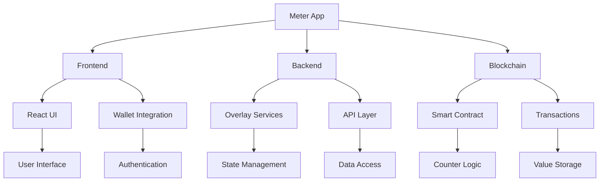

# Meter App Walkthrough

This walkthrough guides you through building a complete meter application using BSV's building blocks. The meter app is a simple counter application that demonstrates key concepts including frontend development, overlay services for state management, and smart contract integration.

## 🎯 Learning Objectives

By the end of this module, you'll understand:
- How to build a frontend application with BSV integration
- Implementing overlay services for state management
- Integrating smart contracts for on-chain logic
- Testing and deploying a complete BSV application

## 🏗️ Project Architecture



## 📋 Project Overview

The Meter App is a simple counter application with the following features:

1. **User Authentication**: Sign in with a Metanet wallet
2. **Counter Display**: View the current counter value
3. **Increment/Decrement**: Modify the counter value
4. **Transaction History**: View past counter modifications
5. **On-chain Storage**: Persist counter state on the blockchain

## 🛠️ Step-by-Step Implementation

### Step 1: Project Setup

First, let's set up our project using LARS:

```bash
# Create a new project
lars init meter-app

# Navigate to the project directory
cd meter-app

# Install dependencies
npm install react react-dom @bsv/sdk @bsv/overlay-services @bsv/wallet-sdk
```

Create the project structure:

```
meter-app/
├── src/
│   ├── components/
│   │   ├── App.tsx
│   │   ├── Counter.tsx
│   │   ├── Header.tsx
│   │   ├── TransactionHistory.tsx
│   │   └── WalletConnect.tsx
│   ├── services/
│   │   ├── counterService.ts
│   │   ├── overlayService.ts
│   │   └── walletService.ts
│   ├── contracts/
│   │   └── CounterContract.scrypt
│   ├── utils/
│   │   └── helpers.ts
│   └── index.tsx
├── public/
│   └── index.html
├── lars.config.js
└── package.json
```

### Step 2: Smart Contract Implementation

Let's create a simple counter contract in `src/contracts/CounterContract.scrypt`:

```typescript
contract CounterContract {
    // State variables
    int count;
    PubKey owner;
    
    // Constructor
    public function constructor(int initialCount, PubKey ownerPubKey) {
        this.count = initialCount;
        this.owner = ownerPubKey;
    }
    
    // Increment the counter
    public function increment(Sig signature, int amount, SigHashPreimage txPreimage) {
        // Verify owner's signature
        require(checkSig(signature, this.owner));
        
        // Verify amount is positive
        require(amount > 0);
        
        // Update state
        this.count += amount;
        
        // Ensure proper state transition
        bytes outputScript = this.getStateScript();
        require(Tx.checkOutputP2PKH(txPreimage, 0, outputScript, this.amount));
    }
    
    // Decrement the counter
    public function decrement(Sig signature, int amount, SigHashPreimage txPreimage) {
        // Verify owner's signature
        require(checkSig(signature, this.owner));
        
        // Verify amount is positive and not greater than current count
        require(amount > 0);
        require(this.count >= amount);
        
        // Update state
        this.count -= amount;
        
        // Ensure proper state transition
        bytes outputScript = this.getStateScript();
        require(Tx.checkOutputP2PKH(txPreimage, 0, outputScript, this.amount));
    }
    
    // Get current count
    public function getCount(): int {
        return this.count;
    }
}
```

Compile the contract:

```bash
# Compile the contract
scrypt compile
```

### Step 3: Overlay Services Implementation

Create the overlay service in `src/services/overlayService.ts`:

```typescript
import { OverlayServices, TopicManager, LookupService, StateManager } from '@bsv/overlay-services';

export class CounterOverlayService {
  private overlayServices: OverlayServices;
  private topicManager: TopicManager;
  private lookupService: LookupService;
  private stateManager: StateManager;
  
  constructor() {
    // Initialize Overlay Services
    this.overlayServices = new OverlayServices({
      network: 'testnet', // Use 'mainnet' for production
      apiKey: process.env.BSV_API_KEY,
    });
    
    // Initialize components
    this.topicManager = new TopicManager({ overlayServices: this.overlayServices });
    this.lookupService = new LookupService({ overlayServices: this.overlayServices });
    this.stateManager = new StateManager({ overlayServices: this.overlayServices });
  }
  
  async initialize() {
    // Register counter topic
    await this.topicManager.registerTopic({
      name: 'counter-events',
      description: 'Events related to counter changes',
      schema: {
        type: 'object',
        properties: {
          userId: { type: 'string' },
          action: { type: 'string', enum: ['increment', 'decrement'] },
          amount: { type: 'number' },
          timestamp: { type: 'number' },
          txid: { type: 'string' },
        },
        required: ['userId', 'action', 'amount', 'timestamp'],
      },
      indexes: [
        { fields: ['userId'] },
        { fields: ['action'] },
        { fields: ['timestamp'] },
      ],
    });
    
    // Register counter state
    await this.stateManager.registerState({
      name: 'counter-state',
      description: 'Current state of counters',
      schema: {
        type: 'object',
        properties: {
          userId: { type: 'string' },
          count: { type: 'number' },
          lastUpdated: { type: 'number' },
          txid: { type: 'string' },
        },
        required: ['userId', 'count', 'lastUpdated'],
      },
      keyPattern: 'counter:{userId}',
      versioning: {
        enabled: true,
        maxVersions: 10,
      },
    });
    
    console.log('Overlay services initialized');
  }
  
  // Publish a counter event
  async publishCounterEvent(userId: string, action: 'increment' | 'decrement', amount: number, txid?: string) {
    await this.topicManager.publish('counter-events', {
      userId,
      action,
      amount,
      timestamp: Date.now(),
      txid,
    });
    
    console.log(`Published ${action} event for user ${userId}`);
  }
  
  // Subscribe to counter events
  async subscribeToCounterEvents(userId: string, callback: (event: any) => void) {
    const subscription = await this.topicManager.subscribe('counter-events', {
      onData: callback,
      filter: { userId },
    });
    
    console.log(`Subscribed to counter events for user ${userId}`);
    return subscription;
  }
  
  // Update counter state
  async updateCounterState(userId: string, count: number, txid?: string) {
    const key = `counter:${userId}`;
    
    // Get current state
    const currentState = await this.stateManager.getState('counter-state', key);
    
    // Prepare new state
    const newState = {
      userId,
      count,
      lastUpdated: Date.now(),
      txid,
    };
    
    // Update state with transition
    await this.stateManager.transition('counter-state', key, newState, {
      transitionType: 'counter-update',
      metadata: {
        previousCount: currentState?.count || 0,
        changeAmount: count - (currentState?.count || 0),
      },
    });
    
    console.log(`Updated counter state for user ${userId} to ${count}`);
  }
  
  // Get counter state
  async getCounterState(userId: string) {
    const key = `counter:${userId}`;
    return await this.stateManager.getState('counter-state', key);
  }
  
  // Get counter history
  async getCounterHistory(userId: string, limit = 10) {
    const events = await this.topicManager.query('counter-events', {
      filter: { userId },
      sort: { timestamp: -1 },
      limit,
    });
    
    return events;
  }
}

// Export singleton instance
export const counterOverlayService = new CounterOverlayService();
```

### Step 4: Wallet Service Implementation

Create the wallet service in `src/services/walletService.ts`:

```typescript
import { KeyPair } from '@bsv/sdk';

export class WalletService {
  private isConnected: boolean = false;
  private publicKey?: string;
  private userId?: string;
  
  // Connect to wallet
  async connect() {
    try {
      // Check if Metanet wallet is available
      if (window.metanet) {
        // Request user identity
        const identity = await window.metanet.requestIdentity({
          name: 'BSV Meter App',
          permissions: ['basic_identity'],
        });
        
        this.publicKey = identity.publicKey;
        this.userId = `user:${identity.publicKey.substring(0, 10)}`;
        this.isConnected = true;
        
        console.log(`Connected to wallet: ${this.userId}`);
        return true;
      } else {
        console.log('Metanet wallet not found');
        alert('Please install a Metanet wallet to use this application');
        return false;
      }
    } catch (error) {
      console.error('Failed to connect to wallet:', error);
      return false;
    }
  }
  
  // Disconnect from wallet
  disconnect() {
    this.isConnected = false;
    this.publicKey = undefined;
    this.userId = undefined;
    console.log('Disconnected from wallet');
  }
  
  // Check if wallet is connected
  isWalletConnected() {
    return this.isConnected;
  }
  
  // Get user ID
  getUserId() {
    return this.userId;
  }
  
  // Get public key
  getPublicKey() {
    return this.publicKey;
  }
  
  // Sign a message
  async signMessage(message: string) {
    if (!this.isConnected || !window.metanet) {
      throw new Error('Wallet not connected');
    }
    
    try {
      const signature = await window.metanet.signMessage(message);
      return signature;
    } catch (error) {
      console.error('Failed to sign message:', error);
      throw error;
    }
  }
  
  // Sign a transaction
  async signTransaction(tx: any) {
    if (!this.isConnected || !window.metanet) {
      throw new Error('Wallet not connected');
    }
    
    try {
      const signedTx = await window.metanet.signTransaction(tx);
      return signedTx;
    } catch (error) {
      console.error('Failed to sign transaction:', error);
      throw error;
    }
  }
}

// Export singleton instance
export const walletService = new WalletService();
```

### Step 5: Counter Service Implementation

Create the counter service in `src/services/counterService.ts`:

```typescript
import { Transaction, Script, KeyPair } from '@bsv/sdk';
import { CounterContract } from '../contracts/CounterContract';
import { counterOverlayService } from './overlayService';
import { walletService } from './walletService';

export class CounterService {
  private contract?: CounterContract;
  private contractTxid?: string;
  
  // Initialize counter contract
  async initialize() {
    try {
      // Check if wallet is connected
      if (!walletService.isWalletConnected()) {
        throw new Error('Wallet not connected');
      }
      
      const userId = walletService.getUserId();
      if (!userId) {
        throw new Error('User ID not available');
      }
      
      // Check if user already has a counter
      const state = await counterOverlayService.getCounterState(userId);
      
      if (state && state.txid) {
        // Load existing contract
        await this.loadContract(state.txid);
      } else {
        // Deploy new contract
        await this.deployContract();
      }
      
      return true;
    } catch (error) {
      console.error('Failed to initialize counter:', error);
      return false;
    }
  }
  
  // Deploy a new counter contract
  async deployContract() {
    try {
      // Check if wallet is connected
      if (!walletService.isWalletConnected()) {
        throw new Error('Wallet not connected');
      }
      
      const publicKey = walletService.getPublicKey();
      if (!publicKey) {
        throw new Error('Public key not available');
      }
      
      // Compile the contract
      await CounterContract.compile();
      
      // Create a new instance with initial count of 0
      this.contract = new CounterContract(0, publicKey);
      
      // Connect to wallet for signing
      await this.contract.connect(walletService);
      
      // Deploy the contract
      const deployTx = await this.contract.deploy(1000); // 1000 satoshis
      this.contractTxid = deployTx.id;
      
      console.log(`Counter contract deployed: ${this.contractTxid}`);
      
      // Update overlay service
      const userId = walletService.getUserId();
      if (userId) {
        await counterOverlayService.updateCounterState(userId, 0, this.contractTxid);
        await counterOverlayService.publishCounterEvent(userId, 'increment', 0, this.contractTxid);
      }
      
      return this.contractTxid;
    } catch (error) {
      console.error('Failed to deploy counter contract:', error);
      throw error;
    }
  }
  
  // Load an existing contract
  async loadContract(txid: string) {
    try {
      // Compile the contract
      await CounterContract.compile();
      
      // Load the contract instance
      this.contract = await CounterContract.fromTx(txid);
      this.contractTxid = txid;
      
      // Connect to wallet for signing
      await this.contract.connect(walletService);
      
      console.log(`Counter contract loaded: ${txid}`);
      return true;
    } catch (error) {
      console.error('Failed to load counter contract:', error);
      throw error;
    }
  }
  
  // Get current count
  async getCount() {
    if (!this.contract) {
      throw new Error('Contract not initialized');
    }
    
    return this.contract.count;
  }
  
  // Increment the counter
  async increment(amount: number = 1) {
    if (!this.contract) {
      throw new Error('Contract not initialized');
    }
    
    try {
      // Call the increment method
      const { tx } = await this.contract.methods.increment(
        (sigResponses) => findSig(sigResponses, walletService.getPublicKey()),
        amount,
        (sigHashType) => getSigHashPreimage(sigHashType)
      );
      
      console.log(`Counter incremented by ${amount}: ${tx.id}`);
      
      // Update overlay service
      const userId = walletService.getUserId();
      if (userId) {
        await counterOverlayService.updateCounterState(userId, this.contract.count, tx.id);
        await counterOverlayService.publishCounterEvent(userId, 'increment', amount, tx.id);
      }
      
      return tx.id;
    } catch (error) {
      console.error('Failed to increment counter:', error);
      throw error;
    }
  }
  
  // Decrement the counter
  async decrement(amount: number = 1) {
    if (!this.contract) {
      throw new Error('Contract not initialized');
    }
    
    try {
      // Call the decrement method
      const { tx } = await this.contract.methods.decrement(
        (sigResponses) => findSig(sigResponses, walletService.getPublicKey()),
        amount,
        (sigHashType) => getSigHashPreimage(sigHashType)
      );
      
      console.log(`Counter decremented by ${amount}: ${tx.id}`);
      
      // Update overlay service
      const userId = walletService.getUserId();
      if (userId) {
        await counterOverlayService.updateCounterState(userId, this.contract.count, tx.id);
        await counterOverlayService.publishCounterEvent(userId, 'decrement', amount, tx.id);
      }
      
      return tx.id;
    } catch (error) {
      console.error('Failed to decrement counter:', error);
      throw error;
    }
  }
  
  // Get transaction history
  async getHistory(limit: number = 10) {
    const userId = walletService.getUserId();
    if (!userId) {
      throw new Error('User ID not available');
    }
    
    return await counterOverlayService.getCounterHistory(userId, limit);
  }
}

// Export singleton instance
export const counterService = new CounterService();
```

### Step 6: React Components Implementation

Create the main App component in `src/components/App.tsx`:

```tsx
import React, { useEffect, useState } from 'react';
import Header from './Header';
import Counter from './Counter';
import TransactionHistory from './TransactionHistory';
import WalletConnect from './WalletConnect';
import { walletService } from '../services/walletService';
import { counterService } from '../services/counterService';
import { counterOverlayService } from '../services/overlayService';

const App: React.FC = () => {
  const [isConnected, setIsConnected] = useState(false);
  const [isInitialized, setIsInitialized] = useState(false);
  const [count, setCount] = useState(0);
  const [history, setHistory] = useState<any[]>([]);
  const [isLoading, setIsLoading] = useState(false);
  
  // Initialize services
  useEffect(() => {
    const init = async () => {
      await counterOverlayService.initialize();
    };
    
    init();
  }, []);
  
  // Handle wallet connection
  const handleConnect = async () => {
    setIsLoading(true);
    
    try {
      const connected = await walletService.connect();
      setIsConnected(connected);
      
      if (connected) {
        const initialized = await counterService.initialize();
        setIsInitialized(initialized);
        
        if (initialized) {
          await refreshData();
        }
      }
    } catch (error) {
      console.error('Connection error:', error);
    } finally {
      setIsLoading(false);
    }
  };
  
  // Handle wallet disconnection
  const handleDisconnect = () => {
    walletService.disconnect();
    setIsConnected(false);
    setIsInitialized(false);
    setCount(0);
    setHistory([]);
  };
  
  // Refresh data
  const refreshData = async () => {
    if (!isInitialized) return;
    
    setIsLoading(true);
    
    try {
      // Get current count
      const currentCount = await counterService.getCount();
      setCount(currentCount);
      
      // Get transaction history
      const txHistory = await counterService.getHistory();
      setHistory(txHistory);
    } catch (error) {
      console.error('Failed to refresh data:', error);
    } finally {
      setIsLoading(false);
    }
  };
  
  // Handle increment
  const handleIncrement = async (amount: number = 1) => {
    if (!isInitialized) return;
    
    setIsLoading(true);
    
    try {
      await counterService.increment(amount);
      await refreshData();
    } catch (error) {
      console.error('Failed to increment:', error);
    } finally {
      setIsLoading(false);
    }
  };
  
  // Handle decrement
  const handleDecrement = async (amount: number = 1) => {
    if (!isInitialized) return;
    
    setIsLoading(true);
    
    try {
      await counterService.decrement(amount);
      await refreshData();
    } catch (error) {
      console.error('Failed to decrement:', error);
    } finally {
      setIsLoading(false);
    }
  };
  
  return (
    <div className="app">
      <Header />
      
      <WalletConnect
        isConnected={isConnected}
        onConnect={handleConnect}
        onDisconnect={handleDisconnect}
        isLoading={isLoading}
      />
      
      {isConnected && isInitialized && (
        <>
          <Counter
            count={count}
            onIncrement={handleIncrement}
            onDecrement={handleDecrement}
            isLoading={isLoading}
          />
          
          <TransactionHistory
            history={history}
            onRefresh={refreshData}
            isLoading={isLoading}
          />
        </>
      )}
    </div>
  );
};

export default App;
```

Create the Header component in `src/components/Header.tsx`:

```tsx
import React from 'react';

const Header: React.FC = () => {
  return (
    <header className="header">
      <h1>BSV Meter App</h1>
      <p>A simple counter application built on Bitcoin SV</p>
    </header>
  );
};

export default Header;
```

Create the WalletConnect component in `src/components/WalletConnect.tsx`:

```tsx
import React from 'react';
import { walletService } from '../services/walletService';

interface WalletConnectProps {
  isConnected: boolean;
  onConnect: () => void;
  onDisconnect: () => void;
  isLoading: boolean;
}

const WalletConnect: React.FC<WalletConnectProps> = ({
  isConnected,
  onConnect,
  onDisconnect,
  isLoading,
}) => {
  return (
    <div className="wallet-connect">
      {isConnected ? (
        <div className="wallet-info">
          <p>Connected as: {walletService.getUserId()}</p>
          <button
            onClick={onDisconnect}
            disabled={isLoading}
          >
            Disconnect Wallet
          </button>
        </div>
      ) : (
        <div className="wallet-connect-prompt">
          <p>Connect your Metanet wallet to use the app</p>
          <button
            onClick={onConnect}
            disabled={isLoading}
          >
            {isLoading ? 'Connecting...' : 'Connect Wallet'}
          </button>
        </div>
      )}
    </div>
  );
};

export default WalletConnect;
```

Create the Counter component in `src/components/Counter.tsx`:

```tsx
import React, { useState } from 'react';

interface CounterProps {
  count: number;
  onIncrement: (amount: number) => void;
  onDecrement: (amount: number) => void;
  isLoading: boolean;
}

const Counter: React.FC<CounterProps> = ({
  count,
  onIncrement,
  onDecrement,
  isLoading,
}) => {
  const [amount, setAmount] = useState(1);
  
  const handleAmountChange = (e: React.ChangeEvent<HTMLInputElement>) => {
    const value = parseInt(e.target.value);
    setAmount(isNaN(value) || value < 1 ? 1 : value);
  };
  
  return (
    <div className="counter">
      <h2>Counter</h2>
      
      <div className="counter-display">
        <span className="counter-value">{count}</span>
      </div>
      
      <div className="counter-controls">
        <div className="amount-control">
          <label htmlFor="amount">Amount:</label>
          <input
            type="number"
            id="amount"
            min="1"
            value={amount}
            onChange={handleAmountChange}
            disabled={isLoading}
          />
        </div>
        
        <div className="counter-buttons">
          <button
            onClick={() => onDecrement(amount)}
            disabled={isLoading || count < amount}
          >
            - Decrement
          </button>
          
          <button
            onClick={() => onIncrement(amount)}
            disabled={isLoading}
          >
            + Increment
          </button>
        </div>
      </div>
    </div>
  );
};

export default Counter;
```

Create the TransactionHistory component in `src/components/TransactionHistory.tsx`:

```tsx
import React from 'react';

interface TransactionHistoryProps {
  history: any[];
  onRefresh: () => void;
  isLoading: boolean;
}

const TransactionHistory: React.FC<TransactionHistoryProps> = ({
  history,
  onRefresh,
  isLoading,
}) => {
  // Format timestamp
  const formatTimestamp = (timestamp: number) => {
    return new Date(timestamp).toLocaleString();
  };
  
  // Format transaction ID
  const formatTxid = (txid: string) => {
    return txid ? `${txid.substring(0, 8)}...${txid.substring(txid.length - 8)}` : 'N/A';
  };
  
  return (
    <div className="transaction-history">
      <div className="history-header">
        <h2>Transaction History</h2>
        <button
          onClick={onRefresh}
          disabled={isLoading}
        >
          {isLoading ? 'Refreshing...' : 'Refresh'}
        </button>
      </div>
      
      {history.length === 0 ? (
        <p>No transactions yet</p>
      ) : (
        <table className="history-table">
          <thead>
            <tr>
              <th>Time</th>
              <th>Action</th>
              <th>Amount</th>
              <th>Transaction</th>
            </tr>
          </thead>
          <tbody>
            {history.map((item, index) => (
              <tr key={index}>
                <td>{formatTimestamp(item.timestamp)}</td>
                <td>{item.action}</td>
                <td>{item.amount}</td>
                <td>
                  {item.txid ? (
                    <a
                      href={`https://whatsonchain.com/tx/${item.txid}`}
                      target="_blank"
                      rel="noopener noreferrer"
                    >
                      {formatTxid(item.txid)}
                    </a>
                  ) : (
                    'N/A'
                  )}
                </td>
              </tr>
            ))}
          </tbody>
        </table>
      )}
    </div>
  );
};

export default TransactionHistory;
```

### Step 7: Main Entry Point

Create the main entry point in `src/index.tsx`:

```tsx
import React from 'react';
import ReactDOM from 'react-dom';
import App from './components/App';
import './styles.css';

ReactDOM.render(
  <React.StrictMode>
    <App />
  </React.StrictMode>,
  document.getElementById('root')
);
```

### Step 8: HTML Template

Create the HTML template in `public/index.html`:

```html
<!DOCTYPE html>
<html lang="en">
<head>
  <meta charset="UTF-8">
  <meta name="viewport" content="width=device-width, initial-scale=1.0">
  <title>BSV Meter App</title>
</head>
<body>
  <div id="root"></div>
</body>
</html>
```

### Step 9: CSS Styling

Create the CSS styles in `src/styles.css`:

```css
/* Base styles */
* {
  box-sizing: border-box;
  margin: 0;
  padding: 0;
}

body {
  font-family: -apple-system, BlinkMacSystemFont, 'Segoe UI', Roboto, Oxygen,
    Ubuntu, Cantarell, 'Open Sans', 'Helvetica Neue', sans-serif;
  line-height: 1.6;
  color: #333;
  background-color: #f5f5f5;
}

.app {
  max-width: 800px;
  margin: 0 auto;
  padding: 20px;
}

/* Header */
.header {
  text-align: center;
  margin-bottom: 30px;
  padding-bottom: 20px;
  border-bottom: 1px solid #ddd;
}

.header h1 {
  color: #2c3e50;
  margin-bottom: 10px;
}

/* Wallet Connect */
.wallet-connect {
  background-color: #fff;
  border-radius: 8px;
  padding: 20px;
  margin-bottom: 20px;
  box-shadow: 0 2px 4px rgba(0, 0, 0, 0.1);
}

.wallet-info {
  display: flex;
  justify-content: space-between;
  align-items: center;
}

.wallet-connect-prompt {
  text-align: center;
}

/* Counter */
.counter {
  background-color: #fff;
  border-radius: 8px;
  padding: 20px;
  margin-bottom: 20px;
  box-shadow: 0 2px 4px rgba(0, 0, 0, 0.1);
}

.counter h2 {
  text-align: center;
  margin-bottom: 20px;
  color: #2c3e50;
}

.counter-display {
  text-align: center;
  margin-bottom: 20px;
}

.counter-value {
  font-size: 72px;
  font-weight: bold;
  color: #3498db;
}

.counter-controls {
  display: flex;
  flex-direction: column;
  gap: 15px;
}

.amount-control {
  display: flex;
  align-items: center;
  justify-content: center;
  gap: 10px;
}

.amount-control input {
  width: 60px;
  padding: 8px;
  border: 1px solid #ddd;
  border-radius: 4px;
  text-align: center;
}

.