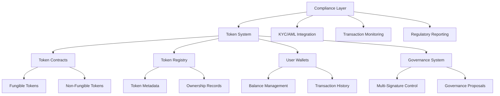

# Token System Implementation

This guide walks you through implementing a complete token system on BSV, including token creation, transfer mechanisms, compliance features, and multi-signature governance. You'll build a flexible token platform that can be adapted for various use cases.

## 🎯 Learning Objectives

By the end of this module, you'll understand:
- How to design and implement custom tokens on BSV
- Transfer and trading mechanisms for tokens
- Implementing compliance and audit features
- Setting up multi-signature governance
- Best practices for token system security

## 🏗️ Project Architecture



## 📋 Project Overview

Our token system will include the following components:

1. **Token Contracts**: Smart contracts for fungible and non-fungible tokens
2. **Token Registry**: Central registry for token metadata and ownership
3. **User Wallets**: Interface for users to manage their tokens
4. **Governance System**: Multi-signature control for system administration
5. **Compliance Layer**: Features for regulatory compliance

## 🛠️ Step-by-Step Implementation

### Step 1: Project Setup

First, let's set up our project using LARS:

```bash
# Create a new project
lars init bsv-token-system

# Navigate to the project directory
cd bsv-token-system

# Install dependencies
npm install @bsv/sdk @bsv/overlay-services @bsv/wallet-sdk
```

Create the project structure:

```
bsv-token-system/
├── src/
│   ├── contracts/
│   │   ├── FungibleToken.scrypt
│   │   ├── NonFungibleToken.scrypt
│   │   └── TokenRegistry.scrypt
│   ├── services/
│   │   ├── tokenService.ts
│   │   ├── registryService.ts
│   │   ├── walletService.ts
│   │   ├── governanceService.ts
│   │   └── complianceService.ts
│   ├── models/
│   │   ├── Token.ts
│   │   ├── Transaction.ts
│   │   └── User.ts
│   ├── utils/
│   │   ├── crypto.ts
│   │   └── validation.ts
│   └── index.ts
├── test/
│   ├── contracts/
│   │   ├── FungibleToken.test.ts
│   │   ├── NonFungibleToken.test.ts
│   │   └── TokenRegistry.test.ts
│   └── services/
│       ├── tokenService.test.ts
│       └── registryService.test.ts
├── lars.config.js
└── package.json
```

### Step 2: Token Contract Implementation

Let's start by implementing the fungible token contract in `src/contracts/FungibleToken.scrypt`:

```typescript
contract FungibleToken {
    // State variables
    bytes tokenId;
    PubKey issuer;
    mapping(PubKey, int) balances;
    int totalSupply;
    bool paused;
    
    // Token metadata
    bytes name;
    bytes symbol;
    int decimals;
    
    // Constructor
    public function constructor(
        bytes tokenId,
        PubKey issuerPubKey,
        bytes tokenName,
        bytes tokenSymbol,
        int tokenDecimals,
        int initialSupply
    ) {
        this.tokenId = tokenId;
        this.issuer = issuerPubKey;
        this.name = tokenName;
        this.symbol = tokenSymbol;
        this.decimals = tokenDecimals;
        this.totalSupply = initialSupply;
        this.balances[issuerPubKey] = initialSupply;
        this.paused = false;
    }
    
    // Transfer tokens
    public function transfer(
        PubKey sender,
        PubKey recipient,
        int amount,
        Sig signature,
        SigHashPreimage txPreimage
    ) {
        // Verify not paused
        require(!this.paused);
        
        // Verify sender's signature
        require(checkSig(signature, sender));
        
        // Verify sender has sufficient balance
        require(this.balances[sender] >= amount);
        require(amount > 0);
        
        // Update balances
        this.balances[sender] -= amount;
        this.balances[recipient] += amount;
        
        // Ensure proper state transition
        bytes outputScript = this.getStateScript();
        require(Tx.checkOutputP2PKH(txPreimage, 0, outputScript, this.amount));
    }
    
    // Mint new tokens (only issuer)
    public function mint(
        PubKey recipient,
        int amount,
        Sig signature,
        SigHashPreimage txPreimage
    ) {
        // Verify not paused
        require(!this.paused);
        
        // Verify issuer's signature
        require(checkSig(signature, this.issuer));
        require(amount > 0);
        
        // Update balances and total supply
        this.balances[recipient] += amount;
        this.totalSupply += amount;
        
        // Ensure proper state transition
        bytes outputScript = this.getStateScript();
        require(Tx.checkOutputP2PKH(txPreimage, 0, outputScript, this.amount));
    }
    
    // Burn tokens
    public function burn(
        PubKey sender,
        int amount,
        Sig signature,
        SigHashPreimage txPreimage
    ) {
        // Verify not paused
        require(!this.paused);
        
        // Verify sender's signature
        require(checkSig(signature, sender));
        
        // Verify sender has sufficient balance
        require(this.balances[sender] >= amount);
        require(amount > 0);
        
        // Update balances and total supply
        this.balances[sender] -= amount;
        this.totalSupply -= amount;
        
        // Ensure proper state transition
        bytes outputScript = this.getStateScript();
        require(Tx.checkOutputP2PKH(txPreimage, 0, outputScript, this.amount));
    }
    
    // Pause/unpause token (only issuer)
    public function setPaused(
        bool newPausedState,
        Sig signature,
        SigHashPreimage txPreimage
    ) {
        // Verify issuer's signature
        require(checkSig(signature, this.issuer));
        
        // Update paused state
        this.paused = newPausedState;
        
        // Ensure proper state transition
        bytes outputScript = this.getStateScript();
        require(Tx.checkOutputP2PKH(txPreimage, 0, outputScript, this.amount));
    }
    
    // Get token metadata
    public function getMetadata(): bytes {
        return this.name + b':' + this.symbol + b':' + Util.toString(this.decimals);
    }
    
    // Get balance
    public function getBalance(PubKey address): int {
        return this.balances[address];
    }
    
    // Get total supply
    public function getTotalSupply(): int {
        return this.totalSupply;
    }
}
```

Now, let's implement the non-fungible token contract in `src/contracts/NonFungibleToken.scrypt`:

```typescript
contract NonFungibleToken {
    // State variables
    bytes tokenId;
    PubKey issuer;
    mapping(int, PubKey) tokenOwners;
    int totalTokens;
    bool paused;
    
    // Token metadata
    bytes name;
    bytes baseURI;
    
    // Token metadata
    struct TokenMetadata {
        bytes name;
        bytes description;
        bytes uri;
        bytes attributes;
    }
    
    mapping(int, TokenMetadata) tokenMetadata;
    
    // Constructor
    public function constructor(
        bytes tokenId,
        PubKey issuerPubKey,
        bytes tokenName,
        bytes tokenBaseURI
    ) {
        this.tokenId = tokenId;
        this.issuer = issuerPubKey;
        this.name = tokenName;
        this.baseURI = tokenBaseURI;
        this.totalTokens = 0;
        this.paused = false;
    }
    
    // Mint new NFT (only issuer)
    public function mint(
        PubKey recipient,
        bytes name,
        bytes description,
        bytes uri,
        bytes attributes,
        Sig signature,
        SigHashPreimage txPreimage
    ) {
        // Verify not paused
        require(!this.paused);
        
        // Verify issuer's signature
        require(checkSig(signature, this.issuer));
        
        // Create new token
        int tokenId = this.totalTokens + 1;
        this.tokenOwners[tokenId] = recipient;
        
        // Set metadata
        TokenMetadata metadata = {
            name: name,
            description: description,
            uri: uri,
            attributes: attributes
        };
        this.tokenMetadata[tokenId] = metadata;
        
        // Update total tokens
        this.totalTokens += 1;
        
        // Ensure proper state transition
        bytes outputScript = this.getStateScript();
        require(Tx.checkOutputP2PKH(txPreimage, 0, outputScript, this.amount));
    }
    
    // Transfer NFT
    public function transfer(
        int tokenId,
        PubKey sender,
        PubKey recipient,
        Sig signature,
        SigHashPreimage txPreimage
    ) {
        // Verify not paused
        require(!this.paused);
        
        // Verify token exists
        require(tokenId > 0 && tokenId <= this.totalTokens);
        
        // Verify sender owns the token
        require(this.tokenOwners[tokenId] == sender);
        
        // Verify sender's signature
        require(checkSig(signature, sender));
        
        // Transfer ownership
        this.tokenOwners[tokenId] = recipient;
        
        // Ensure proper state transition
        bytes outputScript = this.getStateScript();
        require(Tx.checkOutputP2PKH(txPreimage, 0, outputScript, this.amount));
    }
    
    // Burn NFT
    public function burn(
        int tokenId,
        PubKey sender,
        Sig signature,
        SigHashPreimage txPreimage
    ) {
        // Verify not paused
        require(!this.paused);
        
        // Verify token exists
        require(tokenId > 0 && tokenId <= this.totalTokens);
        
        // Verify sender owns the token
        require(this.tokenOwners[tokenId] == sender);
        
        // Verify sender's signature
        require(checkSig(signature, sender));
        
        // Burn the token (set owner to zero address)
        this.tokenOwners[tokenId] = PubKey(b'0000000000000000000000000000000000000000000000000000000000000000');
        
        // Ensure proper state transition
        bytes outputScript = this.getStateScript();
        require(Tx.checkOutputP2PKH(txPreimage, 0, outputScript, this.amount));
    }
    
    // Pause/unpause token (only issuer)
    public function setPaused(
        bool newPausedState,
        Sig signature,
        SigHashPreimage txPreimage
    ) {
        // Verify issuer's signature
        require(checkSig(signature, this.issuer));
        
        // Update paused state
        this.paused = newPausedState;
        
        // Ensure proper state transition
        bytes outputScript = this.getStateScript();
        require(Tx.checkOutputP2PKH(txPreimage, 0, outputScript, this.amount));
    }
    
    // Get token owner
    public function getTokenOwner(int tokenId): PubKey {
        require(tokenId > 0 && tokenId <= this.totalTokens);
        return this.tokenOwners[tokenId];
    }
    
    // Get token metadata
    public function getTokenMetadata(int tokenId): TokenMetadata {
        require(tokenId > 0 && tokenId <= this.totalTokens);
        return this.tokenMetadata[tokenId];
    }
    
    // Get total tokens
    public function getTotalTokens(): int {
        return this.totalTokens;
    }
}
```

Finally, let's implement the token registry contract in `src/contracts/TokenRegistry.scrypt`:

```typescript
contract TokenRegistry {
    // State variables
    PubKey admin;
    mapping(bytes, bytes) tokenContracts; // tokenId -> contractTxid
    mapping(bytes, bool) tokenApproved; // tokenId -> approved status
    int tokenCount;
    
    // Multi-signature governance
    PubKey[] governors;
    int requiredSignatures;
    
    // Constructor
    public function constructor(
        PubKey adminPubKey,
        PubKey[] governorPubKeys,
        int requiredSigs
    ) {
        this.admin = adminPubKey;
        this.governors = governorPubKeys;
        this.requiredSignatures = requiredSigs;
        this.tokenCount = 0;
    }
    
    // Register a new token (admin only)
    public function registerToken(
        bytes tokenId,
        bytes contractTxid,
        bool approved,
        Sig signature,
        SigHashPreimage txPreimage
    ) {
        // Verify admin's signature
        require(checkSig(signature, this.admin));
        
        // Verify token ID is not already registered
        require(!this.tokenContracts.has(tokenId));
        
        // Register the token
        this.tokenContracts[tokenId] = contractTxid;
        this.tokenApproved[tokenId] = approved;
        this.tokenCount++;
        
        // Ensure proper state transition
        bytes outputScript = this.getStateScript();
        require(Tx.checkOutputP2PKH(txPreimage, 0, outputScript, this.amount));
    }
    
    // Update token approval status (requires governance)
    public function updateTokenApproval(
        bytes tokenId,
        bool approved,
        Sig[] signatures,
        PubKey[] signers,
        SigHashPreimage txPreimage
    ) {
        // Verify token exists
        require(this.tokenContracts.has(tokenId));
        
        // Verify governance signatures
        int validSignatures = 0;
        
        for (int i = 0; i < signatures.length; i++) {
            // Verify signer is a governor
            bool isGovernor = false;
            for (int j = 0; j < this.governors.length; j++) {
                if (signers[i] == this.governors[j]) {
                    isGovernor = true;
                    break;
                }
            }
            
            require(isGovernor);
            
            // Verify signature
            require(checkSig(signatures[i], signers[i]));
            
            validSignatures++;
        }
        
        // Ensure we have enough valid signatures
        require(validSignatures >= this.requiredSignatures);
        
        // Update approval status
        this.tokenApproved[tokenId] = approved;
        
        // Ensure proper state transition
        bytes outputScript = this.getStateScript();
        require(Tx.checkOutputP2PKH(txPreimage, 0, outputScript, this.amount));
    }
    
    // Update token contract (admin only)
    public function updateTokenContract(
        bytes tokenId,
        bytes newContractTxid,
        Sig signature,
        SigHashPreimage txPreimage
    ) {
        // Verify admin's signature
        require(checkSig(signature, this.admin));
        
        // Verify token exists
        require(this.tokenContracts.has(tokenId));
        
        // Update contract TXID
        this.tokenContracts[tokenId] = newContractTxid;
        
        // Ensure proper state transition
        bytes outputScript = this.getStateScript();
        require(Tx.checkOutputP2PKH(txPreimage, 0, outputScript, this.amount));
    }
    
    // Update governance (requires current governance)
    public function updateGovernance(
        PubKey[] newGovernors,
        int newRequiredSignatures,
        Sig[] signatures,
        PubKey[] signers,
        SigHashPreimage txPreimage
    ) {
        // Verify governance signatures
        int validSignatures = 0;
        
        for (int i = 0; i < signatures.length; i++) {
            // Verify signer is a governor
            bool isGovernor = false;
            for (int j = 0; j < this.governors.length; j++) {
                if (signers[i] == this.governors[j]) {
                    isGovernor = true;
                    break;
                }
            }
            
            require(isGovernor);
            
            // Verify signature
            require(checkSig(signatures[i], signers[i]));
            
            validSignatures++;
        }
        
        // Ensure we have enough valid signatures
        require(validSignatures >= this.requiredSignatures);
        
        // Update governance
        this.governors = newGovernors;
        this.requiredSignatures = newRequiredSignatures;
        
        // Ensure proper state transition
        bytes outputScript = this.getStateScript();
        require(Tx.checkOutputP2PKH(txPreimage, 0, outputScript, this.amount));
    }
    
    // Get token contract
    public function getTokenContract(bytes tokenId): bytes {
        require(this.tokenContracts.has(tokenId));
        return this.tokenContracts[tokenId];
    }
    
    // Check if token is approved
    public function isTokenApproved(bytes tokenId): bool {
        require(this.tokenContracts.has(tokenId));
        return this.tokenApproved[tokenId];
    }
    
    // Get token count
    public function getTokenCount(): int {
        return this.tokenCount;
    }
}
```

### Step 3: Token Service Implementation

Now, let's implement the token service in `src/services/tokenService.ts`:

```typescript
import { Transaction, Script, KeyPair } from '@bsv/sdk';
import { FungibleToken } from '../contracts/FungibleToken';
import { NonFungibleToken } from '../contracts/NonFungibleToken';
import { registryService } from './registryService';
import { walletService } from './walletService';

export class TokenService {
  // Create a new fungible token
  async createFungibleToken(
    name: string,
    symbol: string,
    decimals: number,
    initialSupply: number
  ): Promise<{ tokenId: string; contractTxid: string }> {
    try {
      // Check if wallet is connected
      if (!walletService.isWalletConnected()) {
        throw new Error('Wallet not connected');
      }
      
      const issuerPubKey = walletService.getPublicKey();
      if (!issuerPubKey) {
        throw new Error('Public key not available');
      }
      
      // Generate a unique token ID
      const tokenId = this.generateTokenId('FT', name, symbol);
      
      // Compile the contract
      await FungibleToken.compile();
      
      // Create a new token instance
      const token = new FungibleToken(
        tokenId,
        issuerPubKey,
        name,
        symbol,
        decimals,
        initialSupply * Math.pow(10, decimals)
      );
      
      // Connect to wallet for signing
      await token.connect(walletService);
      
      // Deploy the contract
      const deployTx = await token.deploy(1000); // 1000 satoshis
      const contractTxid = deployTx.id;
      
      console.log(`Fungible token deployed: ${contractTxid}`);
      
      // Register the token
      await registryService.registerToken(tokenId, contractTxid, true);
      
      return { tokenId, contractTxid };
    } catch (error) {
      console.error('Failed to create fungible token:', error);
      throw error;
    }
  }
  
  // Create a new non-fungible token collection
  async createNonFungibleToken(
    name: string,
    baseURI: string
  ): Promise<{ tokenId: string; contractTxid: string }> {
    try {
      // Check if wallet is connected
      if (!walletService.isWalletConnected()) {
        throw new Error('Wallet not connected');
      }
      
      const issuerPubKey = walletService.getPublicKey();
      if (!issuerPubKey) {
        throw new Error('Public key not available');
      }
      
      // Generate a unique token ID
      const tokenId = this.generateTokenId('NFT', name, '');
      
      // Compile the contract
      await NonFungibleToken.compile();
      
      // Create a new token instance
      const token = new NonFungibleToken(
        tokenId,
        issuerPubKey,
        name,
        baseURI
      );
      
      // Connect to wallet for signing
      await token.connect(walletService);
      
      // Deploy the contract
      const deployTx = await token.deploy(1000); // 1000 satoshis
      const contractTxid = deployTx.id;
      
      console.log(`Non-fungible token deployed: ${contractTxid}`);
      
      // Register the token
      await registryService.registerToken(tokenId, contractTxid, true);
      
      return { tokenId, contractTxid };
    } catch (error) {
      console.error('Failed to create non-fungible token:', error);
      throw error;
    }
  }
  
  // Transfer fungible tokens
  async transferFungibleTokens(
    tokenId: string,
    recipient: string,
    amount: number
  ): Promise<string> {
    try {
      // Check if wallet is connected
      if (!walletService.isWalletConnected()) {
        throw new Error('Wallet not connected');
      }
      
      const senderPubKey = walletService.getPublicKey();
      if (!senderPubKey) {
        throw new Error('Public key not available');
      }
      
      // Get token contract
      const contractTxid = await registryService.getTokenContract(tokenId);
      if (!contractTxid) {
        throw new Error(`Token ${tokenId} not found`);
      }
      
      // Check if token is approved
      const isApproved = await registryService.isTokenApproved(tokenId);
      if (!isApproved) {
        throw new Error(`Token ${tokenId} is not approved`);
      }
      
      // Load the token contract
      await FungibleToken.compile();
      const token = await FungibleToken.fromTx(contractTxid);
      
      // Connect to wallet for signing
      await token.connect(walletService);
      
      // Transfer tokens
      const { tx } = await token.methods.transfer(
        senderPubKey,
        recipient,
        amount,
        (sigResps) => findSig(sigResps, senderPubKey),
        (sigHashType) => getSigHashPreimage(sigHashType)
      );
      
      console.log(`Tokens transferred: ${tx.id}`);
      
      return tx.id;
    } catch (error) {
      console.error('Failed to transfer tokens:', error);
      throw error;
    }
  }
  
  // Transfer non-fungible token
  async transferNFT(
    tokenId: string,
    tokenItemId: number,
    recipient: string
  ): Promise<string> {
    try {
      // Check if wallet is connected
      if (!walletService.isWalletConnected()) {
        throw new Error('Wallet not connected');
      }
      
      const senderPubKey = walletService.getPublicKey();
      if (!senderPubKey) {
        throw new Error('Public key not available');
      }
      
      // Get token contract
      const contractTxid = await registryService.getTokenContract(tokenId);
      if (!contractTxid) {
        throw new Error(`Token ${tokenId} not found`);
      }
      
      // Check if token is approved
      const isApproved = await registryService.isTokenApproved(tokenId);
      if (!isApproved) {
        throw new Error(`Token ${tokenId} is not approved`);
      }
      
      // Load the token contract
      await NonFungibleToken.compile();
      const token = await NonFungibleToken.fromTx(contractTxid);
      
      // Connect to wallet for signing
      await token.connect(walletService);
      
      // Transfer NFT
      const { tx } = await token.methods.transfer(
        tokenItemId,
        senderPubKey,
        recipient,
        (sigResps) => findSig(sigResps, senderPubKey),
        (sigHashType) => getSigHashPreimage(sigHashType)
      );
      
      console.log(`NFT transferred: ${tx.id}`);
      
      return tx.id;
    } catch (error) {
      console.error('Failed to transfer NFT:', error);
      throw error;
    }
  }
  
  // Mint new fungible tokens
  async mintFungibleTokens(
    tokenId: string,
    recipient: string,
    amount: number
  ): Promise<string> {
    try {
      // Check if wallet is connected
      if (!walletService.isWalletConnected()) {
        throw new Error('Wallet not connected');
      }
      
      const issuerPubKey = walletService.getPublicKey();
      if (!issuerPubKey) {
        throw new Error('Public key not available');
      }
      
      // Get token contract
      const contractTxid = await registryService.getTokenContract(tokenId);
      if (!contractTxid) {
        throw new Error(`Token ${tokenId} not found`);
      }
      
      // Check if token is approved
      const isApproved = await registryService.isTokenApproved(tokenId);
      if (!isApproved) {
        throw new Error(`Token ${tokenId} is not approved`);
      }
      
      // Load the token contract
      await FungibleToken.compile();
      const token = await FungibleToken.fromTx(contractTxid);
      
      // Connect to wallet for signing
      await token.connect(walletService);
      
      // Mint tokens
      const { tx } = await token.methods.mint(
        recipient,
        amount,
        (sigResps) => findSig(sigResps, issuerPubKey),
        (sigHashType) => getSigHashPreimage(sigHashType)
      );
      
      console.log(`Tokens minted: ${tx.id}`);
      
      return tx.id;
    } catch (error) {
      console.error('Failed to mint tokens:', error);
      throw error;
    }
  }
  
  // Mint new NFT
  async mintNFT(
    tokenId: string,
    recipient: string,
    name: string,
    description: string,
    uri: string,
    attributes: string
  ): Promise<string> {
    try {
      // Check if wallet is connected
      if (!walletService.isWalletConnected()) {
        throw new Error('Wallet not connected');
      }
      
      const issuerPubKey = walletService.getPublicKey();
      if (!issuerPubKey) {
        throw new Error('Public key not available');
      }
      
      // Get token contract
      const contractTxid = await registryService.getTokenContract(tokenId);
      if (!contractTxid) {
        throw new Error(`Token ${tokenId} not found`);
      }
      
      // Check if token is approved
      const isApproved = await registryService.isTokenApproved(tokenId);
      if (!isApproved) {
        throw new Error(`Token ${tokenId} is not approved`);
      }
      
      // Load the token contract
      await NonFungibleToken.compile();
      const token = await NonFungibleToken.fromTx(contractTxid);
      
      // Connect to wallet for signing
      await token.connect(walletService);
      
      // Mint NFT
      const { tx } = await token.methods.mint(
        recipient,
        name,
        description,
        uri,
        attributes,
        (sigResps) => findSig(sigResps, issuerPubKey),
        (sigHashType) => getSigHashPreimage(sigHashType)
      );
      
      console.log(`NFT minted: ${tx.id}`);
      
      return tx.id;
    } catch (error) {
      console.error('Failed to mint NFT:', error);
      throw error;
    }
  }
  
  // Generate a unique token ID
  private generateTokenId(prefix: string, name: string, symbol: string): string {
    const timestamp = Date.now().toString();
    const randomPart = Math.random().toString(36).substring(2, 10);
    const nameHash = this.simpleHash(name);
    
    return `${prefix}-${nameHash}-${randomPart}-${timestamp}`;
  }
  
  // Simple hash function
  private simpleHash(text: string): string {
    let hash = 0;
    for (let i = 0; i < text.length; i++) {
      const char = text.charCodeAt(i);
      hash = ((hash << 5) - hash) + char;
      hash = hash & hash; // Convert to 32bit integer
    }
    return Math.abs(hash).toString(16).substring(0, 8);
  }
}

// Export singleton instance
export const tokenService = new TokenService();
```

### Step 4: Registry Service Implementation

Let's implement the registry service in `src/services/registryService.ts`:

```typescript
import { Transaction, Script, KeyPair } from '@bsv/sdk';
import { TokenRegistry } from '../contracts/TokenRegistry';
import { walletService } from './walletService';

export class RegistryService {
  private registry?: TokenRegistry;
  private registryTxid?: string;
  
  // Initialize registry
  async initialize(): Promise<boolean> {
    try {
      // Check if registry already exists
      const existingRegistry = await this.findExistingRegistry();
      
      if (existingRegistry) {
        // Load existing registry
        await this.loadRegistry(existingRegistry);
      } else {
        // Deploy new registry
        await this.deployRegistry();
      }
      
      return true;
    } catch (error) {
      console.error('Failed to initialize registry:', error);
      return false;
    }
  }
  
  // Find existing registry
  private async findExistingRegistry(): Promise<string | null> {
    // This would typically query a database or blockchain explorer
    // For simplicity, we'll return null to