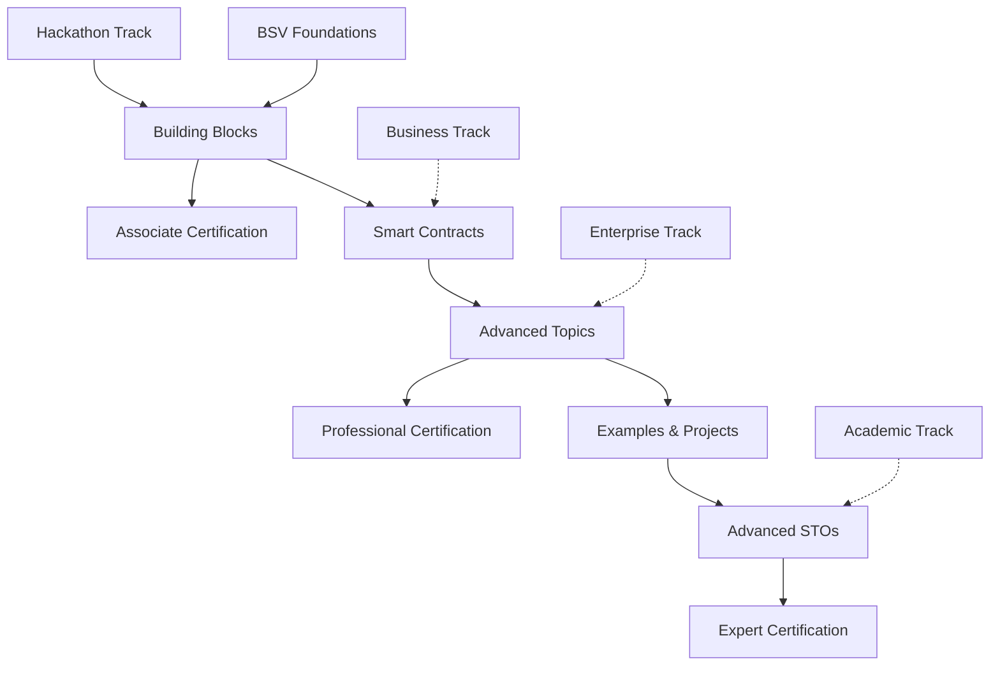

# Technical Development Track

Welcome to the Technical Development Track - your comprehensive pathway to becoming a proficient BSV developer. This track builds upon the foundations to provide hands-on development skills for building applications, smart contracts, and services on the BSV blockchain, culminating in advanced STO (Spendable Transaction Output) mastery.

## 🎯 Track Overview

This technical track is designed for developers, engineers, and technical implementers who want to build on BSV. You'll progress from basic building blocks to advanced architectural patterns, gaining practical experience with real-world projects and mastering cutting-edge STO concepts.

### Prerequisites
- **Required**: Completion of [BSV Foundations](../../01-foundations/README.md)
- **Recommended**: Programming experience (any language)
- **Helpful**: Basic understanding of web development concepts

## 🛠️ Learning Modules

### Module 1: [Building Blocks](01-building-blocks/README.md)
**Duration**: 2-3 weeks | **Level**: Beginner to Intermediate

Master the fundamental components of BSV development:
- **Wallets and SDKs** - Client-side development tools
- **Overlay Services** - Application-layer protocols
- **SPV and Merkle Proofs** - Efficient verification methods
- **Identity and Certificates** - Authentication and authorization

**Key Outcomes**: Set up development environment, create basic applications, implement wallet functionality

### Module 2: [Smart Contracts](02-smart-contracts/README.md)
**Duration**: 3-4 weeks | **Level**: Intermediate

Develop sophisticated smart contracts using sCrypt:
- **sCrypt Introduction** - Language fundamentals and tooling
- **Contract Development** - Writing and structuring contracts
- **Testing and Deployment** - Quality assurance and production deployment
- **Advanced Patterns** - Complex contract architectures

**Key Outcomes**: Build, test, and deploy smart contracts, implement complex business logic

### Module 3: [Advanced Topics](03-advanced-topics/README.md)
**Duration**: 4-5 weeks | **Level**: Advanced

Explore cutting-edge BSV technologies and patterns:
- **Scaling Solutions** - High-throughput application design
- **Mandala Network** - Conceptual framework for BSV applications
- **Enterprise Integration** - Large-scale system integration
- **Performance Optimization** - Efficiency and scalability techniques

**Key Outcomes**: Design scalable architectures, optimize performance, integrate with enterprise systems

### Module 4: [Examples and Projects](04-examples/README.md)
**Duration**: 2-3 weeks | **Level**: All Levels

Apply your skills with comprehensive project implementations:
- **Simple Wallet App** - End-to-end wallet development
- **Smart Contract DApp** - Decentralized application with contracts
- **Overlay Service** - Custom protocol implementation
- **Enterprise Solution** - Production-ready business application

**Key Outcomes**: Complete portfolio projects, demonstrate practical skills

### Module 5: [Advanced STOs](05-advanced-stos/table-of-contents/README.md)
**Duration**: 8-12 weeks | **Level**: Expert

Master advanced Spendable Transaction Output concepts and implementations:

#### **Module 5.1**: [Introduction to BSV, STOs, and Micropayments](05-advanced-stos/table-of-contents/module-1-introduction-to-bsv-spendable-transaction-outputs-stos-and-micropayments.md)
- Advanced BSV architecture and STO fundamentals
- Micropayment systems and economic models
- STO lifecycle and management

#### **Module 5.2**: [SPV and Merkle Proofs](05-advanced-stos/table-of-contents/module-2-simplified-payment-verification-spv-and-merkle-proofs.md)
- Advanced SPV techniques for distributed applications
- Merkle proof optimization and verification
- Trust mechanisms in peer-to-peer systems

#### **Module 5.3**: [STO Lifecycle and Workflow Management](05-advanced-stos/table-of-contents/module-3-sto-lifecycle-and-workflow-management.md)
- Advanced STO state management
- Workflow automation with STOs
- Business process integration

#### **Module 5.4**: [Advanced Transaction Patterns](05-advanced-stos/table-of-contents/module-4-transactions-as-registered-mail-bags-and-stos-as-digital-envelopes.md)
- Transactions as registered mailboxes
- STOs as digital envelopes
- Complex transaction orchestration

#### **Module 5.5**: [Wallet and Identity Management](05-advanced-stos/table-of-contents/module-5-wallet-and-identity-management-in-bsv/README.md)
Advanced wallet architecture and identity systems:
- [Fundamentals of Identity-Based Key Management](05-advanced-stos/table-of-contents/module-5-wallet-and-identity-management-in-bsv/lesson-1-fundamentals-of-identity-based-key-management-in-bsv.md)
- [Master Key Generation and Authentication](05-advanced-stos/table-of-contents/module-5-wallet-and-identity-management-in-bsv/lesson-2-master-key-generation-and-authentication-for-decentralized-services.md)
- [STO Management and Security Protocols](05-advanced-stos/table-of-contents/module-5-wallet-and-identity-management-in-bsv/lesson-3-sto-management-and-security-protocols.md)
- [P2P Communication and ECDHA](05-advanced-stos/table-of-contents/module-5-wallet-and-identity-management-in-bsv/lesson-4-peer-to-peer-communication-and-ecdha-in-decentralized-wallets.md)
- [Advanced Key Management and Recovery](05-advanced-stos/table-of-contents/module-5-wallet-and-identity-management-in-bsv/lesson-5-advanced-key-management-and-recovery-mechanisms.md)

#### **Module 5.6**: [Advanced Locking Mechanisms](05-advanced-stos/table-of-contents/module-6-advanced-locking-and-unlocking-in-bitcoin-transactions.md)
- Complex locking and unlocking patterns
- Multi-signature and time-lock implementations
- Security optimization techniques

#### **Module 5.7**: [sCrypt for Advanced Applications](05-advanced-stos/table-of-contents/module-7-extending-locking-and-unlocking-with-scrypt-for-advanced-applications.md)
- Advanced sCrypt programming patterns
- Complex smart contract architectures
- Performance optimization for sCrypt

#### **Module 5.8**: [Enterprise Overlay Services](05-advanced-stos/table-of-contents/module-8-overlay-services-tailoring-secure-and-scalable-bsv-payment-solutions-for-enterprises/README.md)
Comprehensive enterprise overlay service implementation:
- [Introduction to Overlay Networks and BSV Protocols](05-advanced-stos/table-of-contents/module-8-overlay-services-tailoring-secure-and-scalable-bsv-payment-solutions-for-enterprises/module-1-introduction-to-overlay-networks-and-bsv-protocols.md)
- [SHIP Protocol Implementation](05-advanced-stos/table-of-contents/module-8-overlay-services-tailoring-secure-and-scalable-bsv-payment-solutions-for-enterprises/module-2-implementing-ship-protocol-service-host-interconnect-protocol.md)
- [SLAP Protocol for Service Discovery](05-advanced-stos/table-of-contents/module-8-overlay-services-tailoring-secure-and-scalable-bsv-payment-solutions-for-enterprises/module-3-slap-protocol-service-lookup-availability-protocol-for-service-discovery.md)
- [STOstore Architecture](05-advanced-stos/table-of-contents/module-8-overlay-services-tailoring-secure-and-scalable-bsv-payment-solutions-for-enterprises/lesson-1-introduction-to-stostore-architecture-for-overlay-networks.md)
- [UHRP for Decentralized Data Retrieval](05-advanced-stos/table-of-contents/module-8-overlay-services-tailoring-secure-and-scalable-bsv-payment-solutions-for-enterprises/module-5-uhrp-universal-hash-resolution-protocol-for-decentralized-data-retrieval.md)
- [BRC-31 for Mutual Authentication](05-advanced-stos/table-of-contents/module-8-overlay-services-tailoring-secure-and-scalable-bsv-payment-solutions-for-enterprises/module-6-brc-31-for-mutual-authentication-in-overlay-services.md)

#### **Module 5.9**: [Advanced Payment Channels](05-advanced-stos/table-of-contents/module-9-advanced-payment-channels-in-bitcoin-sv.md)
- Complex payment channel architectures
- Multi-party payment systems
- Channel optimization and security

#### **Module 5.10**: [Sighash Schemes](05-advanced-stos/table-of-contents/module-10-mastering-sighash-schemes-for-transaction-flexibility-and-security.md)
- Advanced transaction signing patterns
- Flexible transaction construction
- Security optimization techniques

#### **Module 5.11**: [Advanced SPV Techniques](05-advanced-stos/table-of-contents/module-11-advanced-spv-techniques-for-distributed-applications.md)
- Distributed application SPV patterns
- Scalable verification architectures
- Performance optimization

#### **Module 5.12**: [Privacy-Preserving Techniques](05-advanced-stos/table-of-contents/module-12-privacy-preserving-transaction-techniques.md)
- Advanced privacy patterns
- Confidential transaction techniques
- Privacy-preserving application design

#### **Module 5.13**: [Merkle-Based Data Structures](05-advanced-stos/table-of-contents/module-13-merkle-based-data-structures-and-efficient-data-retrieval-and-selective-disclosure.md)
- Advanced Merkle tree implementations
- Efficient data retrieval patterns
- Selective disclosure techniques

**Key Outcomes**: Master advanced STO concepts, implement enterprise-grade solutions, design cutting-edge BSV applications

## 🎓 Assessment & Certification

### Progressive Assessment
Each module includes:
- **Knowledge Checks** - Conceptual understanding verification
- **Hands-on Exercises** - Implementation practice
- **Integration Projects** - Component combination
- **Advanced Implementations** - STO mastery demonstrations

### Module Assessment
- **Component Mastery** - Individual component completion
- **Integration Project** - Combining all building blocks
- **Advanced STO Project** - Expert-level implementation
- **Code Review** - Peer and instructor feedback
- **Portfolio Submission** - Demonstrable applications

### Certification Requirements
- **Minimum Score**: 80% on all assessments
- **Practical Demonstration**: Working code examples
- **Integration Project**: Multi-component application
- **Advanced STO Implementation**: Expert-level project
- **Code Quality**: Following BSV best practices

### Certification Levels
- **BSV Developer Associate** - Modules 1-2 completion
- **BSV Developer Professional** - Modules 1-4 completion
- **BSV Technical Expert** - All modules + advanced STO mastery

## 📊 Learning Path Visualization

## 🎯 Career Outcomes

### Job Roles
- **BSV Developer** - Application development
- **Blockchain Engineer** - Infrastructure and protocols
- **Smart Contract Developer** - Contract design and implementation
- **STO Architect** - Advanced transaction system design
- **Solutions Architect** - System design and integration
- **Technical Lead** - Team leadership and architecture

### Skill Validation
- **Portfolio Projects** - Demonstrable applications
- **Open Source Contributions** - Community involvement
- **Technical Certifications** - Verified competencies
- **Industry Recognition** - Professional credibility
- **Advanced STO Expertise** - Cutting-edge technical mastery

## 🤝 Community & Support

### Developer Community
- **BSV Developers Slack** - Real-time collaboration
- **GitHub Organizations** - Open source projects
- **Stack Overflow** - Technical Q&A
- **Developer Meetups** - Local networking
- **STO Expert Groups** - Advanced technical discussions

### Mentorship Program
- **1:1 Mentoring** - Personalized guidance
- **Code Reviews** - Expert feedback
- **Career Guidance** - Professional development
- **Project Collaboration** - Team experience
- **Advanced STO Mentorship** - Expert-level guidance

### Continuing Education
- **Advanced Workshops** - Specialized topics
- **Conference Presentations** - Industry insights
- **Research Participation** - Cutting-edge development
- **360 Learning Integration** - Professional development

## 🚀 Getting Started

### Immediate Next Steps
1. **Complete Prerequisites** - Ensure BSV Foundations certification
2. **Set Up Environment** - Install development tools
3. **Join Community** - Connect with other developers
4. **Start Module 1** - Begin with [Building Blocks](01-building-blocks/README.md)

### Study Schedule Recommendation
- **Part-time** (10 hrs/week): 20-24 weeks total (including advanced STOs)
- **Full-time** (40 hrs/week): 5-6 weeks total
- **Intensive** (60+ hrs/week): 3-4 weeks total

### Success Tips
- **Practice Regularly** - Code every day
- **Build Projects** - Apply concepts immediately
- **Engage Community** - Ask questions and help others
- **Document Learning** - Keep a development journal
- **Master STOs** - Focus on advanced concepts for expert-level skills

---

**Ready to start building?** Begin with [Building Blocks](01-building-blocks/README.md) and progress through to advanced STO mastery!

*This track provides comprehensive BSV development skills from basic concepts to expert-level STO implementation, preparing you to build cutting-edge applications on the BSV blockchain.*