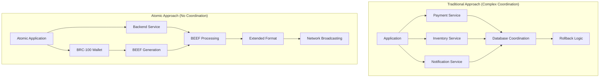

# Module 1: Environment Setup

Welcome to atomic BSV development! This module guides you through setting up a standardized development environment using LARS for atomic transaction development and BRC-100 compliant wallets for BEEF workflow implementation.

## 🎯 Learning Objectives

By the end of this module, you'll be able to:

* Install and configure LARS for atomic BSV development
* Set up BRC-100 compliant wallet for BEEF generation
* Create your first atomic transaction application
* Understand BEEF vs Extended Format transaction flows
* Implement SPV verification for instant validation
* Build atomic operations that eliminate coordination complexity

## 🔄 Atomic Development Architecture

### Traditional vs. Atomic BSV Development



**Key Benefits of Atomic Development:**

* **No Coordination**: Single atomic operations replace complex coordination
* **BEEF Workflow**: P2P transmission with instant SPV verification
* **Extended Format**: Backend handles network broadcasting
* **Simplified Logic**: All-or-nothing semantics eliminate partial states

## 🛠️ Atomic Development Stack

### LARS (Local Automated Runtime System)

* **Purpose**: Standardized atomic development environment
* **Features**: BEEF processing, Extended Format conversion, SPV verification
* **Benefits**: Consistent atomic development patterns

### BRC-100 Wallet Client

* **Purpose**: BEEF generation and atomic transaction signing
* **Features**: Basket management, SPV proof generation, atomic operations
* **Benefits**: Secure atomic transaction creation

### BSV TS-SDK with BEEF Support

* **Purpose**: BEEF processing and Extended Format conversion
* **Features**: Atomic transaction building, SPV verification, format conversion
* **Benefits**: Type-safe atomic development

## 📋 Prerequisites

Before starting atomic development:

* **Node.js** (v18 or later) for TypeScript development
* **npm** or **yarn** for package management
* **Docker** for LARS containerization
* **BRC-100 Wallet** (MetaNet Desktop or compatible)
* **Understanding** of atomic transaction concepts

### System Requirements

* **Operating System**: Windows 10+, macOS 10.15+, or Linux
* **RAM**: 8GB minimum for LARS and wallet operations
* **Storage**: 10GB for development environment
* **Network**: Stable connection for BEEF transmission

## 🚀 Step 1: Install LARS for Atomic Development

LARS provides the standardized environment for atomic BSV development with BEEF processing capabilities.

### Installation

```bash
# Install LARS for atomic development
npm install --save-dev @bsv/lars

# Verify LARS installation
npx lars --help
```

### LARS Configuration for Atomic Development

```typescript
// lars.config.ts - Configuration for atomic development
export default {
  // Atomic transaction processing
  atomic: {
    beefProcessing: true,
    extendedFormatConversion: true,
    spvVerification: true
  },
  
  // Development services
  services: {
    // BEEF processing service
    beefProcessor: {
      port: 3001,
      validation: 'strict'
    },
    
    // Extended Format broadcaster
    broadcaster: {
      port: 3002,
      network: 'testnet'
    },
    
    // SPV verification service
    spvVerifier: {
      port: 3003,
      chainTracker: 'local'
    }
  },
  
  // Hot reloading for atomic development
  hotReload: {
    enabled: true,
    watchPaths: ['src/**/*.ts']
  }
};
```

## 🔐 Step 2: Set Up BRC-100 Wallet for BEEF Generation

### Install Compatible Wallet

```bash
# Install MetaNet Desktop or compatible BRC-100 wallet
# Download from official BSV Academy releases
# Ensure wallet supports BEEF generation and basket management
```

### Wallet Configuration for Atomic Development

```typescript
// Wallet connection for atomic operations
class AtomicWalletService {
  
  // Connect to BRC-100 compliant wallet
  async connectWallet() {
    // Connect to wallet with BEEF capabilities
    // const wallet = new WalletClient();
    // const isConnected = await wallet.isAuthenticated();
    
    // Verify BEEF generation support
    // const capabilities = await wallet.getCapabilities();
    // if (!capabilities.beefGeneration) {
    //   throw new Error('Wallet must support BEEF generation');
    // }
    
    // Verify basket management support
    // if (!capabilities.basketManagement) {
    //   throw new Error('Wallet must support basket management');
    // }
    
    // return wallet;
  }
  
  // Create atomic transaction with BEEF
  async createAtomicTransaction() {
    // const wallet = await this.connectWallet();
    
    // Create atomic operation
    // const response = await wallet.createAction({
    //   description: 'atomic test transaction',
    //   outputs: [{
    //     satoshis: 1,
    //     lockingScript: Script.fromASM('OP_NOP').toHex(),
    //     basket: 'test-tokens',
    //     outputDescription: 'atomic test token'
    //   }]
    // });
    
    // Wallet returns BEEF format for P2P transmission
    // Contains all SPV data needed for instant verification
    // return response.BEEF;
  }
}
```

## 🔄 Step 3: Set Up BEEF Processing Backend

### BEEF Reception and Processing

```typescript
// Backend service for BEEF processing
class BEEFProcessingService {
  
  // Process incoming BEEF transactions
  async processBEEF(beefHex: string) {
    // Parse BEEF transaction
    // const beefTx = Transaction.fromHexBEEF(beefHex);
    
    // Validate BEEF structure and SPV proofs
    // const isValid = await beefTx.verify(this.chainTracker);
    // if (!isValid) {
    //   throw new Error('Invalid BEEF transaction');
    // }
    
    // Process atomic business logic
    // await this.processAtomicLogic(beefTx);
    
    // Convert to Extended Format for network broadcasting
    // const extendedFormat = beefTx.toHexEF();
    // await this.broadcastToNetwork(extendedFormat);
    
    // Atomic operation complete
  }
  
  // Convert BEEF to Extended Format and broadcast
  private async broadcastToNetwork(extendedFormatHex: string) {
    // Extended Format includes previous locking scripts and satoshi amounts
    // Enables broadcast services to validate without node RPC
    // const broadcaster = new ExtendedFormatBroadcaster();
    // const result = await broadcaster.submit(extendedFormatHex);
    // return result.txid;
  }
}
```

## 🎯 Step 4: Create Your First Atomic Application

### Project Structure for Atomic Development

```bash
# Create atomic BSV project
mkdir atomic-bsv-app
cd atomic-bsv-app

# Initialize with atomic development template
npx lars init --template atomic

# Project structure:
# src/
#   atomic/           # Atomic transaction logic
#   beef/            # BEEF processing
#   extended/        # Extended Format handling
#   services/        # Business logic services
# lars.config.ts     # LARS configuration
# package.json       # Dependencies
```

### Basic Atomic Application

```typescript
// src/atomic/AtomicTokenApp.ts
class AtomicTokenApp {
  
  // Create atomic token
  async createToken() {
    // Connect to BRC-100 wallet
    // const wallet = new WalletClient();
    
    // Create atomic token creation transaction
    // const response = await wallet.createAction({
    //   description: 'create atomic token',
    //   outputs: [{
    //     satoshis: 1,
    //     lockingScript: Script.fromASM('OP_NOP').toHex(),
    //     basket: 'my-tokens',
    //     outputDescription: 'atomic token #1'
    //   }]
    // });
    
    // Send BEEF to backend for processing
    // await this.sendBEEFToBackend(response.BEEF);
    
    // Token created atomically - no coordination needed
  }
  
  // Redeem atomic token
  async redeemToken() {
    // List available tokens
    // const tokens = await wallet.listOutputs({
    //   basket: 'my-tokens',
    //   include: 'entire transactions'
    // });
    
    // Create atomic redemption transaction
    // const redemption = await wallet.createAction({
    //   description: 'redeem atomic token',
    //   inputBEEF: tokens.BEEF,
    //   inputs: [{
    //     outpoint: tokens.outputs[0].outpoint,
    //     unlockingScript: Script.fromASM('OP_TRUE').toHex(),
    //     inputDescription: 'token being redeemed'
    //   }]
    // });
    
    // Send BEEF to backend for processing
    // await this.sendBEEFToBackend(redemption.BEEF);
    
    // Token redeemed atomically - no partial states
  }
  
  // Send BEEF to backend for processing
  private async sendBEEFToBackend(beefHex: string) {
    // Send BEEF via P2P transmission
    // const response = await fetch('/api/beef', {
    //   method: 'POST',
    //   headers: { 'Content-Type': 'application/json' },
    //   body: JSON.stringify({ beef: beefHex })
    // });
    
    // Backend processes BEEF and converts to Extended Format
    // Network broadcasting handled by backend
  }
}
```

## 🧪 Step 5: Test Atomic Operations with Identity

### Testing BEEF Workflow with Identity Integration

```typescript
// tests/atomic-with-identity.test.ts
describe('Atomic Operations with Identity', () => {
  
  // Test atomic token creation with identity
  test('should create token atomically with identity verification', async () => {
    // const app = new AtomicTokenAppWithIdentity();
    
    // Create token atomically with identity
    // await app.createTokenWithIdentity();
    
    // Verify token exists in basket with identity metadata
    // const tokens = await wallet.listOutputs({
    //   basket: 'my-tokens',
    //   includeIdentityMetadata: true
    // });
    // expect(tokens.outputs).toHaveLength(1);
    // expect(tokens.outputs[0].identityMetadata).toBeDefined();
    
    // No coordination complexity - simple atomic operation with identity accountability
  });
  
  // Test BEEF processing with identity verification
  test('should process BEEF with identity verification correctly', async () => {
    // const processor = new BEEFProcessingServiceWithIdentity();
    // const mockBEEFWithIdentity = 'mock-beef-hex-data-with-identity-proofs';
    
    // Process BEEF transaction with identity verification
    // await processor.processBEEFWithIdentity(mockBEEFWithIdentity);
    
    // Verify atomic processing with identity verification completed
    // All effects applied or none applied - no partial states
    // Identity verification integrated into atomic operation
  });
  
  // Test Extended Format conversion with identity
  test('should convert BEEF to Extended Format with identity metadata', async () => {
    // const beefTx = Transaction.fromHexBEEF(mockBEEFWithIdentity);
    // const extendedFormat = beefTx.toHexEFWithIdentity();
    
    // Verify Extended Format structure with identity
    // expect(extendedFormat).toContain('0000000000EF'); // EF marker
    // expect(extendedFormat).toContain('IDENTITY_METADATA'); // Identity metadata
    
    // Extended Format ready for network broadcasting with identity accountability
  });
  
  // Test identity certificate validation
  test('should validate BRC-103 identity certificates', async () => {
    // const identityService = new IdentityCertificateService();
    // const mockCertificate = createMockBRC103Certificate();
    
    // Validate certificate authenticity
    // const isValid = await identityService.validateCertificate(mockCertificate);
    // expect(isValid).toBe(true);
    
    // Test selective disclosure validation
    // const disclosureValid = await identityService.validateSelectiveDisclosure(
    //   mockCertificate,
    //   ['name', 'age_verification']
    // );
    // expect(disclosureValid).toBe(true);
  });
  
  // Test Type-42 key derivation
  test('should derive Type-42 shared keys correctly', async () => {
    // const wallet = new WalletClient();
    // const myPrivateKey = 'mock-private-key';
    // const theirPublicKey = 'mock-public-key';
    
    // Derive shared key for private communication
    // const sharedKey = await wallet.deriveType42Key({
    //   myPrivateKey,
    //   theirPublicKey,
    //   invoiceNumber: 'test-invoice-123'
    // });
    
    // Verify shared key generation
    // expect(sharedKey).toBeDefined();
    // expect(sharedKey.length).toBeGreaterThan(0);
  });
});
```

## 🎓 Assessment and Verification with Identity Integration

### Environment Verification Checklist

* ✅ LARS installed and configured for atomic development with identity support
* ✅ MetaNet Desktop Client connected with BRC-100 + BRC-103 capabilities
* ✅ BRC-103 identity certificate created and configured
* ✅ BEEF processing backend operational with identity verification
* ✅ Extended Format broadcasting service configured with identity metadata
* ✅ SPV verification working for instant validation with identity proofs
* ✅ First atomic application with identity accountability created and tested
* ✅ Selective disclosure preferences configured and working
* ✅ Type-42 key derivation operational for private communication

### Knowledge Check

1. **BEEF vs Extended Format with Identity**: Explain when to use each transaction format and how identity is preserved.
2. **Atomic Benefits with Identity**: How do atomic operations eliminate coordination complexity while maintaining identity accountability?
3. **SPV Verification with Identity**: Why can BEEF transactions with identity be verified instantly?
4. **BRC-100 + BRC-103 Integration**: How does the combined interface maintain security while enabling identity verification?
5. **Selective Disclosure**: How does selective disclosure provide verification without compromising privacy?
6. **Type-42 Key Derivation**: How do shared key universes enable private communication between verified parties?

### Hands-on Exercise

Create a simple atomic marketplace with identity accountability:

* Set up atomic token creation for products with creator identity
* Implement atomic purchase transactions with buyer/seller identity verification
* Process BEEF workflow with identity from wallet to backend
* Handle Extended Format broadcasting to network with identity metadata
* Configure selective disclosure for privacy-preserving verification
* Implement Type-42 key derivation for private communication between parties

### Success Criteria

* Environment successfully processes atomic transactions with identity verification
* BEEF workflow operational from wallet to network with embedded identity proofs
* Extended Format conversion working correctly with identity metadata preservation
* SPV verification providing instant validation with identity accountability
* No coordination complexity in application logic or identity verification
* Selective disclosure working correctly for privacy-preserving verification
* Type-42 key derivation enabling secure private communication
* Identity certificates properly validated and managed throughout atomic operations

## 🔗 Next Steps

Continue to [Module 2: Wallet Integration](../02-wallet-integration/) to master atomic transaction creation and BEEF generation with BRC-100 + BRC-103 wallet interfaces and advanced identity certificate management.

### Key Takeaways

* **LARS with Identity Support** provides standardized atomic development environment with integrated identity verification
* **BEEF + Identity Workflow** enables P2P transmission with instant verification and identity accountability
* **MetaNet Desktop Client** provides comprehensive BRC-100 + BRC-103 identity certificate management
* **Extended Format with Identity** handles network broadcasting requirements while preserving identity metadata
* **Atomic Operations with Identity** eliminate coordination complexity while maintaining verifiable accountability
* **BRC-103 Integration** maintains security while enabling privacy-preserving identity verification
* **Selective Disclosure** provides verification without compromising privacy
* **Type-42 Key Derivation** enables secure private communication between verified parties

***

**Ready to build atomically with identity?** Your development environment is now configured for atomic BSV development with BEEF workflow support and comprehensive identity integration!

_This environment setup provides the foundation for building next-generation BSV applications that combine atomic operations with built-in identity accountability, eliminating both coordination complexity and identity infrastructure complexity._
