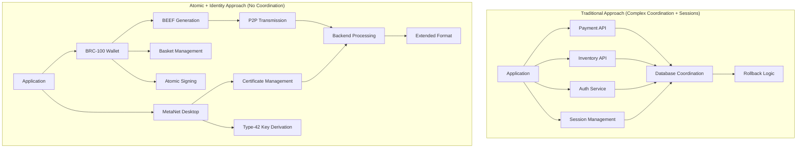
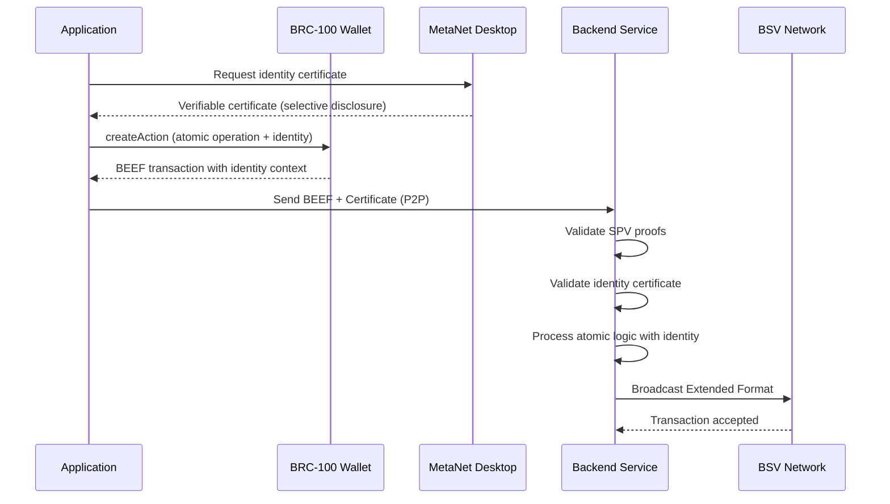

# Module 2: Atomic Wallet Integration with Identity Certificates

Master wallet integration for atomic BSV transactions using the BRC-100 interface with BEEF generation, basket management, SPV verification, and identity certificate management. This module teaches you to build secure atomic operations with privacy-preserving identity integration that eliminate coordination complexity.

## 🎯 Learning Objectives

By the end of this module, you'll be able to:
- Implement BRC-100 wallet integration for atomic transactions
- Generate BEEF transactions for P2P transmission with identity context
- Manage baskets for atomic token operations
- Handle SPV verification for instant validation
- **Integrate Type-42 key derivation for peer-to-peer authentication**
- **Manage identity certificates with selective disclosure**
- **Create atomic business operations with identity accountability**
- **Process atomic state transitions with certificate validation**
- Create atomic business operations without coordination
- Process atomic state transitions securely

## 🔄 Atomic Wallet Architecture

### Traditional vs. Atomic Wallet Integration with Identity



**Atomic + Identity Benefits:**
- **No Coordination**: Single atomic operations replace complex workflows
- **No Sessions**: Per-request certificate validation replaces session management
- **BEEF Workflow**: P2P transmission with instant SPV verification
- **Identity Integration**: Privacy-preserving authentication with selective disclosure
- **Basket Management**: Organized token operations with identity context
- **Atomic Signing**: All-or-nothing transaction creation with certificate validation

## 🔌 BRC-100 Atomic Interface with Identity Integration

The BRC-100 wallet interface provides atomic transaction capabilities with identity certificate management:

### Core Atomic Operations

| Operation | Purpose | Returns |
|-----------|---------|---------|
| `createAction` | Create atomic transactions with identity context | BEEF format |
| `signAction` | Sign atomic transactions | Signed BEEF |
| `listOutputs` | List basket contents | BEEF data included |
| `internalizeAction` | Process received transactions | Atomic internalization |
| **`deriveChild`** | **Type-42 key derivation for P2P auth** | **Derived keys** |
| **`getIdentityKey`** | **Get master identity public key** | **Public key** |
| **`createCertificate`** | **Create identity certificates** | **Certificate data** |

### Identity Certificate Operations

| Operation | Purpose | Returns |
|-----------|---------|---------|
| **`storeCertificate`** | **Store identity certificates** | **Storage confirmation** |
| **`getCertificate`** | **Retrieve stored certificates** | **Certificate data** |
| **`createVerifiableCertificate`** | **Create selective disclosure certs** | **Verifiable certificate** |
| **`validateCertificate`** | **Validate received certificates** | **Validation result** |

### Atomic Transaction Flow with Identity



## 🚀 Implementing Atomic Wallet Integration with Identity

### Step 1: Atomic Wallet Service with Identity Support

```typescript
// src/services/AtomicWalletService.ts
class AtomicWalletService {
  private wallet: any;
  private metanet: any;
  
  // Connect to BRC-100 compliant wallet with identity support
  async connectWallet() {
    // Connect to wallet with atomic capabilities
    // const wallet = new WalletClient();
    // const isAuthenticated = await wallet.isAuthenticated();
    
    // if (!isAuthenticated) {
    //   await wallet.waitForAuthentication();
    // }
    
    // Verify atomic transaction support
    // const capabilities = await this.verifyAtomicCapabilities();
    // if (!capabilities.beefGeneration) {
    //   throw new Error('Wallet must support BEEF generation');
    // }
    
    // Verify identity capabilities
    // if (!capabilities.type42KeyDerivation) {
    //   throw new Error('Wallet must support Type-42 key derivation');
    // }
    
    // this.wallet = wallet;
    // return wallet;
  }
  
  // Connect to MetaNet Desktop for identity management
  async connectIdentityService() {
    // Connect to MetaNet Desktop Client
    // const metanet = new MetaNetClient();
    // const isConnected = await metanet.connect();
    
    // if (!isConnected) {
    //   throw new Error('MetaNet Desktop Client not available');
    // }
    
    // Verify identity capabilities
    // const capabilities = await metanet.getCapabilities();
    // if (!capabilities.certificateManagement) {
    //   throw new Error('MetaNet must support certificate management');
    // }
    
    // this.metanet = metanet;
    // return metanet;
  }
  
  // Verify wallet supports atomic operations and identity
  private async verifyAtomicCapabilities() {
    // Check for required atomic features:
    // - BEEF generation for P2P transmission
    // - Basket management for token organization
    // - SPV proof generation for instant verification
    // - Atomic signing for all-or-nothing operations
    // - Type-42 key derivation for peer-to-peer authentication
    // - Identity certificate integration
    
    // return {
    //   beefGeneration: true,
    //   basketManagement: true,
    //   spvProofs: true,
    //   atomicSigning: true,
    //   type42KeyDerivation: true,
    //   identityIntegration: true
    // };
  }
  
  // Derive keys for peer-to-peer authentication
  async deriveP2PKeys(counterpartyPublicKey: string, invoiceNumber: string) {
    // Use Type-42 key derivation for private communication
    // const derivedKey = await this.wallet.deriveChild(
    //   counterpartyPublicKey,
    //   invoiceNumber
    // );
    
    // Keys are mathematically related but unlinkable to master keys
    // Enables private communication without revealing identity
    // return {
    //   privateKey: derivedKey.privateKey,
    //   publicKey: derivedKey.publicKey,
    //   invoiceNumber: invoiceNumber
    // };
  }
}
```

### Step 2: Atomic Token Creation with Identity Context

```typescript
// Create atomic tokens with BEEF generation and identity integration
class AtomicTokenService {
  private wallet: any;
  private metanet: any;
  
  constructor(walletService: AtomicWalletService) {
    // this.wallet = walletService.wallet;
    // this.metanet = walletService.metanet;
  }
  
  // Create atomic token with identity accountability
  async createAtomicToken(tokenData: TokenData, identityContext?: IdentityContext) {
    // const wallet = new WalletClient();
    // const metanet = new MetaNetClient();
    
    // Get creator's identity certificate if needed
    // let creatorCertificate;
    // if (identityContext?.includeCreatorIdentity) {
    //   creatorCertificate = await metanet.createVerifiableCertificate({
    //     certificateId: 'creator-identity',
    //     revealedFields: identityContext.revealedFields || ['creator_verified']
    //   });
    // }
    
    // Create atomic token creation transaction with identity
    // const response = await wallet.createAction({
    //   description: 'create atomic token with identity',
    //   outputs: [{
    //     satoshis: 1,
    //     lockingScript: this.generateTokenScript(tokenData).toHex(),
    //     basket: tokenData.basket,
    //     outputDescription: `${tokenData.type} token #${tokenData.id}`
    //   }],
    //   // Include identity context for accountability
    //   identityContext: {
    //     creatorCertificate: creatorCertificate,
    //     timestamp: Date.now(),
    //     tokenType: tokenData.type
    //   }
    // });
    
    // Wallet returns BEEF format for P2P transmission
    // Contains all SPV data needed for instant verification
    // Includes identity context for accountability
    // No coordination with external services required
    // return {
    //   beef: response.BEEF,
    //   txid: response.txid,
    //   spvProofs: response.spvProofs,
    //   identityProof: creatorCertificate
    // };
  }
  
  // Transfer atomic token with identity verification
  async transferAtomicToken(tokenOutpoint: string, recipientIdentity: string, transferContext?: TransferContext) {
    // const wallet = new WalletClient();
    // const metanet = new MetaNetClient();
    
    // Get sender's identity certificate
    // const senderCertificate = await metanet.createVerifiableCertificate({
    //   certificateId: 'sender-identity',
    //   revealedFields: transferContext?.senderFields || ['verified_sender']
    // });
    
    // Derive keys for secure transfer to recipient
    // const transferKeys = await wallet.deriveChild(
    //   recipientIdentity,
    //   `transfer-${Date.now()}`
    // );
    
    // Create atomic transfer transaction
    // const response = await wallet.createAction({
    //   description: 'atomic token transfer with identity',
    //   inputs: [{
    //     outpoint: tokenOutpoint,
    //     unlockingScript: this.generateUnlockScript().toHex()
    //   }],
    //   outputs: [{
    //     satoshis: 1,
    //     lockingScript: this.generateRecipientScript(recipientIdentity).toHex(),
    //     basket: 'received-tokens',
    //     outputDescription: 'transferred token'
    //   }],
    //   // Include identity context for both parties
    //   identityContext: {
    //     senderCertificate: senderCertificate,
    //     recipientIdentity: recipientIdentity,
    //     transferKeys: transferKeys.publicKey,
    //     timestamp: Date.now()
    //   }
    // });
    
    // return {
    //   beef: response.BEEF,
    //   txid: response.txid,
    //   transferProof: senderCertificate
    // };
  }
  
  // List atomic tokens from basket with identity context
  async listAtomicTokens(basket: string) {
    // const wallet = new WalletClient();
    
    // List tokens with BEEF data for atomic operations
    // const tokens = await wallet.listOutputs({
    //   basket: basket,
    //   include: 'entire transactions' // Gets BEEF data
    // });
    
    // Each token is a spendable UTXO with identity context
    // Can be consumed atomically in transactions
    // return {
    //   tokens: tokens.outputs,
    //   beef: tokens.BEEF, // For atomic operations
    //   totalCount: tokens.outputs.length,
    //   identityContext: tokens.identityContext // Creator/transfer history
    // };
  }
}
}
```

### Step 3: Identity Certificate Management

```typescript
// Identity certificate management with selective disclosure
class IdentityCertificateService {
private metanet: any;

constructor(metanetClient: any) {
  // this.metanet = metanetClient;
}

// Store identity certificate with selective disclosure capabilities
async storeCertificate(certificate: Certificate) {
  // Store certificate with privacy controls
  // await this.metanet.storeCertificate({
  //   certificate: certificate,
  //   allowSelectiveDisclosure: true,
  //   trustedVerifiers: certificate.trustedVerifiers || []
  // });
  
  // Certificate stored with field-level encryption
  // Each field can be selectively disclosed
  // return {
  //   certificateId: certificate.id,
  //   storedFields: certificate.fields,
  //   selectiveDisclosureEnabled: true
  // };
}

// Create verifiable certificate for specific verifier
async createVerifiableCertificate(request: VerifiableCertificateRequest) {
  // Create certificate with selective field disclosure
  // const verifiableCert = await this.metanet.createVerifiableCertificate({
  //   certificateId: request.certificateId,
  //   verifierPublicKey: request.verifierPublicKey,
  //   revealedFields: request.revealedFields
  // });
  
  // Only requested fields are decryptable by verifier
  // Other fields remain encrypted and private
  // return {
  //   certificate: verifiableCert,
  //   revealedFields: request.revealedFields,
  //   verifierKey: request.verifierPublicKey,
  //   expiresAt: Date.now() + (24 * 60 * 60 * 1000) // 24 hours
  // };
}

// Validate received certificate
async validateCertificate(certificate: any, expectedFields: string[]) {
  // Verify certificate signature and structure
  // const isValid = await this.metanet.validateCertificate(certificate);
  // if (!isValid) {
  //   throw new Error('Invalid certificate signature');
  // }
  
  // Check if required fields are present and decryptable
  // const availableFields = await this.metanet.getAvailableFields(certificate);
  // const hasRequiredFields = expectedFields.every(field =>
  //   availableFields.includes(field)
  // );
  
  // if (!hasRequiredFields) {
  //   throw new Error('Certificate missing required fields');
  // }
  
  // Decrypt and return available field values
  // const fieldValues = {};
  // for (const field of expectedFields) {
  //   fieldValues[field] = await this.metanet.decryptField(certificate, field);
  // }
  
  // return {
  //   isValid: true,
  //   subject: certificate.subject,
  //   certifier: certificate.certifier,
  //   fieldValues: fieldValues,
  //   validatedAt: Date.now()
  // };
}

// Check certificate revocation status
async checkRevocationStatus(certificate: any) {
  // Check if revocation outpoint has been spent
  // const revocationOutpoint = certificate.revocationOutpoint;
  // if (revocationOutpoint === '0'.repeat(64) + '00000000') {
  //   return { isRevoked: false, reason: 'No revocation outpoint set' };
  // }
  
  // Query blockchain to check if outpoint is spent
  // const isSpent = await this.checkOutpointSpent(revocationOutpoint);
  // return {
  //   isRevoked: isSpent,
  //   reason: isSpent ? 'Revocation outpoint spent' : 'Certificate valid',
  //   checkedAt: Date.now()
  // };
}
}
```

### Step 3: Atomic Marketplace Operations

```typescript
// Atomic marketplace without coordination complexity
class AtomicMarketplaceService {
  
  // Atomic asset purchase - no coordination needed
  async purchaseAssetAtomically(assetId: string, paymentAmount: number) {
    // const wallet = new WalletClient();
    
    // Get asset from marketplace basket
    // const assets = await wallet.listOutputs({
    //   basket: 'marketplace-assets',
    //   filter: { assetId: assetId },
    //   include: 'entire transactions'
    // });
    
    // Create atomic purchase transaction
    // const purchase = await wallet.createAction({
    //   description: 'atomic asset purchase',
    //   inputBEEF: assets.BEEF, // Asset being purchased
    //   inputs: [{
    //     outpoint: assets.outputs[0].outpoint,
    //     unlockingScript: this.generatePurchaseScript(paymentAmount).toHex(),
    //     inputDescription: 'asset being purchased'
    //   }],
    //   outputs: [{
    //     satoshis: 1,
    //     lockingScript: this.generateOwnershipScript().toHex(),
    //     basket: 'owned-assets',
    //     outputDescription: 'purchased asset ownership'
    //   }, {
    //     satoshis: paymentAmount,
    //     lockingScript: this.generateSellerPaymentScript().toHex(),
    //     outputDescription: 'payment to seller'
    //   }]
    // });
    
    // Asset ownership and payment happen atomically
    // No race conditions, no partial failure states
    // No coordination between payment and asset transfer
    // return purchase.BEEF; // For P2P transmission to seller
  }
  
  // Atomic inventory management - eliminates overselling
  async purchaseInventoryAtomically(productId: string) {
    // const wallet = new WalletClient();
    
    // Each inventory item is a spendable token
    // Mathematically impossible to oversell
    // const inventory = await wallet.listOutputs({
    //   basket: 'product-inventory',
    //   filter: { productId: productId },
    //   include: 'entire transactions'
    // });
    
    // if (inventory.outputs.length === 0) {
    //   throw new Error('Product out of stock');
    // }
    
    // Atomic purchase consumes inventory token
    // const sale = await wallet.createAction({
    //   description: 'atomic inventory purchase',
    //   inputBEEF: inventory.BEEF,
    //   inputs: [{
    //     outpoint: inventory.outputs[0].outpoint, // Specific inventory item
    //     unlockingScript: Script.fromASM('OP_TRUE').toHex(),
    //     inputDescription: 'inventory token consumption'
    //   }],
    //   outputs: [{
    //     satoshis: 1,
    //     lockingScript: this.generateCustomerOwnershipScript().toHex(),
    //     basket: 'customer-purchases',
    //     outputDescription: 'customer ownership token'
    //   }]
    // });
    
    // Benefits:
    // - Mathematically impossible to oversell
    // - No cache invalidation needed
    // - No coordination between inventory and payment systems
    // return sale.BEEF;
  }
}
```

### Step 4: Atomic Multi-Party Operations

```typescript
// Complex atomic operations involving multiple parties
class AtomicMultiPartyService {
  
  // Atomic supply chain transfer
  async atomicSupplyChainTransfer(transferData: SupplyChainTransfer) {
    // const wallet = new WalletClient();
    
    // Collect BEEF data from all parties
    // const manufacturerBEEF = await this.getManufacturerBEEF(transferData.manufacturerId);
    // const distributorBEEF = await this.getDistributorBEEF(transferData.distributorId);
    // const retailerBEEF = await this.getRetailerBEEF(transferData.retailerId);
    
    // Create atomic multi-party transaction
    // const multiPartyTx = await wallet.createAction({
    //   description: 'atomic supply chain transfer',
    //   inputBEEF: [manufacturerBEEF, distributorBEEF, retailerBEEF],
    //   inputs: [
    //     {
    //       outpoint: transferData.manufacturerOutput,
    //       unlockingScript: this.generateManufacturerUnlock().toHex(),
    //       inputDescription: 'manufacturer product token'
    //     },
    //     {
    //       outpoint: transferData.distributorOutput,
    //       unlockingScript: this.generateDistributorUnlock().toHex(),
    //       inputDescription: 'distributor logistics token'
    //     },
    //     {
    //       outpoint: transferData.retailerOutput,
    //       unlockingScript: this.generateRetailerUnlock().toHex(),
    //       inputDescription: 'retailer payment token'
    //     }
    //   ],
    //   outputs: [
    //     {
    //       satoshis: 1,
    //       lockingScript: this.generateUpdatedManufacturerState().toHex(),
    //       basket: 'manufacturer-state',
    //       outputDescription: 'updated manufacturer state'
    //     },
    //     {
    //       satoshis: 1,
    //       lockingScript: this.generateUpdatedDistributorState().toHex(),
    //       basket: 'distributor-state',
    //       outputDescription: 'updated distributor state'
    //     },
    //     {
    //       satoshis: 1,
    //       lockingScript: this.generateUpdatedRetailerState().toHex(),
    //       basket: 'retailer-state',
    //       outputDescription: 'updated retailer state'
    //     }
    //   ]
    // });
    
    // All parties' state transitions happen atomically
    // No coordination protocols needed
    // No rollback mechanisms required
    // BEEF enables efficient P2P transmission
    // return multiPartyTx.BEEF;
  }
}
```

## 🔐 Atomic Authentication and Security

### Secure Atomic Operations

```typescript
// Secure atomic transaction handling
class AtomicSecurityService {
  
  // Authenticate user for atomic operations
  async authenticateForAtomicOps() {
    // const wallet = new WalletClient();
    
    // Check if user is authenticated
    // const isAuthenticated = await wallet.isAuthenticated();
    // if (!isAuthenticated) {
    //   // Wait for user authentication
    //   await wallet.waitForAuthentication();
    // }
    
    // Get user identity for atomic operations
    // const identity = await this.getUserIdentity();
    // return identity;
  }
  
  // Validate atomic transaction before processing
  async validateAtomicTransaction(beefHex: string) {
    // Parse BEEF transaction
    // const beefTx = Transaction.fromHexBEEF(beefHex);
    
    // Validate SPV proofs for instant verification
    // const spvValid = await beefTx.verify(this.chainTracker);
    // if (!spvValid) {
    //   throw new Error('Invalid SPV proofs in BEEF transaction');
    // }
    
    // Validate atomic constraints
    // const atomicValid = await this.validateAtomicConstraints(beefTx);
    // if (!atomicValid) {
    //   throw new Error('Transaction violates atomic constraints');
    // }
    
    // Validate business rules
    // const businessValid = await this.validateBusinessRules(beefTx);
    // return businessValid;
  }
  
  // Sign atomic transaction securely
  async signAtomicTransaction(actionData: any) {
    // const wallet = new WalletClient();
    
    // Sign atomic transaction with user approval
    // const signedAction = await wallet.signAction({
    //   ...actionData,
    //   requireUserApproval: true // Ensure user sees what they're signing
    // });
    
    // Return signed BEEF for transmission
    // return signedAction.BEEF;
  }
}
```

## 🎯 Atomic Error Handling

### All-or-Nothing Error Patterns

```typescript
// Atomic error handling - no partial states
class AtomicErrorHandler {
  
  // Handle atomic operation errors
  async handleAtomicOperation(operation: () => Promise<any>) {
    try {
      // Attempt atomic operation
      // const result = await operation();
      
      // Operation succeeded completely
      // return { success: true, result };
      
    } catch (error) {
      // Operation failed completely
      // No partial state to clean up
      // No rollback logic needed
      // return { success: false, error: error.message };
    }
    
    // Benefits of atomic error handling:
    // - No complex rollback logic
    // - No partial failure states
    // - Simple success/failure semantics
  }
  
  // Validate wallet capabilities for atomic operations
  async validateWalletCapabilities() {
    // const wallet = new WalletClient();
    
    // Check required capabilities
    // const requiredCapabilities = [
    //   'beefGeneration',
    //   'basketManagement',
    //   'spvProofs',
    //   'atomicSigning'
    // ];
    
    // for (const capability of requiredCapabilities) {
    //   const supported = await wallet.hasCapability(capability);
    //   if (!supported) {
    //     throw new Error(`Wallet missing required capability: ${capability}`);
    //   }
    // }
    
    // All capabilities verified - ready for atomic operations
  }
}
```

## 🎓 Assessment and Exercises

### Knowledge Check

1. **BEEF Generation**: How does BEEF format enable P2P transmission?
2. **Atomic Benefits**: Why don't atomic operations need coordination?
3. **Basket Management**: How do baskets organize tokens for atomic operations?
4. **SPV Verification**: Why can BEEF transactions be verified instantly?

### Hands-on Exercises

#### Exercise 1: Atomic Token System
Build atomic token creation and management:
- Create tokens using BRC-100 wallet interface
- Generate BEEF for P2P transmission
- Manage tokens in organized baskets
- Handle atomic redemption operations

#### Exercise 2: Atomic Marketplace
Implement atomic buying and selling:
- List assets as spendable tokens
- Create atomic purchase transactions
- Handle payment and ownership transfer atomically
- Eliminate coordination between services

#### Exercise 3: Multi-Party Atomic Operations
Build complex atomic transactions:
- Coordinate multiple parties via BEEF
- Create atomic state transitions for all parties
- Handle P2P transmission between counterparties
- Process Extended Format broadcasting

### Success Criteria

- ✅ BRC-100 wallet integration operational
- ✅ BEEF generation working for atomic transactions
- ✅ Basket management organizing tokens effectively
- ✅ SPV verification providing instant validation
- ✅ Atomic operations eliminating coordination complexity
- ✅ Error handling using atomic semantics

## 🔗 Next Steps

Continue to [Module 3: Building Applications](../03-building-applications/README.md) to learn how to build complete atomic applications using the wallet integration patterns you've mastered.

### Key Takeaways

- **BRC-100 Interface** enables secure atomic transaction creation
- **BEEF Generation** provides P2P transmission with SPV verification
- **Basket Management** organizes tokens for atomic operations
- **Atomic Operations** eliminate coordination complexity
- **Error Handling** becomes simple with all-or-nothing semantics

---

**Ready to build atomic applications?** You now have the wallet integration foundation for atomic BSV development!
