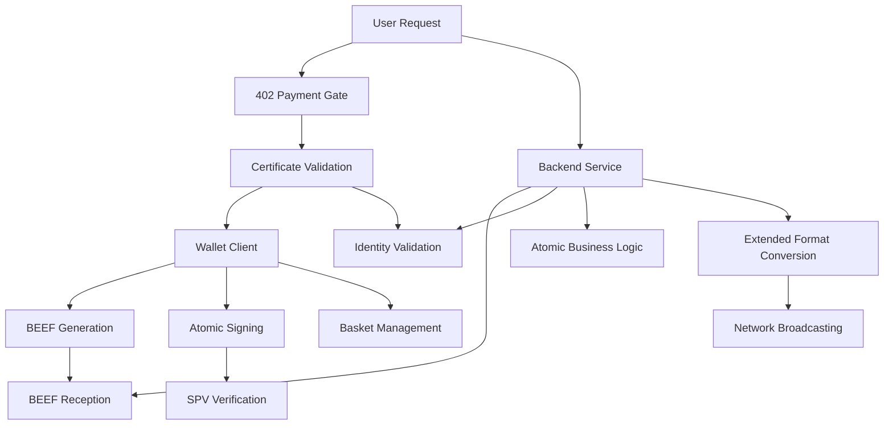

# Module 3: Building Atomic Applications with 402 Payment Gating

Master building applications using BSV's atomic state transaction patterns with BEEF workflow for peer-to-peer transmission, Extended Format for network broadcasting, and 402 micropayment gating for per-request authentication. This module focuses on eliminating coordination complexity through atomic operations while enabling revolutionary per-request monetization.

## 🎯 Learning Objectives

By the end of this module, you'll be able to:
- Build atomic BSV applications that eliminate coordination complexity
- **Implement 402 payment gating for per-request authentication**
- **Create identity-aware atomic applications with certificate validation**
- Implement BEEF workflow for P2P transaction transmission with identity context
- Handle Extended Format conversion for network broadcasting
- Design atomic state transitions that replace distributed coordination
- **Process atomic micropayments with identity accountability**
- Integrate with Topic Managers and Basket Managers for atomic operations
- Process atomic business logic without rollback mechanisms

## 🔄 Atomic Application Architecture

### The Atomic + Identity Advantage

Traditional applications struggle with:
- Complex coordination between multiple services
- Partial failure states requiring rollback logic
- Race conditions and consistency issues
- Expensive distributed transaction protocols
- Session management complexity
- Payment processor integration
- Authentication/authorization overhead

Atomic BSV applications with identity integration eliminate these problems:
- **Single Atomic Operations** - Succeed or fail completely
- **402 Payment Gating** - Per-request micropayment authentication
- **Identity Accountability** - Certificate-based verification without sessions
- **BEEF P2P Transmission** - Direct counterparty communication with identity
- **Extended Format Broadcasting** - Backend converts for network submission
- **SPV Instant Verification** - No waiting for confirmations



## 💳 402 Payment Gating for Per-Request Authentication

### Revolutionary Application Architecture

Replace traditional session-based authentication with per-request micropayment validation:

```typescript
// Traditional session-based approach
// app.use(session({ secret: 'key', resave: false }));
// app.use(passport.initialize());
// app.use(passport.session());

// 402 + Atomic approach
app.use(require402PaymentGate(100)); // 100 satoshis per request
app.use(requireCertificate(['verified_user'])); // Identity validation
```

### 402 Payment Middleware

```typescript
// src/middleware/PaymentGateMiddleware.ts
class PaymentGateMiddleware {
  
  // Require payment for API access
  static requirePayment(satoshisRequired: number = 100) {
    return async (req: any, res: any, next: any) => {
      // Check for payment header
      // const paymentHeader = req.headers['x-bsv-payment'];
      // if (!paymentHeader) {
      //   return res.status(402).json({
      //     error: 'Payment Required',
      //     satoshisRequired: satoshisRequired,
      //     message: 'This endpoint requires micropayment access',
      //     paymentAddress: process.env.PAYMENT_ADDRESS
      //   });
      // }
      
      // Validate atomic payment
      // try {
      //   const payment = JSON.parse(paymentHeader);
      //   const isValid = await this.validateAtomicPayment(payment, satoshisRequired);
      //   if (!isValid) {
      //     return res.status(402).json({
      //       error: 'Invalid Payment',
      //       satoshisRequired: satoshisRequired
      //     });
      //   }
      //
      //   // Payment valid - add to request context
      //   req.payment = payment;
      //   req.paidAmount = satoshisRequired;
      //   next();
      // } catch (error) {
      //   return res.status(400).json({ error: 'Invalid payment format' });
      // }
    };
  }
  
  // Validate BRC-29 atomic payment
  private static async validateAtomicPayment(payment: any, requiredAmount: number) {
    // Parse BEEF payment
    // const beefTx = Transaction.fromHexBEEF(payment.beef);
    
    // Verify SPV proofs instantly
    // const isValid = await beefTx.verify();
    // if (!isValid) return false;
    
    // Check payment amount atomically
    // const outputs = beefTx.outputs;
    // const totalPaid = outputs.reduce((sum, output) => sum + output.satoshis, 0);
    // return totalPaid >= requiredAmount;
  }
}
```

### Identity Certificate Middleware

```typescript
// src/middleware/CertificateMiddleware.ts
class CertificateMiddleware {
  
  // Require identity certificate with specific fields
  static requireCertificate(requiredFields: string[] = []) {
    return async (req: any, res: any, next: any) => {
      // Check for certificate header
      // const certHeader = req.headers['x-identity-certificate'];
      // if (!certHeader) {
      //   return res.status(401).json({
      //     error: 'Identity Certificate Required',
      //     requiredFields: requiredFields,
      //     message: 'This endpoint requires identity verification'
      //   });
      // }
      
      // Validate certificate
      // try {
      //   const certificate = JSON.parse(certHeader);
      //   const validation = await this.validateCertificate(certificate, requiredFields);
      //
      //   if (!validation.isValid) {
      //     return res.status(401).json({
      //       error: 'Invalid Certificate',
      //       reason: validation.reason
      //     });
      //   }
      //
      //   // Certificate valid - add to request context
      //   req.identity = validation.identity;
      //   req.verifiedFields = validation.fields;
      //   next();
      // } catch (error) {
      //   return res.status(400).json({ error: 'Invalid certificate format' });
      // }
    };
  }
  
  // Validate BRC-103 identity certificate
  private static async validateCertificate(certificate: any, requiredFields: string[]) {
    // Verify certificate signature
    // const isSignatureValid = await this.verifyCertificateSignature(certificate);
    // if (!isSignatureValid) {
    //   return { isValid: false, reason: 'Invalid signature' };
    // }
    
    // Check revocation status
    // const isRevoked = await this.checkRevocationStatus(certificate.revocationOutpoint);
    // if (isRevoked) {
    //   return { isValid: false, reason: 'Certificate revoked' };
    // }
    
    // Validate selective disclosure fields
    // const availableFields = await this.getAvailableFields(certificate);
    // const hasRequiredFields = requiredFields.every(field =>
    //   availableFields.includes(field)
    // );
    
    // if (!hasRequiredFields) {
    //   return { isValid: false, reason: 'Missing required fields' };
    // }
    
    // Decrypt field values
    // const fieldValues = {};
    // for (const field of requiredFields) {
    //   fieldValues[field] = await this.decryptField(certificate, field);
    // }
    
    // return {
    //   isValid: true,
    //   identity: certificate.subject,
    //   fields: fieldValues,
    //   certifier: certificate.certifier
    // };
  }
}
```

## �️ Atomic Transaction Creation with Identity

### Basic Atomic Token Operations

```typescript
// Atomic token creation - all-or-nothing operation
async function createAtomicToken() {
  // Connect to BRC-100 compliant wallet
  // const wallet = new WalletClient();
  
  // Create atomic token creation action
  // const response = await wallet.createAction({
  //   description: 'create atomic event ticket',
  //   outputs: [{
  //     satoshis: 1,
  //     lockingScript: Script.fromASM('OP_NOP').toHex(),
  //     basket: 'event-tickets',
  //     outputDescription: 'VIP concert ticket #1234'
  //   }]
  // });
  
  // Wallet returns BEEF format for P2P transmission
  // Contains all SPV data needed for instant verification
  // No coordination with external services required
  // return response.BEEF; // Ready for counterparty transmission
}

// Atomic token redemption - consumes token atomically
async function redeemAtomicToken() {
  // List available tokens from basket
  // const tokens = await wallet.listOutputs({
  //   basket: 'event-tickets',
  //   include: 'entire transactions' // Gets BEEF data for SPV
  // });
  
  // Create atomic redemption transaction
  // const redemption = await wallet.createAction({
  //   description: 'redeem event ticket atomically',
  //   inputBEEF: tokens.BEEF, // SPV data for inputs
  //   inputs: [{
  //     outpoint: tokens.outputs[0].outpoint,
  //     unlockingScript: Script.fromASM('OP_TRUE').toHex(),
  //     inputDescription: 'ticket being redeemed'
  //   }]
  // });
  
  // Token is consumed atomically - no partial states
  // Either redemption succeeds completely or fails completely
  // return redemption.BEEF; // For P2P transmission to venue
}
```

### Atomic Marketplace Operations

```typescript
// Atomic asset purchase - eliminates coordination complexity
async function atomicAssetPurchase() {
  // Get available marketplace assets
  // const assets = await wallet.listOutputs({
  //   basket: 'marketplace-items',
  //   include: 'entire transactions'
  // });
  
  // Create atomic purchase transaction
  // const purchase = await wallet.createAction({
  //   description: 'atomic digital asset purchase',
  //   inputBEEF: assets.BEEF, // Asset being purchased
  //   inputs: [{
  //     outpoint: assets.outputs[0].outpoint,
  //     unlockingScript: purchaseUnlockingScript.toHex(),
  //     inputDescription: 'digital asset being purchased'
  //   }],
  //   outputs: [{
  //     satoshis: assetValue,
  //     lockingScript: buyerOwnershipScript.toHex(),
  //     basket: 'owned-assets',
  //     outputDescription: 'purchased asset ownership'
  //   }, {
  //     satoshis: paymentAmount,
  //     lockingScript: sellerPaymentScript.toHex(),
  //     outputDescription: 'payment to seller'
  //   }]
  // });
  
  // Asset ownership and payment happen atomically
  // No race conditions, no partial failure states
  // No coordination between payment and asset transfer services
  // return purchase.BEEF; // For P2P transmission to seller
}
```

### Atomic Inventory Management

```typescript
// Each inventory item as spendable token eliminates overselling
async function atomicInventoryPurchase() {
  // Inventory items are individual UTXOs in baskets
  // Each item can only be spent once - mathematically impossible to oversell
  // const inventory = await wallet.listOutputs({
  //   basket: 'product-inventory',
  //   filter: { product: 'iPhone_case_model_47' },
  //   include: 'entire transactions'
  // });
  
  // Atomic purchase consumes specific inventory token
  // const sale = await wallet.createAction({
  //   description: 'atomic inventory item purchase',
  //   inputBEEF: inventory.BEEF,
  //   inputs: [{
  //     outpoint: inventory.outputs[0].outpoint, // Specific inventory item
  //     unlockingScript: Script.fromASM('OP_TRUE').toHex(),
  //     inputDescription: 'inventory token consumption'
  //   }],
  //   outputs: [{
  //     satoshis: 1,
  //     lockingScript: customerOwnershipScript.toHex(),
  //     basket: 'customer-purchases',
  //     outputDescription: 'customer ownership token'
  //   }, {
  //     satoshis: purchasePrice,
  //     lockingScript: merchantPaymentScript.toHex(),
  //     outputDescription: 'payment to merchant'
  //   }]
  // });
  
  // Benefits of atomic inventory:
  // - Mathematically impossible to oversell
  // - No cache invalidation needed
  // - No coordination between inventory and payment systems
  // - No race conditions possible
  // return sale.BEEF; // For P2P transmission
}
```

## 🔄 BEEF Processing Backend

### BEEF Reception and Validation

```typescript
// Backend receives BEEF transactions from user applications
// Validates atomically and processes business logic
class AtomicBEEFProcessor {
  
  // Process incoming BEEF transaction from user
  async processBEEFTransaction(beefHex: string) {
    // Parse BEEF format transaction
    // const beefTx = Transaction.fromHexBEEF(beefHex);
    
    // Validate BEEF structure and SPV proofs
    // const isValid = await beefTx.verify(chainTracker);
    // if (!isValid) {
    //   throw new Error('Invalid BEEF transaction');
    // }
    
    // Apply atomic business logic
    // await this.processAtomicBusinessLogic(beefTx);
    
    // Convert BEEF to Extended Format for network broadcasting
    // const extendedFormat = beefTx.toHexEF();
    // await this.broadcastToNetwork(extendedFormat);
    
    // Atomic operation complete - no partial states
    // Either complete success or complete failure
  }
  
  // Apply business logic atomically
  private async processAtomicBusinessLogic(beefTx: Transaction) {
    // Extract transaction details
    // const inputs = beefTx.inputs;
    // const outputs = beefTx.outputs;
    
    // Update topic manager state atomically
    // await this.topicManager.processAtomicUpdate(beefTx);
    
    // Update basket manager allocations atomically
    // await this.basketManager.processAtomicTransfer(beefTx);
    
    // Apply any additional business rules atomically
    // All updates succeed or all fail - no coordination needed
  }
  
  // Convert BEEF to Extended Format and broadcast to BSV network
  private async broadcastToNetwork(extendedFormatHex: string) {
    // Extended Format includes previous locking scripts and satoshi amounts
    // Enables broadcast services to validate without node RPC calls
    // const broadcastService = new BroadcastService();
    // const result = await broadcastService.submit(extendedFormatHex);
    
    // Network propagation via standard BSV protocol
    // return result.txid;
  }
}
```

### Topic Manager Integration

```typescript
// Topic Manager handles atomic operations with shared context
class AtomicTopicManager {
  
  // Process atomic state transitions for specific topics
  async processAtomicTopicUpdate(beefTx: Transaction, topic: string) {
    // Validate transaction is relevant to topic
    // const isRelevant = await this.validateTopicRelevance(beefTx, topic);
    // if (!isRelevant) return;
    
    // Apply atomic state transition
    // const currentState = await this.getTopicState(topic);
    // const newState = this.calculateNewState(currentState, beefTx);
    
    // Update topic state atomically
    // await this.updateTopicState(topic, newState);
    
    // Notify subscribers of atomic state change
    // await this.notifySubscribers(topic, newState);
    
    // All operations succeed or fail together
    // No coordination complexity between state update and notifications
  }
  
  // Calculate new state based on atomic transaction
  private calculateNewState(currentState: any, beefTx: Transaction) {
    // Apply transaction effects to current state
    // This is pure computation - no side effects
    // Return new state that will be applied atomically
  }
}
```

### Basket Manager Integration

```typescript
// Basket Manager organizes UTXOs for atomic operations
class AtomicBasketManager {
  
  // Process atomic transfers between baskets
  async processAtomicBasketTransfer(beefTx: Transaction) {
    // Extract basket operations from transaction
    // const basketOps = this.extractBasketOperations(beefTx);
    
    // Apply all basket changes atomically
    // for (const op of basketOps) {
    //   switch (op.type) {
    //     case 'move':
    //       await this.moveTokenBetweenBaskets(op.token, op.fromBasket, op.toBasket);
    //       break;
    //     case 'create':
    //       await this.addTokenToBasket(op.token, op.basket);
    //       break;
    //     case 'consume':
    //       await this.removeTokenFromBasket(op.token, op.basket);
    //       break;
    //   }
    // }
    
    // All basket operations succeed or fail together
    // No partial basket states possible
  }
  
  // Organize tokens for atomic operations
  async organizeForAtomicOperation(requiredTokens: string[]) {
    // Group tokens by basket for efficient atomic operations
    // const tokensByBasket = await this.groupTokensByBasket(requiredTokens);
    
    // Prepare BEEF data for atomic transaction creation
    // const beefData = await this.prepareBEEFForTokens(tokensByBasket);
    
    // Return organized data for atomic transaction
    // return beefData;
  }
}
```

## 🎯 Atomic Application Patterns

### Atomic Multi-Party Operations

```typescript
// Complex atomic operations involving multiple parties
async function atomicMultiPartyTransaction() {
  // Collect BEEF data from all parties
  // const manufacturerBEEF = await getManufacturerBEEF();
  // const distributorBEEF = await getDistributorBEEF();
  // const retailerBEEF = await getRetailerBEEF();
  
  // Create atomic multi-party transaction
  // const multiPartyTx = await wallet.createAction({
  //   description: 'atomic supply chain transfer',
  //   inputBEEF: [manufacturerBEEF, distributorBEEF, retailerBEEF],
  //   inputs: [
  //     { outpoint: manufacturerOutput, /* manufacturer input */ },
  //     { outpoint: distributorOutput, /* distributor input */ },
  //     { outpoint: retailerOutput, /* retailer input */ }
  //   ],
  //   outputs: [
  //     { /* updated manufacturer state */ },
  //     { /* updated distributor state */ },
  //     { /* updated retailer state */ }
  //   ]
  // });
  
  // All parties' state transitions happen atomically
  // No coordination protocols needed
  // No rollback mechanisms required
  // BEEF enables efficient P2P transmission between parties
}
```

### Atomic Event Processing

```typescript
// Process events atomically without coordination complexity
class AtomicEventProcessor {
  
  // Process event atomically
  async processAtomicEvent(eventBEEF: string) {
    // Parse event transaction
    // const eventTx = Transaction.fromHexBEEF(eventBEEF);
    
    // Validate event structure
    // const isValid = await this.validateEventStructure(eventTx);
    // if (!isValid) throw new Error('Invalid event structure');
    
    // Apply all event effects atomically
    // await this.applyEventEffects(eventTx);
    
    // Update all related systems atomically
    // await this.updateRelatedSystems(eventTx);
    
    // Broadcast to network via Extended Format
    // const extendedFormat = eventTx.toHexEF();
    // await this.broadcastToNetwork(extendedFormat);
    
    // Event processing complete - all effects applied atomically
  }
  
  // Apply all event effects in single atomic operation
  private async applyEventEffects(eventTx: Transaction) {
    // Extract event data from transaction
    // const eventData = this.extractEventData(eventTx);
    
    // Apply effects based on event type
    // switch (eventData.type) {
    //   case 'user-registration':
    //     await this.processUserRegistration(eventData);
    //     break;
    //   case 'asset-transfer':
    //     await this.processAssetTransfer(eventData);
    //     break;
    //   case 'contract-execution':
    //     await this.processContractExecution(eventData);
    //     break;
    // }
    
    // All effects applied atomically - no partial processing
  }
}
```

## 🔧 Atomic Error Handling

### All-or-Nothing Error Patterns

```typescript
// Atomic error handling - no partial failure states
class AtomicErrorHandler {
  
  // Handle atomic operation errors
  async handleAtomicOperation(operation: () => Promise<any>) {
    try {
      // Attempt atomic operation
      // const result = await operation();
      
      // Operation succeeded completely
      // return { success: true, result };
      
    } catch (error) {
      // Operation failed completely
      // No partial state to clean up
      // No rollback logic needed
      // return { success: false, error: error.message };
    }
    
    // Benefits of atomic error handling:
    // - No complex rollback logic
    // - No partial failure states
    // - No coordination between error handling systems
    // - Simple success/failure semantics
  }
  
  // Validate atomic transaction before processing
  async validateAtomicTransaction(beefHex: string): Promise<boolean> {
    try {
      // Parse BEEF transaction
      // const beefTx = Transaction.fromHexBEEF(beefHex);
      
      // Validate SPV proofs
      // const spvValid = await beefTx.verify(chainTracker);
      // if (!spvValid) return false;
      
      // Validate business rules
      // const businessValid = await this.validateBusinessRules(beefTx);
      // if (!businessValid) return false;
      
      // Validate atomic constraints
      // const atomicValid = await this.validateAtomicConstraints(beefTx);
      // return atomicValid;
      
    } catch (error) {
      // Any validation error means transaction is invalid
      // return false;
    }
  }
}
```

## 🎓 Assessment and Exercises

### Knowledge Check

1. **Atomic vs Coordinated**: Explain how atomic transactions eliminate the need for distributed coordination protocols.

2. **BEEF Workflow**: Describe the flow from BEEF generation to Extended Format broadcasting.

3. **Error Handling**: How does atomic error handling differ from traditional distributed system error handling?

4. **State Management**: Why don't atomic applications need complex state management or rollback mechanisms?

### Hands-on Exercises

#### Exercise 1: Atomic Token System
Build an atomic token creation and redemption system:
- Create tokens atomically using wallet API
- Implement atomic redemption logic
- Handle BEEF transmission between parties
- Process Extended Format broadcasting

#### Exercise 2: Atomic Marketplace
Implement an atomic marketplace:
- Atomic asset listing and purchasing
- Eliminate coordination between payment and asset transfer
- Handle inventory as spendable tokens
- Process multi-party atomic transactions

#### Exercise 3: Atomic Event Processing
Build an atomic event processing system:
- Receive events via BEEF format
- Process all event effects atomically
- Update multiple systems without coordination
- Handle error cases with atomic semantics

### Success Criteria

- ✅ Understand atomic transaction benefits over coordination
- ✅ Implement BEEF workflow for P2P transmission
- ✅ Handle Extended Format conversion for network broadcasting
- ✅ Build applications without coordination complexity
- ✅ Process atomic business logic without rollback mechanisms
- ✅ Integrate with Topic and Basket Managers atomically

## 🔗 Next Steps

Continue to [Module 4: Distributed Architecture](../04-distributed-architecture/README.md) to learn how atomic transactions scale across distributed systems while maintaining their atomic properties.

### Key Takeaways

- **Atomic Operations** eliminate coordination complexity
- **BEEF Workflow** enables efficient P2P transmission
- **Extended Format** handles network broadcasting
- **SPV Verification** provides instant validation
- **Error Handling** becomes simple with atomic semantics
- **State Management** is eliminated through atomic transitions

---

**Ready to eliminate coordination complexity?** Master atomic application patterns and build systems that are fundamentally simpler and more reliable than traditional distributed architectures.
