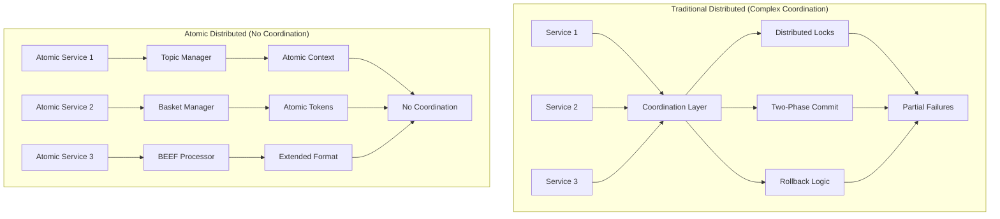

# Module 4: Atomic Distributed Architecture with Identity Federation

Master distributed atomic operations across BSV systems while maintaining atomic properties and identity accountability. This module teaches you to implement Topic Managers for atomic shared context, Basket Managers for atomic token organization, Extended Format broadcasting for network integration, and identity-aware distributed systems.

## 🎯 Learning Objectives

By the end of this module, you'll be able to:
- Implement Topic Managers for atomic operations with shared context
- Use Basket Managers for atomic token organization and management
- **Build identity-aware distributed systems with certificate federation**
- **Implement multi-party atomic operations with identity verification**
- Handle Extended Format conversion and network broadcasting
- Design distributed atomic systems that eliminate coordination complexity
- **Create identity-federated atomic systems across organizations**
- Build scalable atomic operations across multiple services
- Create resilient atomic systems using BSV infrastructure

## 🔄 Atomic Distributed Architecture

### Traditional vs. Atomic Distributed Systems



**Atomic Distributed Benefits:**
- **No Coordination Protocols** - Atomic operations eliminate distributed coordination
- **BEEF P2P Transmission** - Direct counterparty communication
- **Extended Format Broadcasting** - Backend handles network submission
- **Atomic Context Sharing** - Topic Managers provide atomic shared state

## 🎯 Topic Manager for Atomic Operations

Topic Managers handle atomic operations with shared context while maintaining atomic properties.

### Atomic Topic Management

```typescript
// Atomic Topic Manager - handles atomic operations with shared context
class AtomicTopicManager {
  
  // Process atomic topic updates
  async processAtomicTopicUpdate(beefHex: string, topic: string) {
    // Parse BEEF transaction
    // const beefTx = Transaction.fromHexBEEF(beefHex);
    
    // Validate BEEF structure and SPV proofs
    // const isValid = await beefTx.verify(this.chainTracker);
    // if (!isValid) {
    //   throw new Error('Invalid BEEF transaction for topic update');
    // }
    
    // Check if transaction is relevant to topic
    // const isRelevant = await this.validateTopicRelevance(beefTx, topic);
    // if (!isRelevant) return;
    
    // Apply atomic state transition for topic
    // await this.applyAtomicTopicTransition(beefTx, topic);
    
    // Notify subscribers of atomic state change
    // await this.notifyAtomicSubscribers(topic, beefTx);
    
    // Convert to Extended Format for network broadcasting
    // const extendedFormat = beefTx.toHexEF();
    // await this.broadcastToNetwork(extendedFormat);
    
    // All operations succeed or fail atomically
  }
  
  // Apply atomic state transition for topic
  private async applyAtomicTopicTransition(beefTx: Transaction, topic: string) {
    // Get current topic state
    // const currentState = await this.getTopicState(topic);
    
    // Calculate new state based on atomic transaction
    // const newState = this.calculateAtomicStateTransition(currentState, beefTx);
    
    // Apply new state atomically
    // await this.setTopicState(topic, newState);
    
    // State transition is atomic - no partial updates
    // Either complete success or complete failure
  }
  
  // Subscribe to atomic topic updates
  async subscribeToAtomicTopic(topic: string, callback: AtomicTopicCallback) {
    // Register callback for atomic topic updates
    // const subscription = {
    //   topic: topic,
    //   callback: callback,
    //   atomicOnly: true // Only atomic operations
    // };
    
    // Add to subscription list
    // this.subscriptions.set(topic, subscription);
    
    // Callback will be invoked for each atomic topic update
    // No partial state updates - only complete atomic transitions
  }
  
  // Get current atomic topic state
  async getAtomicTopicState(topic: string) {
    // Retrieve current atomic state for topic
    // const state = await this.topicStateStore.get(topic);
    
    // State is always consistent due to atomic updates
    // No coordination needed to read state
    // return state;
  }
}
```

### Atomic Multi-Topic Operations

```typescript
// Handle atomic operations across multiple topics
class AtomicMultiTopicManager {
  
  // Process atomic operation affecting multiple topics
  async processMultiTopicAtomicOperation(beefHex: string, topics: string[]) {
    // Parse BEEF transaction
    // const beefTx = Transaction.fromHexBEEF(beefHex);
    
    // Validate BEEF for all affected topics
    // for (const topic of topics) {
    //   const isRelevant = await this.validateTopicRelevance(beefTx, topic);
    //   if (!isRelevant) {
    //     throw new Error(`Transaction not relevant to topic: ${topic}`);
    //   }
    // }
    
    // Apply atomic state transitions to all topics
    // const stateTransitions = [];
    // for (const topic of topics) {
    //   const currentState = await this.getTopicState(topic);
    //   const newState = this.calculateStateTransition(currentState, beefTx);
    //   stateTransitions.push({ topic, newState });
    // }
    
    // Apply all state transitions atomically
    // await this.applyAtomicMultiTopicTransitions(stateTransitions);
    
    // Notify all topic subscribers atomically
    // await this.notifyMultiTopicSubscribers(topics, beefTx);
    
    // All topics updated atomically - no coordination needed
  }
  
  // Apply atomic transitions to multiple topics
  private async applyAtomicMultiTopicTransitions(transitions: TopicTransition[]) {
    // All topic state transitions happen atomically
    // Either all succeed or all fail
    // for (const transition of transitions) {
    //   await this.setTopicState(transition.topic, transition.newState);
    // }
    
    // No coordination protocols needed
    // Atomic semantics handle consistency
  }
}
```

## 🗂️ Basket Manager for Atomic Token Operations

Basket Managers organize tokens for atomic operations while maintaining atomic properties.

### Atomic Basket Management

```typescript
// Atomic Basket Manager - organizes tokens for atomic operations
class AtomicBasketManager {
  
  // Process atomic basket operations
  async processAtomicBasketOperation(beefHex: string) {
    // Parse BEEF transaction
    // const beefTx = Transaction.fromHexBEEF(beefHex);
    
    // Extract basket operations from transaction
    // const basketOps = this.extractBasketOperations(beefTx);
    
    // Validate all basket operations
    // for (const op of basketOps) {
    //   await this.validateBasketOperation(op);
    // }
    
    // Apply all basket operations atomically
    // await this.applyAtomicBasketOperations(basketOps);
    
    // Update basket indices atomically
    // await this.updateBasketIndices(basketOps);
    
    // All basket operations succeed or fail together
  }
  
  // Apply atomic basket operations
  private async applyAtomicBasketOperations(operations: BasketOperation[]) {
    // Process all basket operations atomically
    // for (const op of operations) {
    //   switch (op.type) {
    //     case 'move':
    //       await this.moveTokenBetweenBaskets(op.token, op.fromBasket, op.toBasket);
    //       break;
    //     case 'create':
    //       await this.addTokenToBasket(op.token, op.basket);
    //       break;
    //     case 'consume':
    //       await this.removeTokenFromBasket(op.token, op.basket);
    //       break;
    //   }
    // }
    
    // All operations succeed or fail together
    // No partial basket states possible
  }
  
  // Organize tokens for atomic operations
  async organizeForAtomicOperation(requiredTokens: TokenRequirement[]) {
    // Group tokens by basket for efficient atomic operations
    // const tokensByBasket = new Map<string, Token[]>();
    
    // for (const requirement of requiredTokens) {
    //   const tokens = await this.getTokensFromBasket(
    //     requirement.basket, 
    //     requirement.filter
    //   );
    //   tokensByBasket.set(requirement.basket, tokens);
    // }
    
    // Prepare BEEF data for atomic transaction creation
    // const beefData = await this.prepareBEEFForTokens(tokensByBasket);
    
    // Return organized data for atomic transaction
    // return {
    //   tokensByBasket: tokensByBasket,
    //   beefData: beefData,
    //   totalTokens: this.countTotalTokens(tokensByBasket)
    // };
  }
  
  // Atomic inventory management using baskets
  async manageInventoryAtomically(inventoryOperation: InventoryOperation) {
    // Each inventory item is a token in a basket
    // Atomic operations prevent overselling mathematically
    
    // Get available inventory tokens
    // const availableTokens = await this.getTokensFromBasket(
    //   inventoryOperation.productBasket,
    //   { available: true }
    // );
    
    // if (availableTokens.length < inventoryOperation.quantity) {
    //   throw new Error('Insufficient inventory');
    // }
    
    // Select tokens for atomic consumption
    // const tokensToConsume = availableTokens.slice(0, inventoryOperation.quantity);
    
    // Create atomic inventory transaction
    // const inventoryBEEF = await this.createInventoryBEEF(tokensToConsume);
    
    // Return BEEF for atomic inventory operation
    // return inventoryBEEF;
  }
}
```

### Atomic Cross-Basket Operations

```typescript
// Handle atomic operations across multiple baskets
class AtomicCrossBasketManager {
  
  // Atomic operation involving multiple baskets
  async processAtomicCrossBasketOperation(operation: CrossBasketOperation) {
    // Validate operation affects multiple baskets atomically
    // const affectedBaskets = operation.baskets;
    // for (const basket of affectedBaskets) {
    //   await this.validateBasketAccess(basket);
    // }
    
    // Prepare tokens from all baskets
    // const basketTokens = new Map<string, Token[]>();
    // for (const basket of affectedBaskets) {
    //   const tokens = await this.getTokensFromBasket(basket, operation.filters[basket]);
    //   basketTokens.set(basket, tokens);
    // }
    
    // Create atomic cross-basket transaction
    // const crossBasketBEEF = await this.createCrossBasketBEEF(basketTokens, operation);
    
    // Process atomic cross-basket operation
    // await this.processAtomicBasketOperation(crossBasketBEEF);
    
    // All baskets updated atomically
    // No coordination between basket operations needed
  }
  
  // Atomic marketplace using cross-basket operations
  async atomicMarketplaceOperation(marketplaceOp: MarketplaceOperation) {
    // Atomic asset purchase across baskets
    // - Asset moves from seller basket to buyer basket
    // - Payment moves from buyer basket to seller basket
    // - All happens atomically - no coordination needed
    
    // Prepare cross-basket operation
    // const crossBasketOp = {
    //   baskets: [marketplaceOp.sellerBasket, marketplaceOp.buyerBasket],
    //   operations: [
    //     { type: 'move', asset: marketplaceOp.asset, from: 'seller', to: 'buyer' },
    //     { type: 'move', payment: marketplaceOp.payment, from: 'buyer', to: 'seller' }
    //   ]
    // };
    
    // Execute atomic cross-basket operation
    // await this.processAtomicCrossBasketOperation(crossBasketOp);
    
    // Asset ownership and payment transfer completed atomically
  }
}
```

## 🌐 Extended Format Broadcasting

Handle conversion from BEEF to Extended Format for network broadcasting.

### Extended Format Service

```typescript
// Extended Format broadcasting service
class ExtendedFormatBroadcastService {
  
  // Convert BEEF to Extended Format and broadcast
  async broadcastBEEFToNetwork(beefHex: string) {
    // Parse BEEF transaction
    // const beefTx = Transaction.fromHexBEEF(beefHex);
    
    // Validate BEEF structure before conversion
    // const isValid = await beefTx.verify(this.chainTracker);
    // if (!isValid) {
    //   throw new Error('Invalid BEEF transaction - cannot broadcast');
    // }
    
    // Convert BEEF to Extended Format
    // const extendedFormat = beefTx.toHexEF();
    
    // Extended Format includes:
    // - Previous locking scripts for all inputs
    // - Satoshi amounts for all inputs
    // - EF marker (0000000000EF) for identification
    
    // Broadcast Extended Format to BSV network
    // const broadcastResult = await this.submitToNetwork(extendedFormat);
    
    // Return broadcast result
    // return {
    //   txid: broadcastResult.txid,
    //   status: broadcastResult.status,
    //   extendedFormat: extendedFormat
    // };
  }
  
  // Submit Extended Format to BSV network
  private async submitToNetwork(extendedFormatHex: string) {
    // Extended Format enables broadcast services to validate
    // without contacting BSV nodes for UTXO lookups
    
    // Submit to broadcast service
    // const broadcaster = new BSVBroadcastService();
    // const result = await broadcaster.submit({
    //   transaction: extendedFormatHex,
    //   format: 'extended'
    // });
    
    // Broadcast service can validate immediately
    // No node RPC calls needed for validation
    // return result;
  }
  
  // Batch broadcast multiple BEEF transactions
  async batchBroadcastBEEF(beefTransactions: string[]) {
    // Convert all BEEF transactions to Extended Format
    // const extendedFormatTxs = [];
    // for (const beefHex of beefTransactions) {
    //   const beefTx = Transaction.fromHexBEEF(beefHex);
    //   const extendedFormat = beefTx.toHexEF();
    //   extendedFormatTxs.push(extendedFormat);
    // }
    
    // Batch broadcast all Extended Format transactions
    // const batchResult = await this.batchSubmitToNetwork(extendedFormatTxs);
    
    // All transactions broadcast atomically as a batch
    // return batchResult;
  }
}
```

## 🔄 Atomic Distributed Patterns

### Atomic Event Processing Across Services

```typescript
// Process events atomically across distributed services
class AtomicDistributedEventProcessor {
  
  // Process atomic event across multiple services
  async processAtomicDistributedEvent(eventBEEF: string) {
    // Parse event BEEF transaction
    // const eventTx = Transaction.fromHexBEEF(eventBEEF);
    
    // Determine affected services based on event
    // const affectedServices = this.determineAffectedServices(eventTx);
    
    // Process event atomically across all services
    // const serviceResults = [];
    // for (const service of affectedServices) {
    //   const result = await service.processAtomicEvent(eventTx);
    //   serviceResults.push(result);
    // }
    
    // Update Topic Managers atomically
    // await this.updateTopicManagersAtomically(eventTx, affectedServices);
    
    // Update Basket Managers atomically
    // await this.updateBasketManagersAtomically(eventTx, affectedServices);
    
    // Broadcast to network via Extended Format
    // const extendedFormat = eventTx.toHexEF();
    // await this.broadcastToNetwork(extendedFormat);
    
    // All services updated atomically - no coordination protocols
  }
  
  // Atomic supply chain processing
  async processAtomicSupplyChain(supplyChainBEEF: string) {
    // Parse supply chain BEEF transaction
    // const supplyChainTx = Transaction.fromHexBEEF(supplyChainBEEF);
    
    // Extract supply chain participants
    // const participants = this.extractParticipants(supplyChainTx);
    
    // Process atomic state transitions for all participants
    // for (const participant of participants) {
    //   await this.topicManager.processAtomicTopicUpdate(
    //     supplyChainBEEF, 
    //     participant.topic
    //   );
    //   await this.basketManager.processAtomicBasketOperation(
    //     supplyChainBEEF
    //   );
    // }
    
    // All participant states updated atomically
    // No coordination between participants needed
    // Supply chain state transitions happen atomically
  }
}
```

## 🎓 Assessment and Exercises

### Knowledge Check

1. **Atomic Distribution**: How do atomic operations scale across distributed systems?
2. **Topic Managers**: How do Topic Managers maintain atomic properties?
3. **Basket Managers**: How do baskets organize tokens for atomic operations?
4. **Extended Format**: Why is Extended Format needed for network broadcasting?

### Hands-on Exercises

#### Exercise 1: Atomic Topic Management
Build atomic topic management system:
- Implement Topic Manager for atomic context sharing
- Handle atomic state transitions across topics
- Process BEEF transactions with topic relevance
- Maintain atomic properties in distributed context

#### Exercise 2: Atomic Basket Operations
Create atomic basket management:
- Organize tokens in baskets for atomic operations
- Implement cross-basket atomic transactions
- Handle atomic inventory management
- Prevent overselling through atomic token consumption

#### Exercise 3: Distributed Atomic System
Build complete distributed atomic system:
- Integrate Topic and Basket Managers
- Handle BEEF processing across services
- Convert to Extended Format for broadcasting
- Maintain atomic properties across distribution

### Success Criteria

- ✅ Topic Managers processing atomic operations with shared context
- ✅ Basket Managers organizing tokens for atomic operations
- ✅ Extended Format broadcasting working correctly
- ✅ Distributed atomic operations maintaining atomic properties
- ✅ No coordination protocols needed between services
- ✅ BEEF workflow operational across distributed architecture

## 🔗 Next Steps

Continue to [Module 5: Production Deployment](../05-production-deployment/README.md) to learn how to deploy atomic distributed systems to production using LARS standardization.

### Key Takeaways

- **Topic Managers** enable atomic operations with shared context
- **Basket Managers** organize tokens for atomic operations
- **Extended Format** handles network broadcasting requirements
- **Atomic Distribution** eliminates coordination complexity
- **BEEF Workflow** scales across distributed systems
- **No Coordination** needed between distributed atomic services

---

**Ready for atomic distribution?** You now understand how to build distributed systems that maintain atomic properties without coordination complexity!