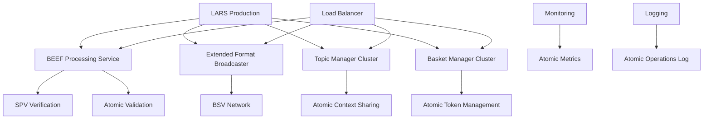

# Module 5: Atomic Production Deployment with Identity Infrastructure

Deploy atomic BSV applications to production using LARS standardization with BEEF processing, Extended Format broadcasting, identity certificate validation infrastructure, and atomic operation scaling. This module teaches you to deploy atomic systems with identity accountability that maintain their atomic properties at production scale.

## 🎯 Learning Objectives

By the end of this module, you'll be able to:
- Deploy atomic BSV applications using LARS production patterns
- **Configure identity certificate validation infrastructure for production**
- **Implement production-grade 402 payment gating systems**
- Configure BEEF processing infrastructure for production scale
- Implement Extended Format broadcasting services
- **Set up certificate revocation monitoring and compliance systems**
- Set up atomic operation monitoring and observability
- Handle atomic system scaling and performance optimization
- **Maintain identity accountability in production environments**
- Maintain atomic properties in production environments

## 🚀 LARS Production Architecture

LARS provides standardized deployment patterns for atomic BSV applications with enterprise-grade atomic operation support.

### Atomic Production Architecture



### Key Atomic Production Features

- **BEEF Processing Scale** - High-throughput BEEF transaction processing
- **Extended Format Broadcasting** - Reliable network submission
- **Atomic Operation Monitoring** - Observability for atomic systems
- **Topic/Basket Manager Clustering** - Scalable atomic context management
- **SPV Verification Infrastructure** - Instant validation at scale

## 🛠️ Setting Up Atomic Production Environment

### LARS Production Configuration

```typescript
// lars.production.config.ts - Production configuration for atomic operations
export default {
  // Atomic production settings
  atomic: {
    beefProcessing: {
      enabled: true,
      maxConcurrentTransactions: 1000,
      validationTimeout: 5000,
      spvVerification: true
    },
    
    extendedFormatBroadcasting: {
      enabled: true,
      batchSize: 100,
      retryAttempts: 3,
      networkEndpoints: ['mainnet-1', 'mainnet-2']
    },
    
    topicManager: {
      clustering: true,
      replication: 3,
      atomicConsistency: 'strong'
    },
    
    basketManager: {
      clustering: true,
      tokenIndexing: true,
      atomicOperations: true
    }
  },
  
  // Production infrastructure
  infrastructure: {
    containerOrchestration: 'kubernetes',
    loadBalancing: true,
    autoScaling: {
      enabled: true,
      minReplicas: 3,
      maxReplicas: 100,
      targetCPU: 70
    }
  },
  
  // Monitoring and observability
  monitoring: {
    atomicMetrics: true,
    beefProcessingMetrics: true,
    extendedFormatMetrics: true,
    alerting: {
      atomicOperationFailures: true,
      beefValidationErrors: true,
      networkBroadcastFailures: true
    }
  }
};
```

### Production BEEF Processing Service

```typescript
// Production BEEF processing service with high availability
class ProductionBEEFProcessor {
  
  // High-throughput BEEF processing
  async processProductionBEEF(beefHex: string) {
    // Parse BEEF with production validation
    // const beefTx = Transaction.fromHexBEEF(beefHex);
    
    // Production SPV verification with caching
    // const isValid = await this.productionSPVVerification(beefTx);
    // if (!isValid) {
    //   await this.logValidationFailure(beefTx);
    //   throw new Error('Production BEEF validation failed');
    // }
    
    // Process atomic business logic with monitoring
    // const startTime = Date.now();
    // await this.processAtomicLogicWithMetrics(beefTx);
    // const processingTime = Date.now() - startTime;
    // await this.recordProcessingMetrics(processingTime);
    
    // Convert to Extended Format with production reliability
    // const extendedFormat = beefTx.toHexEF();
    // await this.productionBroadcast(extendedFormat);
    
    // Log successful atomic operation
    // await this.logAtomicOperationSuccess(beefTx);
  }
  
  // Production SPV verification with caching and redundancy
  private async productionSPVVerification(beefTx: Transaction) {
    // Check SPV cache first for performance
    // const cacheKey = this.generateSPVCacheKey(beefTx);
    // const cachedResult = await this.spvCache.get(cacheKey);
    // if (cachedResult !== null) {
    //   return cachedResult;
    // }
    
    // Verify with multiple chain trackers for redundancy
    // const verificationResults = await Promise.all([
    //   this.primaryChainTracker.verify(beefTx),
    //   this.secondaryChainTracker.verify(beefTx),
    //   this.tertiaryChainTracker.verify(beefTx)
    // ]);
    
    // Require majority consensus for production safety
    // const validCount = verificationResults.filter(r => r).length;
    // const isValid = validCount >= 2;
    
    // Cache result for performance
    // await this.spvCache.set(cacheKey, isValid, 300); // 5 minute cache
    
    // return isValid;
  }
  
  // Production Extended Format broadcasting with reliability
  private async productionBroadcast(extendedFormatHex: string) {
    // Broadcast to multiple endpoints for reliability
    // const broadcastPromises = this.networkEndpoints.map(endpoint => 
    //   this.broadcastToEndpoint(endpoint, extendedFormatHex)
    // );
    
    // Require at least one successful broadcast
    // const results = await Promise.allSettled(broadcastPromises);
    // const successCount = results.filter(r => r.status === 'fulfilled').length;
    
    // if (successCount === 0) {
    //   throw new Error('All network broadcasts failed');
    // }
    
    // Log broadcast results
    // await this.logBroadcastResults(results);
  }
}
```

### Production Topic Manager Cluster

```typescript
// Production Topic Manager with clustering and high availability
class ProductionTopicManagerCluster {
  
  // Process atomic topic updates in production cluster
  async processAtomicTopicUpdateProduction(beefHex: string, topic: string) {
    // Distribute processing across cluster nodes
    // const clusterNode = await this.selectOptimalNode(topic);
    
    // Process with production monitoring
    // const processingStart = Date.now();
    // await clusterNode.processAtomicTopicUpdate(beefHex, topic);
    // const processingTime = Date.now() - processingStart;
    
    // Replicate to other cluster nodes for consistency
    // await this.replicateToClusterNodes(beefHex, topic, clusterNode);
    
    // Record production metrics
    // await this.recordTopicProcessingMetrics(topic, processingTime);
    
    // Verify atomic consistency across cluster
    // await this.verifyClusterConsistency(topic);
  }
  
  // Production topic state management with clustering
  async getProductionTopicState(topic: string) {
    // Get state from primary cluster node
    // const primaryNode = await this.getPrimaryNodeForTopic(topic);
    // const primaryState = await primaryNode.getTopicState(topic);
    
    // Verify consistency with replica nodes
    // const replicaNodes = await this.getReplicaNodesForTopic(topic);
    // const replicaStates = await Promise.all(
    //   replicaNodes.map(node => node.getTopicState(topic))
    // );
    
    // Ensure atomic consistency across cluster
    // const isConsistent = this.verifyStateConsistency(primaryState, replicaStates);
    // if (!isConsistent) {
    //   await this.triggerConsistencyRepair(topic);
    //   throw new Error('Topic state inconsistency detected');
    // }
    
    // return primaryState;
  }
  
  // Production scaling for topic management
  async scaleTopicProcessing(topic: string, load: number) {
    // Determine optimal cluster size based on load
    // const optimalNodes = this.calculateOptimalNodeCount(load);
    // const currentNodes = await this.getCurrentNodeCount(topic);
    
    // Scale up if needed
    // if (optimalNodes > currentNodes) {
    //   await this.scaleUpTopicNodes(topic, optimalNodes - currentNodes);
    // }
    
    // Scale down if needed
    // if (optimalNodes < currentNodes) {
    //   await this.scaleDownTopicNodes(topic, currentNodes - optimalNodes);
    // }
    
    // Maintain atomic properties during scaling
    // await this.verifyAtomicPropertiesDuringScaling(topic);
  }
}
```

### Production Basket Manager Cluster

```typescript
// Production Basket Manager with clustering and atomic guarantees
class ProductionBasketManagerCluster {
  
  // Production atomic basket operations with clustering
  async processProductionBasketOperation(beefHex: string) {
    // Parse BEEF for basket operations
    // const beefTx = Transaction.fromHexBEEF(beefHex);
    // const basketOps = this.extractBasketOperations(beefTx);
    
    // Distribute operations across cluster nodes
    // const nodeAssignments = await this.assignOperationsToNodes(basketOps);
    
    // Process operations atomically across cluster
    // const operationPromises = nodeAssignments.map(assignment => 
    //   assignment.node.processAtomicBasketOperations(assignment.operations)
    // );
    
    // Ensure all operations succeed or all fail
    // const results = await Promise.allSettled(operationPromises);
    // const failedOperations = results.filter(r => r.status === 'rejected');
    
    // if (failedOperations.length > 0) {
    //   // Rollback any successful operations to maintain atomicity
    //   await this.rollbackSuccessfulOperations(results);
    //   throw new Error('Atomic basket operation failed - all operations rolled back');
    // }
    
    // Verify atomic consistency across cluster
    // await this.verifyBasketConsistencyAcrossCluster(basketOps);
  }
  
  // Production inventory management with atomic guarantees
  async manageProductionInventory(inventoryOperation: InventoryOperation) {
    // Get inventory tokens from clustered baskets
    // const clusterNodes = await this.getInventoryClusterNodes(inventoryOperation.productId);
    // const inventoryTokens = await this.getDistributedInventoryTokens(clusterNodes);
    
    // Ensure atomic inventory operations across cluster
    // const atomicInventoryLock = await this.acquireAtomicInventoryLock(inventoryOperation.productId);
    
    // try {
    //   // Process inventory operation atomically
    //   const inventoryBEEF = await this.createAtomicInventoryBEEF(inventoryTokens, inventoryOperation);
    //   await this.processProductionBasketOperation(inventoryBEEF);
    //   
    //   // Verify inventory consistency
    //   await this.verifyInventoryConsistency(inventoryOperation.productId);
    //   
    // } finally {
    //   // Release atomic lock
    //   await this.releaseAtomicInventoryLock(atomicInventoryLock);
    // }
    
    // Inventory operation completed atomically across cluster
  }
}
```

## 📊 Production Monitoring and Observability

### Atomic Operation Metrics

```typescript
// Production monitoring for atomic operations
class AtomicProductionMonitoring {
  
  // Monitor BEEF processing performance
  async monitorBEEFProcessing() {
    // Track BEEF processing metrics
    // const metrics = {
    //   beefTransactionsPerSecond: await this.getBEEFThroughput(),
    //   averageProcessingTime: await this.getAverageProcessingTime(),
    //   spvVerificationTime: await this.getSPVVerificationTime(),
    //   validationFailureRate: await this.getValidationFailureRate(),
    //   atomicOperationSuccessRate: await this.getAtomicSuccessRate()
    // };
    
    // Alert on performance degradation
    // if (metrics.averageProcessingTime > 5000) {
    //   await this.alertSlowBEEFProcessing(metrics);
    // }
    
    // if (metrics.validationFailureRate > 0.01) {
    //   await this.alertHighValidationFailures(metrics);
    // }
    
    // Record metrics for analysis
    // await this.recordProductionMetrics(metrics);
  }
  
  // Monitor Extended Format broadcasting
  async monitorExtendedFormatBroadcasting() {
    // Track broadcasting metrics
    // const broadcastMetrics = {
    //   broadcastsPerSecond: await this.getBroadcastThroughput(),
    //   networkAcceptanceRate: await this.getNetworkAcceptanceRate(),
    //   broadcastLatency: await this.getBroadcastLatency(),
    //   failedBroadcasts: await this.getFailedBroadcastCount()
    // };
    
    // Alert on broadcasting issues
    // if (broadcastMetrics.networkAcceptanceRate < 0.95) {
    //   await this.alertLowNetworkAcceptance(broadcastMetrics);
    // }
    
    // if (broadcastMetrics.broadcastLatency > 10000) {
    //   await this.alertHighBroadcastLatency(broadcastMetrics);
    // }
  }
  
  // Monitor atomic operation consistency
  async monitorAtomicConsistency() {
    // Check Topic Manager consistency
    // const topicConsistency = await this.checkTopicManagerConsistency();
    // if (!topicConsistency.isConsistent) {
    //   await this.alertTopicInconsistency(topicConsistency);
    // }
    
    // Check Basket Manager consistency
    // const basketConsistency = await this.checkBasketManagerConsistency();
    // if (!basketConsistency.isConsistent) {
    //   await this.alertBasketInconsistency(basketConsistency);
    // }
    
    // Verify atomic properties are maintained
    // const atomicProperties = await this.verifyAtomicProperties();
    // if (!atomicProperties.maintained) {
    //   await this.alertAtomicPropertyViolation(atomicProperties);
    // }
  }
}
```

## 🔧 Production Scaling and Performance

### Atomic System Scaling

```typescript
// Production scaling for atomic systems
class AtomicProductionScaling {
  
  // Auto-scale BEEF processing based on load
  async autoScaleBEEFProcessing() {
    // Monitor current BEEF processing load
    // const currentLoad = await this.getBEEFProcessingLoad();
    // const currentCapacity = await this.getBEEFProcessingCapacity();
    // const utilizationRate = currentLoad / currentCapacity;
    
    // Scale up if utilization is high
    // if (utilizationRate > 0.8) {
    //   const additionalCapacity = Math.ceil(currentCapacity * 0.5);
    //   await this.scaleUpBEEFProcessors(additionalCapacity);
    //   await this.logScalingEvent('scale-up', 'beef-processing', additionalCapacity);
    // }
    
    // Scale down if utilization is low
    // if (utilizationRate < 0.3 && currentCapacity > this.minBEEFCapacity) {
    //   const reductionCapacity = Math.floor(currentCapacity * 0.3);
    //   await this.scaleDownBEEFProcessors(reductionCapacity);
    //   await this.logScalingEvent('scale-down', 'beef-processing', reductionCapacity);
    // }
    
    // Maintain atomic properties during scaling
    // await this.verifyAtomicPropertiesDuringScaling();
  }
  
  // Optimize atomic operation performance
  async optimizeAtomicPerformance() {
    // Optimize BEEF processing pipeline
    // await this.optimizeBEEFProcessingPipeline();
    
    // Optimize SPV verification caching
    // await this.optimizeSPVVerificationCache();
    
    // Optimize Topic Manager performance
    // await this.optimizeTopicManagerPerformance();
    
    // Optimize Basket Manager performance
    // await this.optimizeBasketManagerPerformance();
    
    // Optimize Extended Format broadcasting
    // await this.optimizeExtendedFormatBroadcasting();
    
    // Verify optimizations maintain atomic properties
    // await this.verifyOptimizationsPreserveAtomicity();
  }
}
```

## 🎓 Assessment and Exercises

### Knowledge Check

1. **Production Atomicity**: How do atomic properties scale to production environments?
2. **BEEF Processing Scale**: What are the key considerations for high-throughput BEEF processing?
3. **Extended Format Broadcasting**: How does production broadcasting maintain reliability?
4. **Cluster Consistency**: How do clustered atomic services maintain consistency?

### Hands-on Exercises

#### Exercise 1: Production BEEF Processing
Deploy production BEEF processing infrastructure:
- Set up high-throughput BEEF processing service
- Implement production SPV verification with caching
- Configure Extended Format broadcasting with reliability
- Monitor atomic operation performance

#### Exercise 2: Atomic Service Clustering
Build clustered atomic services:
- Deploy Topic Manager cluster with consistency
- Deploy Basket Manager cluster with atomic guarantees
- Implement cluster-wide atomic operation coordination
- Handle scaling while maintaining atomic properties

#### Exercise 3: Production Monitoring
Implement comprehensive atomic system monitoring:
- Monitor BEEF processing performance and reliability
- Track Extended Format broadcasting success rates
- Monitor atomic consistency across clustered services
- Set up alerting for atomic property violations

### Success Criteria

- ✅ Production BEEF processing handling high throughput
- ✅ Extended Format broadcasting with high reliability
- ✅ Clustered atomic services maintaining consistency
- ✅ Auto-scaling preserving atomic properties
- ✅ Comprehensive monitoring of atomic operations
- ✅ Production system maintaining atomic guarantees at scale

## 🔗 Next Steps

Continue to [Module 6: Advanced Patterns](../06-advanced-patterns/README.md) to learn advanced atomic transaction patterns and expert-level atomic system design.

### Key Takeaways

- **Production Atomicity** scales with proper infrastructure design
- **BEEF Processing** can handle high throughput with optimization
- **Extended Format Broadcasting** provides reliable network submission
- **Clustered Services** maintain atomic properties across distribution
- **Monitoring** is essential for production atomic systems
- **Scaling** must preserve atomic guarantees

---

**Ready for production atomic systems?** You now understand how to deploy and scale atomic BSV applications while maintaining their atomic properties in production environments!