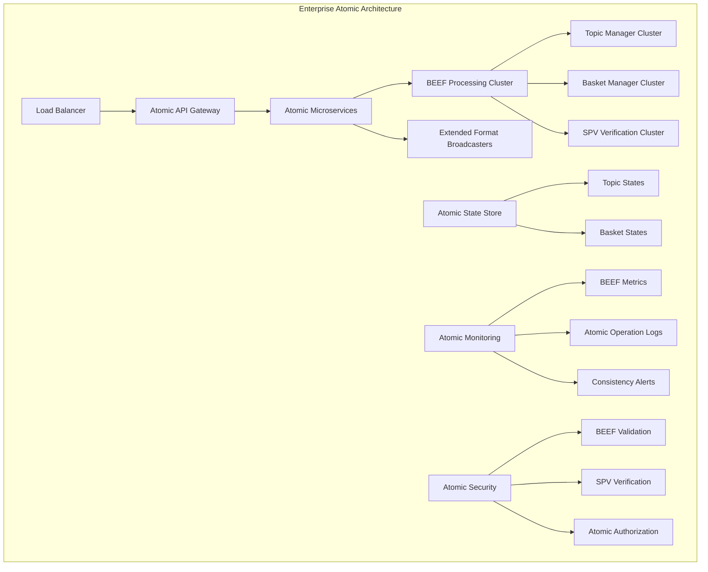

# Module 6: Advanced Atomic Patterns

Master advanced atomic transaction patterns and expert-level atomic system design with enterprise identity federation. This module covers sophisticated atomic operations, complex multi-party atomic transactions with identity verification, enterprise atomic integration strategies, and cutting-edge atomic BSV architectures with advanced identity management.

## 🎯 Learning Objectives

By the end of this module, you'll be able to:
- Master advanced atomic transaction patterns and complex atomic operations
- **Design sophisticated multi-party atomic systems with identity federation**
- **Implement enterprise-grade identity compliance and selective disclosure**
- **Build advanced 402 payment models for enterprise monetization**
- Implement enterprise-grade atomic integration strategies
- **Create complex certificate validation systems for multi-organization workflows**
- Optimize atomic system performance for large-scale operations
- Use cutting-edge atomic BSV technologies and protocols
- Architect complex atomic distributed systems

## 🏗️ Advanced Atomic Architecture Patterns

### Enterprise-Scale Atomic Systems



### Advanced Atomic Microservices

```typescript
// Advanced atomic microservice orchestration
class AtomicMicroserviceOrchestrator {
  
  // Deploy atomic microservice cluster
  async deployAtomicServiceCluster(serviceDefinition: AtomicServiceDefinition) {
    // Deploy BEEF processing services
    // const beefProcessors = await this.deployBEEFProcessors(
    //   serviceDefinition.beefProcessing
    // );
    
    // Deploy Extended Format broadcasters
    // const extendedFormatBroadcasters = await this.deployExtendedFormatBroadcasters(
    //   serviceDefinition.broadcasting
    // );
    
    // Deploy Topic Manager cluster
    // const topicManagers = await this.deployTopicManagerCluster(
    //   serviceDefinition.topicManagement
    // );
    
    // Deploy Basket Manager cluster
    // const basketManagers = await this.deployBasketManagerCluster(
    //   serviceDefinition.basketManagement
    // );
    
    // Configure atomic operation routing
    // await this.configureAtomicRouting({
    //   beefProcessors,
    //   extendedFormatBroadcasters,
    //   topicManagers,
    //   basketManagers
    // });
    
    // Verify atomic properties across cluster
    // await this.verifyClusterAtomicProperties();
  }
  
  // Auto-scale atomic services based on atomic operation load
  async autoScaleAtomicServices() {
    // Monitor atomic operation metrics
    // const atomicMetrics = await this.getAtomicOperationMetrics();
    
    // Scale BEEF processing based on throughput
    // if (atomicMetrics.beefThroughput > this.beefCapacityThreshold) {
    //   await this.scaleUpBEEFProcessors();
    // }
    
    // Scale Topic Managers based on topic activity
    // if (atomicMetrics.topicActivity > this.topicCapacityThreshold) {
    //   await this.scaleUpTopicManagers();
    // }
    
    // Scale Basket Managers based on token operations
    // if (atomicMetrics.basketOperations > this.basketCapacityThreshold) {
    //   await this.scaleUpBasketManagers();
    // }
    
    // Maintain atomic properties during scaling
    // await this.maintainAtomicPropertiesDuringScaling();
  }
}
```

## 🔄 Advanced Atomic Transaction Patterns

### Complex Multi-Party Atomic Operations

```typescript
// Advanced multi-party atomic transaction patterns
class AdvancedAtomicMultiParty {
  
  // Complex supply chain atomic operation
  async complexSupplyChainAtomicOperation(supplyChainData: ComplexSupplyChainData) {
    // Collect BEEF from all supply chain participants
    // const participantBEEFs = await this.collectParticipantBEEFs(supplyChainData.participants);
    
    // Validate all participant contributions
    // for (const participantBEEF of participantBEEFs) {
    //   const isValid = await this.validateParticipantBEEF(participantBEEF);
    //   if (!isValid) {
    //     throw new Error('Invalid participant BEEF in supply chain operation');
    //   }
    // }
    
    // Create complex atomic supply chain transaction
    // const complexAtomicTx = await this.createComplexAtomicTransaction({
    //   description: 'complex multi-party supply chain operation',
    //   inputBEEFs: participantBEEFs,
    //   inputs: this.generateComplexInputs(supplyChainData),
    //   outputs: this.generateComplexOutputs(supplyChainData),
    //   atomicConstraints: this.defineAtomicConstraints(supplyChainData)
    // });
    
    // Process complex atomic operation across all systems
    // await this.processComplexAtomicOperation(complexAtomicTx);
    
    // Verify atomic consistency across all participants
    // await this.verifyComplexAtomicConsistency(supplyChainData.participants);
    
    // All participant states updated atomically
    // No coordination protocols needed despite complexity
  }
  
  // Advanced atomic marketplace with complex rules
  async advancedAtomicMarketplace(marketplaceOperation: AdvancedMarketplaceOperation) {
    // Handle complex marketplace rules atomically
    // - Multi-asset bundles
    // - Dynamic pricing
    // - Conditional transfers
    // - Escrow mechanisms
    // - Reputation updates
    
    // Prepare complex atomic marketplace transaction
    // const complexMarketplaceTx = await this.wallet.createAction({
    //   description: 'advanced atomic marketplace operation',
    //   inputBEEF: await this.prepareComplexMarketplaceBEEF(marketplaceOperation),
    //   inputs: this.generateComplexMarketplaceInputs(marketplaceOperation),
    //   outputs: this.generateComplexMarketplaceOutputs(marketplaceOperation),
    //   atomicRules: this.defineComplexAtomicRules(marketplaceOperation)
    // });
    
    // All complex marketplace rules enforced atomically
    // No partial execution of complex business logic
    // return complexMarketplaceTx.BEEF;
  }
  
  // Atomic cross-chain bridge operations
  async atomicCrossChainBridge(bridgeOperation: CrossChainBridgeOperation) {
    // Handle atomic operations across blockchain boundaries
    // While maintaining atomic properties within BSV
    
    // Prepare atomic bridge transaction
    // const bridgeTx = await this.wallet.createAction({
    //   description: 'atomic cross-chain bridge operation',
    //   inputs: this.prepareBridgeInputs(bridgeOperation),
    //   outputs: this.prepareBridgeOutputs(bridgeOperation),
    //   bridgeConstraints: this.defineBridgeAtomicConstraints(bridgeOperation)
    // });
    
    // Process atomic bridge operation
    // await this.processAtomicBridgeOperation(bridgeTx);
    
    // Atomic properties maintained within BSV portion
    // Cross-chain coordination handled separately
  }
}
```

### Advanced Atomic State Management

```typescript
// Advanced atomic state management patterns
class AdvancedAtomicStateManager {
  
  // Complex atomic state transitions
  async processComplexAtomicStateTransition(stateTransition: ComplexStateTransition) {
    // Handle complex state transitions atomically
    // - Multiple state machines
    // - Conditional state changes
    // - State validation rules
    // - State rollback prevention
    
    // Validate complex state transition
    // const isValidTransition = await this.validateComplexStateTransition(stateTransition);
    // if (!isValidTransition) {
    //   throw new Error('Invalid complex atomic state transition');
    // }
    
    // Apply complex state changes atomically
    // const atomicStateChanges = this.calculateComplexStateChanges(stateTransition);
    // await this.applyAtomicStateChanges(atomicStateChanges);
    
    // Verify complex state consistency
    // await this.verifyComplexStateConsistency(stateTransition);
    
    // All complex state changes applied atomically
    // No partial state transitions possible
  }
  
  // Advanced atomic workflow management
  async processAdvancedAtomicWorkflow(workflow: AdvancedAtomicWorkflow) {
    // Handle complex workflows atomically
    // - Multi-step processes
    // - Conditional branching
    // - Parallel execution paths
    // - Workflow state management
    
    // Parse workflow into atomic operations
    // const atomicOperations = this.parseWorkflowIntoAtomicOps(workflow);
    
    // Execute all workflow steps atomically
    // const workflowBEEF = await this.createWorkflowBEEF(atomicOperations);
    // await this.processAtomicWorkflow(workflowBEEF);
    
    // Verify workflow completion atomically
    // await this.verifyAtomicWorkflowCompletion(workflow);
    
    // Entire complex workflow completed atomically
    // No partial workflow execution states
  }
}
```

## 🎯 Advanced Atomic Performance Optimization

### High-Performance Atomic Operations

```typescript
// Advanced atomic performance optimization
class AdvancedAtomicPerformanceOptimizer {
  
  // Optimize BEEF processing pipeline
  async optimizeBEEFProcessingPipeline() {
    // Implement advanced BEEF processing optimizations
    // - Parallel BEEF validation
    // - BEEF caching strategies
    // - SPV verification optimization
    // - Batch BEEF processing
    
    // Configure parallel BEEF processing
    // const parallelProcessors = await this.setupParallelBEEFProcessors({
    //   concurrency: this.calculateOptimalConcurrency(),
    //   queueSize: this.calculateOptimalQueueSize(),
    //   batchSize: this.calculateOptimalBatchSize()
    // });
    
    // Implement advanced SPV caching
    // const spvCache = await this.setupAdvancedSPVCache({
    //   cacheSize: this.calculateOptimalCacheSize(),
    //   ttl: this.calculateOptimalTTL(),
    //   distributedCaching: true
    // });
    
    // Configure BEEF batch processing
    // const batchProcessor = await this.setupBEEFBatchProcessor({
    //   batchSize: this.calculateOptimalBatchSize(),
    //   processingInterval: this.calculateOptimalInterval(),
    //   atomicBatchGuarantees: true
    // });
    
    // Verify optimizations maintain atomic properties
    // await this.verifyOptimizationsPreserveAtomicity();
  }
  
  // Advanced atomic operation caching
  async implementAdvancedAtomicCaching() {
    // Implement sophisticated caching while preserving atomicity
    // - Atomic operation result caching
    // - Topic state caching
    // - Basket state caching
    // - SPV proof caching
    
    // Configure atomic-aware caching
    // const atomicCache = await this.setupAtomicAwareCache({
    //   cacheInvalidation: 'atomic-consistent',
    //   distributedCache: true,
    //   atomicConsistencyGuarantees: true
    // });
    
    // Implement cache coherence for atomic operations
    // await this.implementAtomicCacheCoherence();
    
    // Verify caching preserves atomic properties
    // await this.verifyCachingPreservesAtomicity();
  }
  
  // Advanced atomic system monitoring
  async implementAdvancedAtomicMonitoring() {
    // Implement sophisticated monitoring for atomic systems
    // - Real-time atomic operation tracking
    // - Atomic consistency monitoring
    // - Performance bottleneck detection
    // - Atomic property violation detection
    
    // Configure advanced atomic metrics
    // const atomicMetrics = await this.setupAdvancedAtomicMetrics({
    //   realTimeTracking: true,
    //   consistencyMonitoring: true,
    //   performanceAnalysis: true,
    //   atomicPropertyVerification: true
    // });
    
    // Implement predictive atomic system analysis
    // await this.implementPredictiveAtomicAnalysis();
    
    // Set up atomic property violation alerts
    // await this.setupAtomicPropertyViolationAlerts();
  }
}
```

## 🏢 Enterprise Atomic Integration

### Enterprise Atomic Patterns

```typescript
// Enterprise-grade atomic integration patterns
class EnterpriseAtomicIntegration {
  
  // Integrate atomic operations with enterprise systems
  async integrateWithEnterpriseERP(erpIntegration: ERPAtomicIntegration) {
    // Integrate atomic BSV operations with enterprise ERP systems
    // while maintaining atomic properties
    
    // Configure atomic ERP integration
    // const atomicERPBridge = await this.setupAtomicERPBridge({
    //   erpSystem: erpIntegration.erpSystem,
    //   atomicOperationMapping: erpIntegration.operationMapping,
    //   consistencyGuarantees: 'atomic'
    // });
    
    // Process ERP operations atomically
    // const erpAtomicTx = await this.createERPAtomicTransaction(erpIntegration);
    // await this.processERPAtomicOperation(erpAtomicTx);
    
    // Verify ERP integration maintains atomic properties
    // await this.verifyERPAtomicIntegration(erpIntegration);
    
    // ERP operations processed atomically with BSV
  }
  
  // Enterprise atomic audit and compliance
  async implementEnterpriseAtomicAudit(auditRequirements: EnterpriseAuditRequirements) {
    // Implement enterprise-grade audit trails for atomic operations
    // - Immutable audit logs
    // - Regulatory compliance tracking
    // - Atomic operation forensics
    // - Compliance reporting
    
    // Configure atomic audit system
    // const atomicAuditSystem = await this.setupAtomicAuditSystem({
    //   auditRequirements: auditRequirements,
    //   immutableLogging: true,
    //   complianceTracking: true,
    //   forensicCapabilities: true
    // });
    
    // Implement atomic compliance monitoring
    // await this.implementAtomicComplianceMonitoring(auditRequirements);
    
    // Generate atomic compliance reports
    // await this.generateAtomicComplianceReports(auditRequirements);
    
    // All audit requirements met atomically
  }
  
  // Enterprise atomic disaster recovery
  async implementEnterpriseAtomicDisasterRecovery(drPlan: AtomicDisasterRecoveryPlan) {
    // Implement disaster recovery for atomic systems
    // while preserving atomic properties
    
    // Configure atomic disaster recovery
    // const atomicDR = await this.setupAtomicDisasterRecovery({
    //   recoveryTimeObjective: drPlan.rto,
    //   recoveryPointObjective: drPlan.rpo,
    //   atomicConsistencyGuarantees: true
    // });
    
    // Implement atomic state replication
    // await this.implementAtomicStateReplication(drPlan);
    
    // Test atomic disaster recovery procedures
    // await this.testAtomicDisasterRecovery(drPlan);
    
    // Disaster recovery maintains atomic properties
  }
}
```

## 🎓 Master-Level Assessment

### Expert Knowledge Check

1. **Complex Atomic Operations**: How do you design atomic operations that span multiple complex business processes?
2. **Enterprise Integration**: How do atomic properties integrate with existing enterprise systems?
3. **Performance Optimization**: What are the key strategies for optimizing atomic system performance?
4. **Advanced Patterns**: How do advanced atomic patterns solve complex distributed system challenges?

### Master-Level Exercises

#### Exercise 1: Complex Multi-Party Atomic System
Design and implement a sophisticated multi-party atomic system:
- Handle complex supply chain with multiple participants
- Implement advanced atomic state management
- Optimize for high-performance atomic operations
- Integrate with enterprise systems atomically

#### Exercise 2: Enterprise Atomic Platform
Build an enterprise-grade atomic platform:
- Implement advanced atomic microservices architecture
- Handle complex atomic workflows and state management
- Integrate with existing enterprise systems
- Implement comprehensive atomic monitoring and compliance

#### Exercise 3: Advanced Atomic Performance System
Create a high-performance atomic system:
- Optimize BEEF processing for maximum throughput
- Implement advanced atomic caching strategies
- Handle complex atomic operations at scale
- Maintain atomic properties under extreme load

### Master Certification Criteria

- ✅ Design complex multi-party atomic systems
- ✅ Implement enterprise-grade atomic integration
- ✅ Optimize atomic system performance for scale
- ✅ Handle advanced atomic patterns and edge cases
- ✅ Maintain atomic properties in complex scenarios
- ✅ Architect sophisticated atomic distributed systems

## 🎉 Congratulations - Technical Track Complete!

You have mastered the complete BSV atomic development stack:

### Your Journey
1. **Environment Setup** - LARS and atomic development environment
2. **Wallet Integration** - BRC-100 and BEEF generation
3. **Building Applications** - Atomic application development
4. **Distributed Architecture** - Topic/Basket Managers and Extended Format
5. **Production Deployment** - Scaling atomic systems
6. **Advanced Patterns** - Expert-level atomic architectures

### Your Expertise
- **Atomic Transaction Mastery** - Eliminate coordination complexity
- **BEEF Workflow Expertise** - P2P transmission and SPV verification
- **Extended Format Broadcasting** - Network integration
- **Production Atomic Systems** - Enterprise-scale deployment
- **Advanced Atomic Patterns** - Complex multi-party operations

### Next Steps
- **Build Production Systems** - Apply your atomic expertise
- **Contribute to BSV Ecosystem** - Share atomic patterns and tools
- **Mentor Other Developers** - Teach atomic development principles
- **Innovate with Atomic Operations** - Push the boundaries of what's possible

---

**You are now a BSV Atomic Systems Expert!** You understand how to build applications that fundamentally eliminate coordination complexity through atomic operations, BEEF workflow, and Extended Format broadcasting. Use this knowledge to build the next generation of BSV applications!