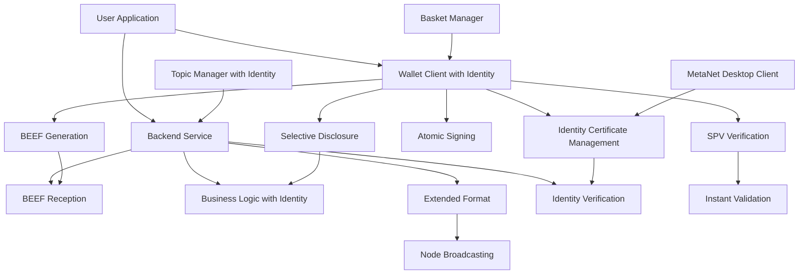

# Technical Overview with Identity Integration

Welcome to the Technical Development Track - your comprehensive pathway to building applications using BSV's atomic state transaction pattern with built-in identity accountability. This track focuses on the BEEF (Background Evaluation Extended Format) workflow for peer-to-peer transaction transmission, the atomic nature of BSV transactions that eliminate coordination complexity, and BRC-103 identity certificates that provide verifiable accountability without sacrificing atomic simplicity.

## 🎯 Track Overview: Atomic State Transactions with Identity

This technical track teaches you to build **atomic BSV applications with identity integration** using the modern architecture where:

* **Atomic transactions eliminate coordination complexity** - Operations succeed or fail completely with built-in accountability
* **BEEF enables peer-to-peer transaction transmission** - Direct counterparty communication with identity verification
* **BRC-103 certificates provide verifiable identity** - Selective disclosure without external identity providers
* **Extended Format handles node broadcasting** - Backend services convert BEEF to EF for network submission
* **SPV verification provides instant validation** - No waiting for block confirmations or identity verification
* **LARS standardizes development environments** - Consistent tooling and deployment patterns with identity support

### Prerequisites

* **Required**: Understanding of atomic transaction concepts and identity certificate basics
* **Recommended**: Programming experience (TypeScript/JavaScript preferred)
* **Helpful**: Basic understanding of UTXO model, SPV verification, and BRC-103 identity certificates

## 🔄 Atomic State Transaction Architecture with Identity

### The Problem with Traditional State and Identity Management

Traditional applications often struggle with:

* Complex coordination between multiple systems and identity providers
* Partial failure states that require rollback mechanisms
* Race conditions and consistency issues in both payments and identity verification
* Expensive distributed transaction protocols and separate identity infrastructure
* Privacy vs verification trade-offs in identity systems

### The BSV Atomic Solution with Identity Integration



**Key Principles with Identity:**

1. **Atomic Operations with Identity**: Transactions succeed or fail completely with built-in accountability
2. **BEEF Workflow with Identity Proofs**: P2P transmission format with embedded identity certificates
3. **BRC-103 Identity Integration**: Verifiable identity with selective disclosure capabilities
4. **Extended Format**: Network broadcasting format for node submission with identity metadata
5. **SPV Verification with Identity**: Instant validation without waiting for confirmations or identity verification
6. **State Elimination**: No complex state management or identity infrastructure - just atomic transitions with accountability

## 🛠️ Learning Modules with Identity Integration

### Module 1: [Environment Setup](01-environment-setup/)

**Duration**: 1-2 weeks | **Level**: Beginner

Set up your atomic transaction development environment with identity support:

* **LARS Installation** - Standardized development runtime with identity capabilities
* **Wallet Integration** - BRC-100 compliant wallet setup with BRC-103 identity support
* **BEEF Tooling** - Transaction format handling with identity certificate embedding
* **SPV Verification** - Instant transaction validation setup with identity proofs
* **MetaNet Desktop Client** - Identity certificate management and selective disclosure

**Key Outcomes**: LARS environment, BEEF workflow, SPV verification, identity certificate management

### Module 2: [Wallet Integration](02-wallet-integration/)

**Duration**: 2-3 weeks | **Level**: Beginner to Intermediate

Master atomic transaction creation and signing with identity integration:

* **Atomic Transaction Building** - Creating complete state transitions with identity accountability
* **BEEF Generation with Identity** - P2P transmission format with embedded certificates
* **BRC-103 Certificate Management** - Identity certificate creation and verification
* **Type-42 Key Derivation** - Shared key universes for private communication
* **Selective Disclosure Implementation** - Privacy-preserving identity verification
* **Basket Management** - Organizing UTXOs for atomic operations with identity context

**Key Outcomes**: Atomic transaction creation, BEEF workflow mastery, identity certificate integration

### Module 3: [Building Applications](03-building-applications/)

**Duration**: 3-4 weeks | **Level**: Intermediate

Develop applications using atomic transaction patterns with identity verification:

* **Atomic Business Logic with Identity** - Eliminating coordination complexity while maintaining accountability
* **BEEF Reception with Identity Validation** - Backend counterparty processing with certificate verification
* **402 Payment Gating** - HTTP micropayment authentication with identity verification
* **State Transition Design** - Atomic operation patterns with identity accountability
* **Error Handling** - All-or-nothing transaction processing with identity verification

**Key Outcomes**: Atomic application architecture, BEEF processing, identity-aware business logic

### Module 4: [Distributed Architecture](04-distributed-architecture/)

**Duration**: 3-4 weeks | **Level**: Intermediate to Advanced

Implement atomic patterns across distributed systems with identity federation:

* **Topic Manager Integration** - Atomic operations with shared context and identity verification
* **Identity Federation** - Multi-party certificate validation and trust networks
* **Basket Manager Patterns** - Asset management with atomic guarantees and identity accountability
* **Extended Format Broadcasting** - Converting BEEF to network format with identity metadata
* **SPV Verification Networks** - Distributed validation patterns with identity proofs

**Key Outcomes**: Distributed atomic operations, network integration, identity federation

### Module 5: [Production Deployment](05-production-deployment/)

**Duration**: 2-3 weeks | **Level**: Intermediate to Advanced

Deploy atomic transaction systems to production with identity infrastructure:

* **LARS to Production** - Standardized deployment patterns with identity certificate management
* **BEEF Processing Scale** - High-throughput transaction handling with identity verification
* **Identity Certificate Infrastructure** - Production certificate validation and management
* **Extended Format Services** - Node broadcasting infrastructure with identity metadata
* **Monitoring Atomic Operations** - Observability for atomic systems with identity accountability

**Key Outcomes**: Production atomic systems, scalable BEEF processing, identity infrastructure

### Module 6: [Advanced Patterns](06-advanced-patterns/)

**Duration**: 4-6 weeks | **Level**: Advanced

Master advanced atomic transaction patterns with enterprise identity integration:

* **Complex Atomic Operations** - Multi-party atomic transactions with identity verification
* **Advanced BEEF Workflows** - Sophisticated P2P patterns with identity exchange
* **Enterprise Identity Federation** - Advanced certificate validation and trust networks
* **Atomic Smart Contracts** - Contract-based atomic operations with identity requirements
* **Performance Optimization** - High-performance atomic systems with identity integration

**Key Outcomes**: Expert atomic patterns, advanced BEEF workflows, enterprise identity integration

## 🔄 BEEF Workflow Deep Dive with Identity

### BEEF vs Extended Format with Identity Integration

Understanding the two transaction formats with identity support:

```typescript
// BEEF: Background Evaluation Extended Format with Identity
// Used for P2P transmission between counterparties with identity verification
// Contains all data needed for SPV verification and identity validation
interface BEEFTransactionWithIdentity {
  // Transaction with embedded input data and identity certificates
  // Enables immediate validation without node lookup or identity provider
  // Transmitted directly between application and backend with identity proofs
  // Includes BRC-103 certificates and selective disclosure data
}

// Extended Format: Network Broadcasting Format with Identity Metadata
// Used for node submission and network propagation with identity context
// Converted from BEEF by backend services with identity preservation
interface ExtendedFormatTransactionWithIdentity {
  // Standard transaction format with EF marker and identity metadata
  // Includes previous locking scripts, satoshi amounts, and identity proofs
  // Enables broadcast services to validate without node RPC or identity services
  // Preserves identity accountability in network format
}
```

### Atomic Transaction Flow with Identity

```typescript
// 1. User initiates atomic operation with identity verification
async function initiateAtomicOperationWithIdentity() {
  // Application requests atomic state transition with identity requirements
  // Wallet creates BEEF transaction with all required inputs/outputs and identity certificates
  // SPV proofs and identity proofs generated for immediate verification
  // BRC-103 certificates embedded with selective disclosure settings
  // All-or-nothing operation - no partial states possible, full accountability
}

// 2. Backend receives BEEF transaction with identity validation
async function processBEEFTransactionWithIdentity(beefData) {
  // Validate BEEF format, SPV proofs, and identity certificates
  // Verify BRC-103 certificates and selective disclosure permissions
  // Apply business logic atomically with identity accountability
  // Convert to Extended Format for node broadcasting with identity metadata
  // Atomic success/failure - no intermediate states, full identity verification
}

// 3. Network broadcasting via Extended Format with identity preservation
async function broadcastToNetworkWithIdentity(extendedFormatTx) {
  // Backend converts BEEF to Extended Format preserving identity context
  // Broadcast service validates without node RPC or identity services
  // Submit to BSV network for inclusion with identity accountability
  // Atomic operation complete with verifiable participant identity
}
```

## 🎯 Atomic Transaction Benefits with Identity

### Eliminated Complexity

* **No Coordination Protocols** - Atomic operations eliminate distributed coordination and identity provider integration
* **No Rollback Mechanisms** - Transactions succeed or fail completely with identity verification
* **No Race Conditions** - Atomic nature prevents partial state issues in both payments and identity
* **No Complex State Management** - Simple atomic transitions replace complex state machines and identity infrastructure
* **No Separate Identity Systems** - Built-in identity accountability without external providers

### BEEF Advantages with Identity

* **Instant Validation** - SPV verification and identity verification without external dependencies
* **P2P Efficiency with Identity** - Direct counterparty communication with mutual authentication
* **Reduced Latency** - No waiting for network confirmations or identity provider responses
* **Scalable Architecture** - Backend services handle format conversion and identity verification
* **Privacy-Preserving** - Selective disclosure provides verification without full identity exposure

### Development Benefits with Identity

* **Simplified Logic** - Atomic operations with identity are easier to reason about than separate systems
* **Reduced Bugs** - No partial failure states to handle in payments or identity verification
* **Better Performance** - Elimination of coordination overhead and identity provider latency
* **Standardized Patterns** - LARS provides consistent development experience with identity integration
* **Built-in Accountability** - Every atomic operation has verifiable participant identity

## 🚀 Modern BSV Atomic Stack with Identity

### Core Components

* **LARS with Identity Support** - Standardized development environment for atomic applications with identity integration
* **BEEF Processing with Identity** - P2P transaction transmission and validation with embedded certificates
* **BRC-103 Certificate Management** - Identity certificate creation, validation, and selective disclosure
* **Extended Format Services** - Network broadcasting infrastructure with identity metadata
* **SPV Verification with Identity** - Instant transaction and identity validation
* **Topic Managers with Identity** - Atomic operations with shared context and identity verification
* **Basket Managers** - UTXO organization for atomic operations with identity accountability
* **MetaNet Desktop Client** - Identity certificate management and selective disclosure interface

### Development Workflow with Identity

1. **Setup LARS with Identity** - Standardized atomic development environment with identity capabilities
2. **Configure Identity Certificates** - Set up BRC-103 certificates and selective disclosure preferences
3. **Design Atomic Operations with Identity** - Define complete state transitions with identity requirements
4. **Implement BEEF Workflow with Identity** - P2P transaction handling with embedded certificates
5. **Add SPV and Identity Verification** - Instant validation capabilities for both transactions and identity
6. **Deploy with Standards** - LARS-based production deployment with identity infrastructure

## 🎓 Learning Outcomes with Identity Integration

### Technical Mastery

* **Atomic Transaction Design with Identity** - Creating operations that eliminate coordination while maintaining accountability
* **BEEF Workflow Implementation with Identity** - P2P transaction transmission patterns with embedded certificates
* **BRC-103 Certificate Management** - Identity certificate creation, validation, and selective disclosure
* **SPV Verification Integration with Identity** - Instant validation without confirmations or identity providers
* **Extended Format Broadcasting with Identity** - Network submission infrastructure with identity metadata
* **LARS Development Standards with Identity** - Consistent tooling and deployment with identity support

### Architectural Understanding

* **Atomic vs Coordinated Systems with Identity** - Understanding the fundamental difference in both payments and identity
* **BEEF vs Extended Format with Identity** - When and how to use each transaction format with identity integration
* **SPV vs Full Node Validation with Identity** - Instant verification patterns for transactions and identity
* **P2P vs Broadcast Patterns with Identity** - Direct counterparty vs network communication with identity verification
* **Built-in vs External Identity** - Understanding integrated identity vs separate identity providers

## 🚀 Getting Started with Identity Integration

### Immediate Next Steps

1. **Understand Atomic Concepts with Identity** - Grasp the elimination of coordination complexity in both payments and identity
2. **Install LARS Environment with Identity Support** - Set up standardized development tools with identity capabilities
3. **Study BEEF Workflow with Identity** - Learn P2P transaction transmission patterns with embedded certificates
4. **Practice SPV and Identity Verification** - Master instant validation techniques for transactions and identity
5. **Configure MetaNet Desktop Client** - Set up identity certificate management and selective disclosure
6. **Start Module 1** - Begin with [Environment Setup](01-environment-setup/)

### Success Tips with Identity

* **Think Atomically with Identity** - Design operations that succeed or fail completely with built-in accountability
* **Master BEEF Workflow with Identity** - Understand P2P transaction transmission with embedded certificates
* **Use LARS Standards with Identity** - Leverage standardized development patterns with identity integration
* **Focus on SPV and Identity** - Embrace instant verification over confirmations and external identity providers
* **Eliminate Coordination** - Replace complex state management and identity infrastructure with atomic operations
* **Embrace Selective Disclosure** - Provide verification while preserving privacy
* **Integrate Identity from Day One** - Build accountability into atomic operations rather than adding it later

***

**Ready to build atomic BSV applications with identity integration?** Begin with [Environment Setup](01-environment-setup/) and master the atomic transaction patterns with built-in identity accountability that eliminate coordination complexity!

_This track teaches you to build applications using BSV's atomic transaction model with BRC-103 identity integration, BEEF workflow for P2P transmission with embedded certificates, and LARS standardization for consistent development and deployment with identity support._
