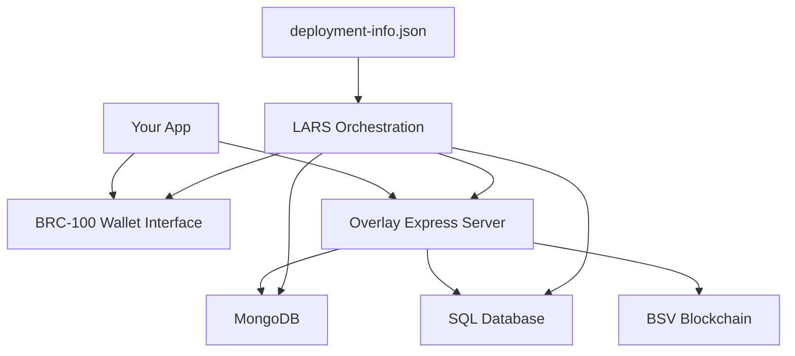

# BSV Hackathon Quick Start Guide

Get from zero to building atomic BSV applications with identity integration in under 30 minutes using LARS (Local Automated Runtime System)!

## ⚡ 15-Minute LARS Stack Setup

- [ ] **Prerequisites installed** (5 minutes)
- [ ] **LARS environment ready** (5 minutes)
- [ ] **deployment-info.json configured** (3 minutes)
- [ ] **Local stack running** (2 minutes)
- [ ] **Ready to build atomically!** ✅

## 🚀 The Atomic Development Stack with Identity

### Why BEEF + Identity Changes Everything

**BEEF (Background Evaluation Extended Format)** combined with **BRC-103 Identity Certificates** enables atomic transactions with built-in accountability and eliminates coordination complexity:

Traditional hackathon development:
```javascript
// Complex distributed coordination nightmare
// try {
//   const payment = await paymentService.charge(amount);
//   const inventory = await inventoryService.reserve(item);
//   const shipping = await shippingService.create(order);
// } catch (error) {
//   // Complex rollback logic, partial failures, race conditions
// }
```

BEEF + Identity enabled atomic development:
```javascript
// Single atomic operation with identity accountability
// const purchase = await wallet.createAction({
//   description: 'complete purchase with identity verification',
//   inputs: [paymentUTXO, inventoryUTXO],
//   outputs: [customerReceiptUTXO, merchantPaymentUTXO],
//   identityVerification: {
//     certificate: customerCertificate,
//     selectiveDisclosure: ['name', 'age_verification']
//   }
// });
// Either succeeds completely or fails completely - with full accountability
```

### BEEF + Identity: The Foundation

**What BEEF + Identity provides:**
- **Instant SPV verification** - Transactions carry their own cryptographic proofs
- **Identity accountability** - BRC-103 certificates provide verifiable identity
- **Selective disclosure** - Reveal only necessary identity fields
- **No external dependencies** - Everything needed for validation is included
- **Atomic confidence** - Small casual payments can be trusted immediately with identity
- **Local header verification** - Verify against your own block headers

### LARS: Development Environment Orchestration

**LARS (Local Automated Runtime System)** standardizes the runtime and coordination of components that most developers use:

### LARS Stack Components



**LARS provides:**
- BRC-100 style wallet interface
- Overlay Express server for application protocols
- MongoDB and SQL databases
- Docker container management
- All configured via deployment-info.json

## 🛠️ Prerequisites Setup

### System Requirements
```bash
# Check prerequisites
node --version    # Need v20+
docker --version  # Need Docker with Compose
ngrok --version   # Need ngrok for tunneling
git --version     # Need Git for version control

# Install missing components:
# Node.js: https://nodejs.org/
# Docker: https://docker.com/get-started
# ngrok: https://ngrok.com/download
```

### MetaNet Client (for funding and identity)
Download MetaNet Client for funding local development keys and managing identity certificates:
- **macOS**: [Download DMG](https://github.com/bitcoin-sv/metanet-desktop/releases/latest)
- **Windows**: [Download EXE](https://github.com/bitcoin-sv/metanet-desktop/releases/latest)
- **Linux**: [Download AppImage](https://github.com/bitcoin-sv/metanet-desktop/releases/latest)

**Identity Features:**
- Generate and manage BRC-103 identity certificates
- Configure selective disclosure preferences
- Manage Type-42 key derivation for shared key universes

## 📋 Project Setup with LARS

### 1. Initialize Your Project
```bash
# Create hackathon project
mkdir bsv-atomic-app && cd bsv-atomic-app
npm init -y

# Install LARS as development dependency
npm install --save-dev @bsv/lars

# Create basic project structure
mkdir -p backend/src/{topic-managers,lookup-services,contracts}
mkdir -p frontend/src
```

### 2. Create deployment-info.json

This is the heart of LARS configuration - it defines your entire stack:

```json
{
  "schema": "bsv-app",
  "schemaVersion": "1.0",
  "topicManagers": {
    "tm_hackathon": "./backend/src/topic-managers/HackathonTopicManager.ts"
  },
  "lookupServices": {
    "ls_hackathon": {
      "serviceFactory": "./backend/src/lookup-services/HackathonLookupServiceFactory.ts",
      "hydrateWith": "mongo"
    }
  },
  "frontend": {
    "language": "react",
    "sourceDirectory": "./frontend"
  },
  "contracts": {
    "language": "sCrypt",
    "baseDirectory": "./backend"
  },
  "configs": [
    {
      "name": "Local LARS",
      "network": "testnet",
      "provider": "LARS",
      "run": ["backend", "frontend"]
    }
  ]
}
```

### 3. Create Topic Manager (Overlay Protocol with Identity)
```typescript
// backend/src/topic-managers/HackathonTopicManager.ts
// Topic Manager handles your application's overlay protocol with identity verification
// export class HackathonTopicManager implements TopicManager {
//   async identifyAdmissibleOutputs(beef: number[], previousCoins: Coin[]): Promise<AdmissibleOutput[]> {
//     // Define what outputs your app recognizes as valid
//     // Include identity certificate validation
//     // This is where atomic business logic with identity lives
//   }
//
//   async handleNewIncomingOutput(output: IncomingOutput): Promise<void> {
//     // Process new atomic operations with identity verification
//     // Validate BRC-103 certificates and selective disclosure
//     // Update application state based on atomic transactions with identity
//   }
//
//   async validateIdentityCertificate(certificate: BRC103Certificate): Promise<boolean> {
//     // Verify identity certificate authenticity
//     // Check selective disclosure permissions
//     // Validate certificate chain and signatures
//   }
// }
```

### 4. Create Lookup Service Factory (Data Layer with Identity)
```typescript
// backend/src/lookup-services/HackathonLookupServiceFactory.ts
// Lookup Service provides data retrieval for your atomic operations with identity
// export default function createHackathonLookupService(mongoDb: Db): LookupService {
//   return {
//     async outputAdded(txid: string, outputIndex: number, outputScript: Script, topic: string): Promise<void> {
//       // Store atomic operation results with identity information
//       // Record identity certificates and selective disclosure
//       // No complex state management - just record what happened atomically
//     },
//
//     async lookup(question: LookupQuestion): Promise<LookupAnswer | LookupFormula> {
//       // Retrieve data for atomic operations with identity context
//       // Query identity certificates and permissions
//       // Simple queries - no complex coordination needed
//     },
//
//     async lookupIdentity(identityKey: string): Promise<BRC103Certificate | null> {
//       // Retrieve identity certificate by key
//       // Support selective disclosure queries
//       // Return only permitted fields based on disclosure settings
//     }
//   };
// }
```

### 5. Frontend Package.json
```json
{
  "name": "hackathon-frontend",
  "version": "1.0.0",
  "dependencies": {
    "react": "^18.0.0",
    "react-dom": "^18.0.0"
  },
  "scripts": {
    "start": "react-scripts start",
    "build": "react-scripts build"
  }
}
```

## 🚀 Start Your LARS Environment

### Interactive Setup
```bash
# Start LARS interactive menu
npx lars

# Follow the prompts to:
# 1. Configure global keys (server private key, TAAL API key)
# 2. Set up project configuration
# 3. Choose network (testnet for hackathons)
# 4. Start the environment
```

### What LARS Does Automatically
1. **Generates Docker Compose** - Creates containers for your stack
2. **Starts ngrok tunnel** - Exposes your local environment
3. **Launches OverlayExpress** - Your application server
4. **Starts databases** - MongoDB and SQL as configured
5. **Runs frontend** - React app with hot reloading
6. **Watches for changes** - Recompiles contracts automatically

### Direct Start (Skip Menus)
```bash
# Start environment directly
npx lars start

# LARS will:
# - Check system dependencies
# - Start Docker containers
# - Launch frontend and backend
# - Display real-time logs
```

## 💡 The Atomic Development Paradigm

### Traditional vs Atomic Thinking

**Traditional Hackathon App:**
```javascript
// Complex state management
// const [loading, setLoading] = useState(false);
// const [error, setError] = useState(null);
// const [step, setStep] = useState('payment');
// 
// // Multi-step process with failure points
// async function processOrder() {
//   setLoading(true);
//   try {
//     await validatePayment();
//     await reserveInventory();
//     await createShipment();
//     await sendNotification();
//   } catch (error) {
//     // Complex error handling and rollback
//   }
// }
```

**Atomic Hackathon App:**
```javascript
// Single atomic operation
// async function processOrder() {
//   const result = await wallet.createAction({
//     description: 'complete order',
//     inputs: [customerPayment, inventoryItem],
//     outputs: [merchantPayment, customerReceipt]
//   });
//   // Either works completely or fails completely
//   // No partial states, no complex error handling
// }
```

### Atomic Business Operations with Identity

**Event Ticketing with Identity Verification:**
```javascript
// Create ticket atomically with identity
// const ticket = await wallet.createAction({
//   description: 'mint VIP ticket with identity verification',
//   outputs: [{
//     satoshis: 1,
//     basket: 'concert-tickets',
//     data: { event: 'BSV Conference', seat: 'A1' }
//   }],
//   identityRequirement: {
//     certificate: true,
//     selectiveDisclosure: ['age_verification', 'name']
//   }
// });

// Redeem ticket atomically with identity check
// const entry = await wallet.createAction({
//   description: 'redeem ticket with identity verification',
//   inputs: [{ outpoint: ticket.outpoint }],
//   outputs: [{ satoshis: 1, basket: 'used-tickets' }],
//   identityVerification: {
//     certificate: attendeeCertificate,
//     matchRequired: ['name'] // Must match ticket holder
//   }
// });
```

**Digital Marketplace with Identity:**
```javascript
// Atomic asset sale with identity accountability
// const sale = await wallet.createAction({
//   description: 'buy digital art with identity verification',
//   inputs: [buyerPayment, sellerAsset],
//   outputs: [sellerPayment, buyerAsset],
//   identityExchange: {
//     buyer: { certificate: buyerCert, disclose: ['name', 'location'] },
//     seller: { certificate: sellerCert, disclose: ['business_name', 'reputation'] }
//   }
// });
// Ownership transfer, payment, and identity verification happen atomically
```

**Identity Certificate Issuance:**
```javascript
// Issue identity certificate atomically
// const certificate = await wallet.createAction({
//   description: 'issue verified identity certificate',
//   outputs: [{
//     satoshis: 1,
//     basket: 'identity-certificates',
//     data: {
//       certificateType: 'BRC-103',
//       issuer: 'trusted-authority',
//       subject: subjectPublicKey,
//       claims: encryptedClaims,
//       selectiveDisclosureCapability: true
//     }
//   }]
// });
```

## 🎯 Hackathon Success Strategy

### Hour-by-Hour Plan

**Hour 1: Environment Setup**
- Install prerequisites
- Create deployment-info.json
- Start LARS environment
- Verify wallet connection

**Hours 2-3: Atomic Operations Design**
- Define your atomic business operations
- Create topic manager for your protocol
- Implement lookup service for data
- Test basic atomic transactions

**Hours 4-5: Frontend Integration**
- Connect frontend to wallet
- Build UI for atomic operations
- Test user flows
- Handle success/failure states

**Hours 6-7: Polish and Testing**
- Test edge cases
- Improve user experience
- Add error handling
- Prepare demo scenarios

**Hour 8: Demo Preparation**
- Practice atomic operation demos
- Prepare explanation of eliminated complexity
- Show before/after comparison
- Highlight BSV advantages

### Key Atomic Patterns for Hackathons with Identity

1. **Token Creation/Redemption with Identity** - Event tickets, coupons, certificates with holder verification
2. **Atomic Swaps with Identity Exchange** - Asset trading with mutual identity verification
3. **Inventory Management with Provenance** - Each item as spendable token with ownership history
4. **Identity Certificate Management** - BRC-103 certificate issuance, verification, and selective disclosure
5. **Voting Systems with Identity** - Atomic vote casting with voter verification and privacy
6. **Access Control with Identity** - 402 payment gating with identity-based permissions
7. **Reputation Systems** - Identity-linked reputation tokens and verification

## 🆘 Troubleshooting

### LARS Issues
```bash
# Check Docker is running
docker ps

# Restart LARS environment
npx lars
# Choose "Start Environment" from menu

# Check logs
docker logs lars-overlay-express
docker logs lars-mongodb
```

### Wallet Connection Issues
```bash
# Verify ngrok tunnel
curl http://localhost:4040/api/tunnels

# Check wallet interface
# Visit your ngrok URL in browser
# Should see OverlayExpress API documentation
```

### Funding Issues
- Use MetaNet Client to fund your server key
- Keep at least 10,000 satoshis for stable operation
- Get testnet coins from [BSV Faucet](https://faucet.bitcoinscaling.io/)

## 📚 Essential Resources

### LARS Documentation
- **BRC-102 Spec**: deployment-info.json specification
- **LARS GitHub**: https://github.com/bitcoin-sv/lars
- **Overlay Services**: Application-layer protocols

### Atomic Development with Identity
- **Interactive Demo**: [fast.brc.dev](https://fast.brc.dev/)
- **Developer FAQ**: How atomic transactions with identity change computer science
- **BSV SDK**: TypeScript development kit with identity support
- **BRC-103 Specification**: Identity certificate standard
- **Type-42 Key Derivation**: Shared key universe specification
- **BRC-31 Authrite**: Mutual authentication protocol

### Emergency Support
- **BSV Discord**: Developer community
- **Stack Overflow**: #bitcoin-sv tag
- **GitHub Issues**: Tool-specific problems

---

**Ready to build atomically with identity?** Your LARS environment eliminates the coordination complexity that kills hackathon productivity while providing built-in identity accountability. Focus on your unique value proposition while atomic transactions with identity handle the distributed systems complexity automatically.

**The Bottom Line**: Stop fighting coordination problems and identity management complexity. Start building with atomic operations that include verifiable identity from day one.

## 🔐 Identity Integration Quick Reference

### Essential Identity Components for Hackathons

**BRC-103 Certificate Structure:**
```javascript
// const identityCertificate = {
//   version: '1.0',
//   issuer: issuerPublicKey,
//   subject: subjectPublicKey,
//   claims: {
//     name: 'encrypted_name',
//     age_verification: 'over_18',
//     location: 'encrypted_location'
//   },
//   selectiveDisclosure: {
//     name: { required: false, encrypted: true },
//     age_verification: { required: true, encrypted: false },
//     location: { required: false, encrypted: true }
//   },
//   signature: issuerSignature
// };
```

**Type-42 Key Derivation for Shared Secrets:**
```javascript
// Generate shared key for private communication
// const sharedKey = deriveType42Key({
//   myPrivateKey: myKey,
//   theirPublicKey: theirKey,
//   invoiceNumber: 'unique-invoice-123'
// });
// Use for encrypting sensitive data in atomic transactions
```

**402 Payment Gating with Identity:**
```javascript
// Middleware for identity-gated access
// app.use('/premium-content', async (req, res, next) => {
//   const payment = await validatePayment(req.headers.authorization);
//   const identity = await validateIdentity(req.headers['x-identity-cert']);
//
//   if (payment.valid && identity.verified) {
//     next(); // Grant access atomically
//   } else {
//     res.status(402).json({ error: 'Payment and identity required' });
//   }
// });
```

**Selective Disclosure in Practice:**
```javascript
// Reveal only necessary identity fields
// const disclosedIdentity = await selectivelyDisclose({
//   certificate: fullCertificate,
//   requestedFields: ['age_verification', 'location'],
//   permissions: userDisclosurePreferences
// });
// Share minimal identity information for atomic operations
```