# Comprehensive Audit Plan for BSV Technical Pathway Documentation

## 1. Overview and Objectives

This audit will thoroughly review the technical pathway documentation to ensure accuracy, completeness, and alignment with the actual BSV ecosystem components. The audit will focus on:

1. Correcting inaccurate information about sCrypt, wallet infrastructure, and other components
2. Adding missing documentation for BRC103, BRC100, and 402 payment requirements
3. Ensuring code snippets and examples reflect actual implementations
4. Providing proper references to source code and real implementations

## 2. Key Components to Audit

### 2.1 TS-SDK Documentation

**Current Status:**
- The TS-SDK documentation provides a comprehensive overview of the SDK's capabilities
- Includes code examples for transaction building, SPV proofs, identity management, and data operations

**Audit Tasks:**
- Verify code examples against actual SDK implementation
- Ensure all imports and function signatures match the current SDK version
- Check for any missing features or capabilities
- Add references to actual source code where appropriate

### 2.2 BRC100 and BRC103 Documentation

**Current Status:**
- BRC100 is mentioned in the documentation as a wallet interface standard
- BRC103 is not documented in the current technical pathway
- Limited information about how these standards work together

**Audit Tasks:**
- Add comprehensive documentation about BRC103 (Peer-to-Peer Mutual Authentication and Certificate Exchange Protocol)
- Update BRC100 documentation to accurately reflect its role in identity management
- Include code examples showing how to implement these standards
- Document the relationship between BRC100, BRC103, and other BRCs
- Reference actual implementations and source code

### 2.3 402 Payment Requirements

**Current Status:**
- No documentation about 402 payment requirements in the current technical pathway

**Audit Tasks:**
- Add documentation about BRC-41 (PacketPay HTTP Payment Mechanism)
- Add documentation about BRC-105 (HTTP Service Monetization Framework)
- Include code examples showing how to implement payment requirements
- Document the relationship between these payment mechanisms and other BSV components
- Reference actual implementations and source code

### 2.4 Wallet Infrastructure

**Current Status:**
- The README incorrectly describes wallet infrastructure as Kubernetes-based
- Missing details about the actual implementation

**Audit Tasks:**
- Correct the description of wallet infrastructure
- Document the Express-based server implementation with Knex for database migrations
- Include information about the JSON-RPC endpoint and API structure
- Add details about authentication, monetization, and database options
- Reference the actual implementation and source code
- Include the swagger.yaml API documentation

### 2.5 sCrypt Documentation

**Current Status:**
- Current documentation incorrectly describes sCrypt
- Missing information about how sCrypt works as an embedded DSL
- Lacks details about script context, for loops, and stateful contracts

**Audit Tasks:**
- Correct the description of sCrypt as an embedded DSL
- Document the use of props, methods, and decorators
- Add information about script context handling
- Include details about for loops and stateful contracts
- Focus specifically on BSV implementation (not BTC)
- Reference actual implementations and source code
- Include examples of proper sCrypt contract development

## 3. Documentation Structure and Format

The audit will ensure that all documentation follows a consistent structure:

1. **Overview** - Clear explanation of the component and its role in the BSV ecosystem
2. **Technical Details** - Accurate description of how the component works
3. **Code Examples** - Real, working code snippets that demonstrate usage
4. **Integration Patterns** - How the component interacts with other parts of the ecosystem
5. **References** - Links to source code, specifications, and additional resources

## 4. Verification Methodology

For each component, the audit will:

1. Compare documentation against actual implementations
2. Verify code examples by testing them against current libraries
3. Check for technical accuracy and completeness
4. Ensure all claims are supported by references to actual code
5. Identify and correct any inconsistencies or errors

## 5. Deliverables

The audit will produce:

1. **Updated Documentation Files** - Corrected and expanded markdown files for each component
2. **Audit Report** - Summary of findings and changes made
3. **Code Snippet Repository** - Collection of verified code examples
4. **Reference Guide** - Links to source code and specifications for each component

## 6. Implementation Plan

### Phase 1: Information Gathering and Analysis
- Review all current documentation
- Examine actual implementations and source code
- Identify gaps and inaccuracies

### Phase 2: Documentation Updates
- Correct inaccurate information
- Add missing documentation
- Update code examples
- Add references to source code

### Phase 3: Verification and Testing
- Test all code examples
- Verify technical accuracy
- Ensure consistency across documentation

### Phase 4: Final Review and Delivery
- Conduct final review of all documentation
- Prepare audit report
- Deliver updated documentation

## 7. Audit Components and Relationships

```mermaid
graph TD
    A[Technical Pathway Audit] --> B[TS-SDK]
    A --> C[BRC Standards]
    A --> D[Wallet Infrastructure]
    A --> E[sCrypt]
    A --> F[Payment Requirements]
    
    B --> B1[Transaction Building]
    B --> B2[SPV Proofs]
    B --> B3[Identity Management]
    B --> B4[Data Operations]
    
    C --> C1[BRC100 - Wallet Interface]
    C --> C2[BRC103 - Authentication Protocol]
    C --> C3[Other BRCs]
    
    D --> D1[Express Server]
    D --> D2[Knex Migrations]
    D --> D3[JSON-RPC API]
    D --> D4[Deployment Options]
    
    E --> E1[Embedded DSL]
    E --> E2[Props, Methods, Decorators]
    E --> E3[Script Context]
    E --> E4[Stateful Contracts]
    
    F --> F1[BRC-41 PacketPay]
    F --> F2[BRC-105 HTTP Monetization]
    F --> F3[402 Payment Flow]
```

## 8. Timeline and Milestones

1. **Initial Assessment** - Complete review of current documentation and actual implementations
2. **Draft Updates** - Prepare draft updates for each component
3. **Code Example Verification** - Test and verify all code examples
4. **Final Documentation** - Finalize all documentation updates
5. **Audit Report** - Prepare and deliver final audit report

This comprehensive audit will ensure that the technical pathway documentation accurately reflects the actual BSV ecosystem components, providing developers with reliable and accurate information for building on BSV.