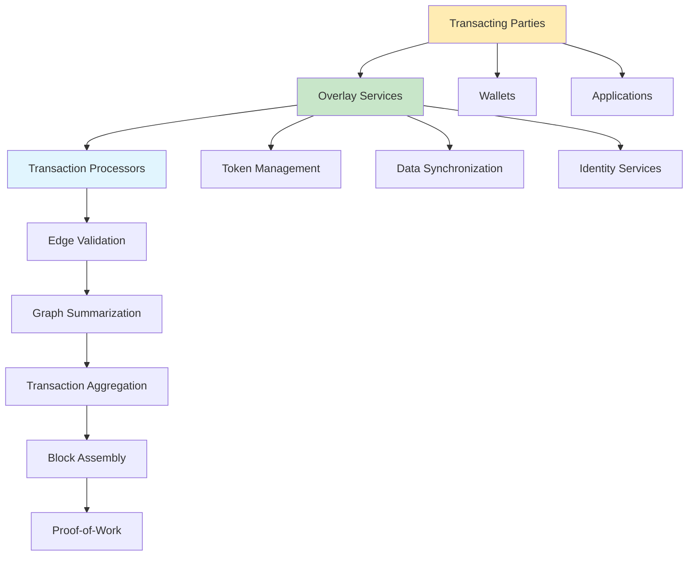
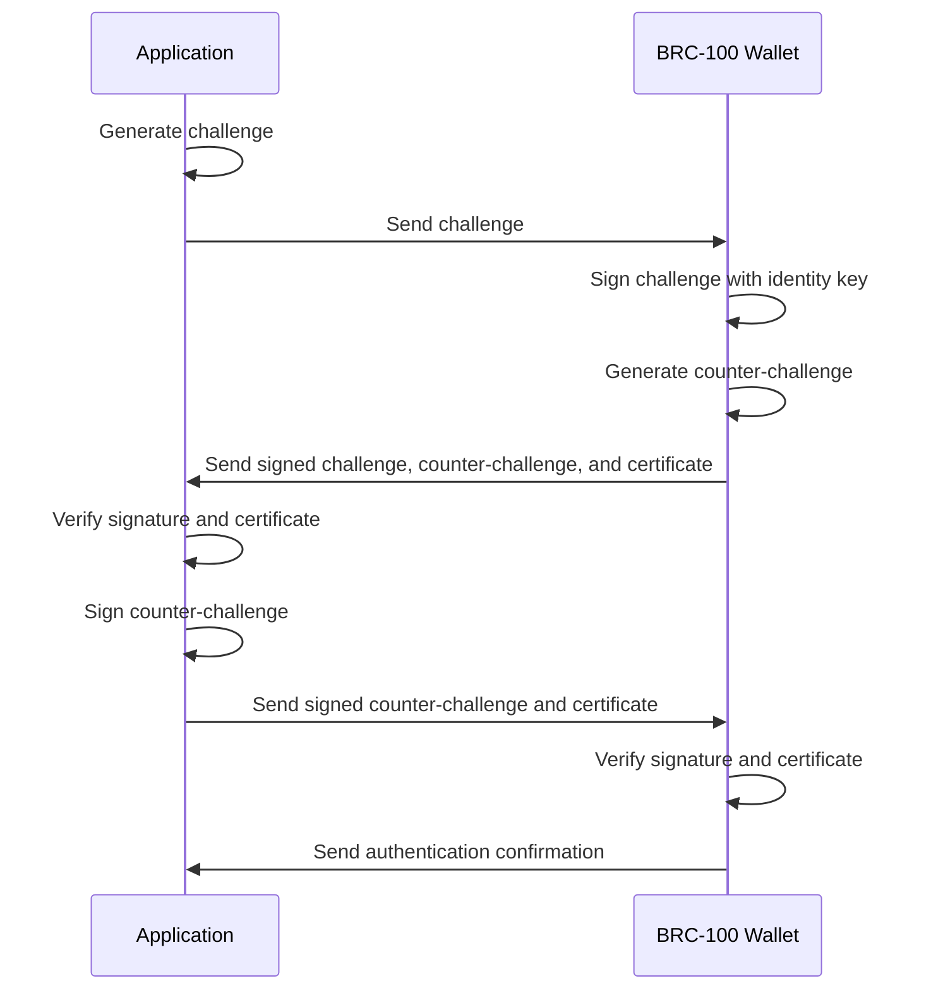
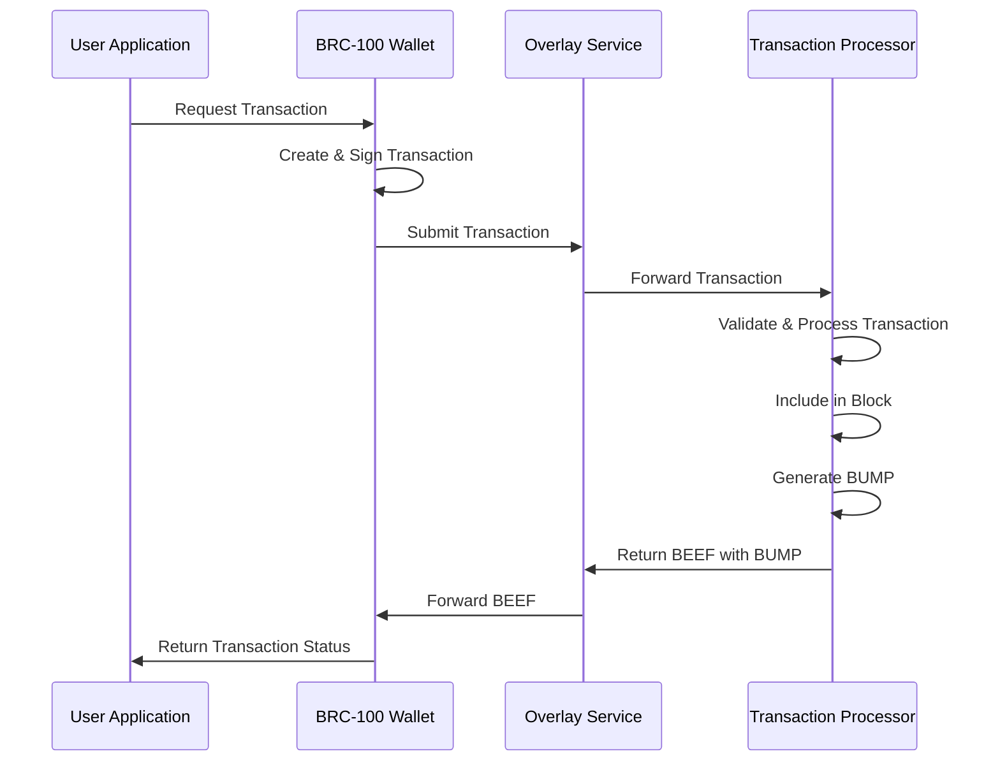
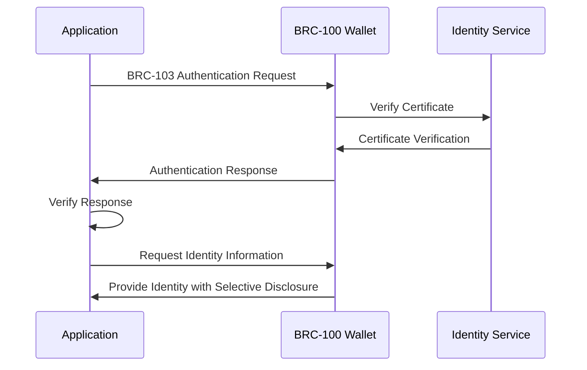

# BSV Ecosystem Components: A Comprehensive Overview

## Introduction

The Bitcoin SV (BSV) ecosystem provides a comprehensive stack for building distributed applications that leverage the unique capabilities of the blockchain. This document explores the key components of this ecosystem, how they interact, and the patterns that enable scalable, secure, and efficient applications.

Unlike traditional blockchain platforms that focus primarily on cryptocurrency transactions, BSV has evolved into a complete application development platform with specialized components for identity, authentication, data synchronization, and transaction processing. These components work together to form a cohesive system that addresses the challenges of building distributed applications at scale.

## The Mandala Network: A Conceptual Framework

At the heart of the BSV ecosystem is the Mandala Network, a conceptual framework that defines how the various components interact. The Mandala Network consists of three primary layers:

1. **Transaction Processors** (Core): Responsible for creating blocks, witnessing transactions, and distributing Merkle proofs
2. **Overlay Services** (Middle): Enable specialized tracking and management of tokens and data
3. **Transacting Parties** (Edge): End users with specialized applications that create transactions through wallets



### Transaction Flow in the Mandala Network

Transactions flow inward from Transacting Parties through Overlay Services to the Transaction Processing Network. The network aggregates and assembles transactions into blocks, with state updates flowing outward back to the Transacting Parties.

1. **Edge Validation**: Scripts are verified after requesting necessary input transactions and proofs
2. **Graph Summarization**: Transactions are stripped to core graph elements (inputs, TXID, outputs)
3. **Transaction Aggregation**: Graphs are combined and ordered to prevent double-spends
4. **Block Assembly**: Candidate block headers are created
5. **Proof-of-Work**: Blocks are solved and headers are propagated outward

This architecture enables specialization and optimization at every layer, allowing the network to scale efficiently while maintaining security and reliability.

## Core Transaction Processing Components

### BEEF (BRC-62): Background Evaluation Extended Format Transactions

BEEF is a binary format for sending transactions between peers to enable Simple Payment Verification (SPV). It optimizes for minimal bandwidth while maintaining the data required to independently validate transactions.

Key features of BEEF:
- Includes Merkle paths to prove transaction inclusion in blocks
- Steps back through the Transaction DAG until every input has a corresponding parent transaction with a Merkle path
- Enables efficient validation without requiring a full node

```
Field           | Description                                      | Size
----------------|--------------------------------------------------|------------
Version no      | Version number (0100BEEF)                        | 4 bytes
nBUMPs          | Number of BSV Unified Merkle Paths               | 1-9 bytes
BUMP data       | All BUMPs required to prove inclusion            | variable
nTransactions   | Number of transactions                           | 1-9 bytes
Raw Transaction | RawTx bytes                                      | variable
Has BUMP        | 01 if so, followed by BUMP index; 00 if not      | 1+ bytes
```

### BUMP (BRC-74): BSV Unified Merkle Path Format

BUMP provides a standardized format for Merkle proofs, optimized for generation by transaction processors and convenient for proof-validating clients. It encodes multiple txids within one block along with their Merkle paths.

Key features of BUMP:
- Encodes block height and tree height
- Includes level 0 of the Merkle tree with txids of interest and their siblings
- Optimizes size by skipping encoding of far right leaves when duplication would suffice
- Enables efficient verification of transaction inclusion in blocks

```
Field           | Description                                      | Size
----------------|--------------------------------------------------|------------
block height    | VarInt block height                              | 1-9 bytes
tree height     | Height of the Merkle Tree                        | 1 byte
nLeaves         | Number of leaves at this height                  | 1-9 bytes
leaves          | Each leaf with offset, flags, and hash           | variable
```

### Atomic BEEF (BRC-95): Atomic BEEF Transactions

Atomic BEEF is a variant of BEEF that focuses on atomicity, ensuring all data within a BEEF structure relates to a single "subject transaction." This format disallows unrelated transactions within the BEEF structure, reinforcing a clear, minimalistic data set for transaction validation.

Key features of Atomic BEEF:
- Adds a unique header prefix (0x01010101) followed by the subject TXID
- Ensures all transactions in the structure are part of the subject transaction's dependency graph
- Optimizes for single-transaction use cases
- Simplifies validation by focusing on a single verifiable transaction and its dependencies

```
Field           | Description                                      | Size
----------------|--------------------------------------------------|------------
Atomic Prefix   | Fixed constant 0x01010101                        | 4 bytes
Subject TXID    | TXID of the subject transaction                  | 32 bytes
BEEF structure  | Standard BEEF structure                          | variable
```

## Identity and Authentication Layer

### BRC-100: Wallet Interface Standard

BRC-100 defines a consistent interface for wallet interactions, providing a comprehensive identity framework that eliminates password fatigue and enables secure, verifiable interactions.

Key features of BRC-100:
- Identity management capabilities
- Cross-application authentication
- Certificate issuance and verification
- Selective disclosure for privacy protection

```javascript
// Example: Integrating with a BRC-100 wallet
import { MetanetDesktopClient } from '@bsv/metanet-desktop-client';

async function authenticateUser() {
  // Initialize the client
  const client = new MetanetDesktopClient({
    appName: 'Example App',
    appId: 'com.example.app',
  });
  
  // Connect to the wallet
  await client.connect();
  
  // Authenticate with BRC-103
  const authResult = await client.authenticate();
  
  if (authResult.authenticated) {
    console.log('Authenticated user:', authResult.identity.name);
    return authResult.identity;
  }
}
```

### BRC-103: Peer-to-Peer Mutual Authentication

BRC-103 enables secure mutual authentication between peers without relying on centralized identity providers. It uses a challenge-response protocol with certificate exchange to establish trust between applications and wallets.

Key features of BRC-103:
- Mutual authentication between peers
- Challenge-response for proving identity
- Certificate exchange for identity verification
- Zero trust model with cryptographic verification



## Overlay Networks and Data Synchronization

### BRC-88: Overlay Services Synchronization Architecture

BRC-88 defines the Overlay Services Synchronization Architecture, detailing the Services Host Interconnect Protocol (SHIP) and Services Lookup Availability Protocol (SLAP). These protocols enable efficient peer discovery and data synchronization across UTXO-based overlay networks.

Key components of BRC-88:
- **SHIP/SLAP Topic Managers**: Manage topic-specific transaction admittance
- **SHIP/SLAP Lookup Services**: Provide mechanisms for querying UTXO states within topics
- **Advertiser**: Handles creation and revocation of SHIP and SLAP advertisements
- **Overlay Services Engine**: Coordinates processing of transactions and synchronization of data

```
SHIP Token Format:
Field 1: The string SHIP, denoting a SHIP advertisement
Field 2: The BRC-31 identity key of the advertiser
Field 3: The domain name of the HTTPS server hosting the network node
Field 4: The topic name hosted by the advertiser

SLAP Token Format:
Field 1: The string SLAP, denoting a SLAP advertisement
Field 2: The BRC-31 identity key of the advertiser
Field 3: The domain name of the HTTPS server hosting the network node
Field 4: The service name, represented by a BRC-24 provider ID
```

### BRC-81: Private Overlays with P2PKH Transactions

BRC-81 explores the use of off-chain secrets and offset values, enabling private overlay networks to be tracked among transactions that appear to be normal P2PKH spends. This leverages the isomorphic properties of the curve, allowing UTXO owners to retain spendability rights even when P2PKH outputs contain other information stored within offsets from the root key.

Key features of BRC-81:
- Enables private overlay networks with standard P2PKH transactions
- Uses off-chain secrets and offset values for privacy
- Maintains spendability rights for UTXO owners
- Allows on-chain record of private, off-chain data

### BRC-26: Universal Hash Resolution Protocol

BRC-26 describes the Universal Hash Resolution Protocol (UHRP), a standard framework for content availability advertisement implemented with a UTXO-based overlay network. It enables content hosts to advertise the availability of files by creating UTXO-based advertisement tokens.

Key features of UHRP:
- Content hosts advertise file availability through UTXO-based tokens
- Users can seek content based on its hash
- Provides resilience to single points of failure
- Enables content providers to ensure wide availability by paying multiple hosts

## Token Protocol

### BRC-92: Mandala Token Protocol

BRC-92 defines a minimalist protocol for tokenization, issuance, transfer, recovery, and redemption within the context of Overlays. It uses a genesis transaction output as an assetId and includes this assetId in output scripts for token transfers.

Key features of BRC-92:
- Uses genesis transaction output as assetId (txid + vout)
- Pushes assetId to the stack in output scripts for token transfers
- Supports both fungible tokens and NFTs
- Enables token recovery and redemption

```
Fungible Token Script:
21 <assetId> <amount> OP_DROP OP_2DROP ...

NFT Script:
21 <assetId> OP_2DROP ...
```

## Integration Patterns

### Transaction Processing Flow

The following diagram illustrates how these components work together in a typical transaction processing flow:



### Authentication and Identity Flow



## Scaling Patterns and Approaches

The BSV ecosystem enables multiple scaling patterns that can be combined to meet the needs of different applications:

### Horizontal Scaling with Overlay Networks

Overlay networks enable horizontal scaling by distributing data and processing across multiple specialized services. Each overlay can focus on a specific domain or use case, allowing for efficient resource allocation and parallel processing.

Key aspects:
- **Topic-based partitioning**: Data is partitioned by topic, allowing specialized processing
- **Peer discovery**: SHIP and SLAP enable efficient discovery of peers hosting specific topics or services
- **Distributed data storage**: Data can be distributed across multiple nodes while maintaining consistency

### Vertical Scaling with Efficient Data Structures

The core transaction processing components (BEEF, BUMP, Atomic BEEF) enable vertical scaling by optimizing data structures for efficient processing and minimal bandwidth usage.

Key aspects:
- **Minimized data transfer**: BEEF and BUMP optimize for minimal bandwidth while maintaining necessary validation data
- **Efficient validation**: Atomic BEEF focuses on single-transaction validation, reducing complexity
- **Merkle proof optimization**: BUMP optimizes Merkle proofs for efficient verification

### Hybrid Approaches

Most real-world applications will use a hybrid approach, combining horizontal and vertical scaling techniques:

1. **Layered architecture**: Applications can use multiple layers of overlay services, each optimized for specific functions
2. **Selective data synchronization**: Applications can synchronize only the data they need, reducing bandwidth and storage requirements
3. **Specialized processing**: Different components can be optimized for specific tasks, improving overall efficiency

## Conclusion

The BSV ecosystem provides a comprehensive stack for building distributed applications that can scale to meet the needs of enterprise and consumer applications. By leveraging the Mandala Network architecture and the specialized components described in this document, developers can create secure, efficient, and scalable applications that take full advantage of the BSV blockchain.

The key to success in this ecosystem is understanding how these components work together and selecting the right combination for your specific use case. Whether you're building a simple payment application or a complex distributed system, the BSV ecosystem provides the tools and patterns you need to succeed.

## References

- [BRC-62: Background Evaluation Extended Format Transactions](https://github.com/bitcoin-sv/BRCs/blob/master/transactions/0062.md)
- [BRC-74: BSV Unified Merkle Path Format](https://github.com/bitcoin-sv/BRCs/blob/master/transactions/0074.md)
- [BRC-95: Atomic BEEF Transactions](https://github.com/bitcoin-sv/BRCs/blob/master/transactions/0095.md)
- [BRC-100: Wallet Interface Standard](https://github.com/bitcoin-sv/BRCs/blob/master/wallet/0100.md)
- [BRC-103: Peer-to-Peer Mutual Authentication](https://github.com/bitcoin-sv/BRCs/blob/master/peer-to-peer/0103.md)
- [BRC-88: Overlay Services Synchronization Architecture](https://github.com/bitcoin-sv/BRCs/blob/master/overlays/0088.md)
- [BRC-81: Private Overlays with P2PKH Transactions](https://github.com/bitcoin-sv/BRCs/blob/master/overlays/0081.md)
- [BRC-90: Thoughts on the Mandala Network](https://github.com/bitcoin-sv/BRCs/blob/master/opinions/0090.md)
- [BRC-91: Outputs, Overlays, and Scripts in the Mandala Network](https://github.com/bitcoin-sv/BRCs/blob/master/opinions/0091.md)
- [BRC-92: Mandala Token Protocol](https://github.com/bitcoin-sv/BRCs/blob/master/tokens/0092.md)