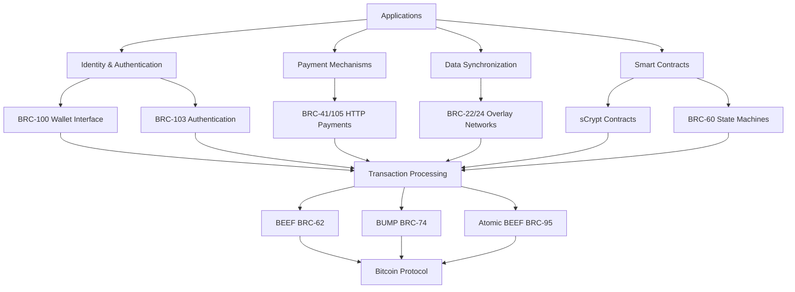
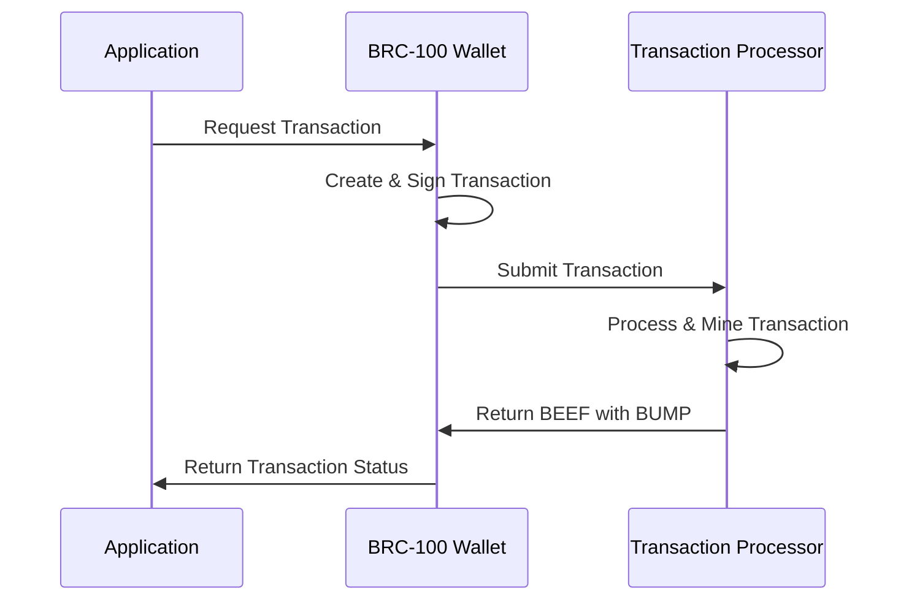

# BSV Ecosystem Components: A Comprehensive Overview

## Introduction
This document will provide a comprehensive overview of the BSV ecosystem components, focusing on how they work together to enable distributed applications. We'll explore the key protocols, standards, and technologies that form the foundation of the BSV ecosystem, with particular emphasis on the components that enable secure identity, efficient transaction processing, and scalable data management.

## Document Structure

### 1. The BSV Full Stack for Distributed Applications
- Overview of the layered architecture
- How components interact across layers
- Key design principles and patterns

### 2. Core Transaction Processing Components
- **BEEF (BRC-62)**: Background Evaluation Extended Format Transactions
  - Purpose and benefits
  - How it enables efficient SPV
  - Integration with other components
  
- **BUMP (BRC-74)**: BSV Unified Merkle Path Format
  - Standardized Merkle proof format
  - Optimization for minimal bandwidth
  - Role in transaction verification
  
- **Atomic BEEF (BRC-95)**: Atomic BEEF Transactions
  - Ensuring transaction atomicity
  - Single-subject transaction focus
  - Use cases and applications

### 3. Identity and Authentication Layer
- **BRC-100**: Wallet Interface Standard
  - Identity management capabilities
  - Cross-application authentication
  - Integration with applications
  
- **BRC-103**: Peer-to-Peer Mutual Authentication
  - Challenge-response protocol
  - Certificate exchange
  - Security considerations

### 4. Payment and Monetization Mechanisms
- **BRC-41/105**: HTTP Payment Mechanisms
  - 402 Payment Required implementation
  - Service monetization
  - Integration with wallets and applications

### 5. Data Synchronization and Overlay Networks
- **BRC-22/24**: Overlay Network Data Synchronization
  - Efficient data propagation
  - Lookup services
  - Application-specific data management

### 6. State Machines and Smart Contracts
- **sCrypt**: Embedded DSL for Bitcoin Smart Contracts
  - Contract development
  - Script context handling
  - Integration with applications
  
- **BRC-60**: Simplifying State Machine Event Chains
  - State transitions
  - Event processing
  - Application patterns

### 7. Scaling Patterns and Approaches
- Horizontal scaling with overlay networks
- Vertical scaling with efficient data structures
- Hybrid approaches for different use cases

### 8. Integration Patterns and Best Practices
- Application architecture recommendations
- Component selection guidelines
- Security and privacy considerations

### 9. Future Directions and Roadmap
- Upcoming standards and protocols
- Research areas
- Ecosystem growth opportunities

## Key Diagrams

### 1. BSV Full Stack Architecture

### 2. Transaction Processing Flow

### 3. Component Interaction Matrix
A table showing how different components interact with each other, highlighting dependencies and integration points.

## Implementation Approach

1. **Research Phase**
   - Gather detailed specifications for each BRC
   - Identify integration points and dependencies
   - Document use cases and applications

2. **Content Development**
   - Create detailed explanations for each component
   - Develop diagrams and visual aids
   - Write integration patterns and best practices

3. **Review and Refinement**
   - Technical review by domain experts
   - Consistency check across all components
   - Clarity and accessibility improvements

4. **Publication and Distribution**
   - Format for different platforms and audiences
   - Create supplementary materials (presentations, code examples)
   - Establish update mechanism for future changes

## Timeline and Resources

1. **Research Phase**: 2 weeks
2. **Content Development**: 4 weeks
3. **Review and Refinement**: 2 weeks
4. **Publication and Distribution**: 1 week

## Next Steps

1. Request detailed specifications for additional BRCs
2. Begin research phase with focus on BEEF, BUMP, and Atomic BEEF
3. Develop initial architecture diagrams
4. Create detailed outlines for each section