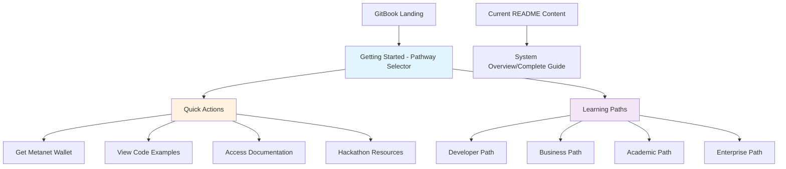

# BSV Academy GitBook Restructuring Plan

## 📋 Executive Summary

Transform the current dense, academic-focused entry point into a user-friendly pathway selector that immediately helps visitors identify their goals and directs them to the right starting point.

## 🎯 Objective

Create a welcoming, action-oriented landing experience that supports multiple user pathways:
- **Metanet desktop wallet seekers**
- **Building blocks for developers** 
- **Documentation access**
- **Code walkthroughs**
- **Hackathon essentials**
- **Examples and templates**
- **Complete curriculum learners**

## 🔄 Current Problems

- README is too dense and overwhelming for new users (328 lines of technical content)
- GitBook starts with comprehensive system overview instead of user needs
- No clear pathway for different user types
- Academic tone doesn't match diverse user intentions
- Users must scroll through extensive content to find their specific needs

## 🚀 Proposed Solution

### Phase 1: Navigation Flow Restructure



### Phase 2: Content Reorganization

**New SUMMARY.md Structure:**
```
## Getting Started (NEW LANDING PAGE)
* [Choose Your Path](01-getting-started/README.md)

## Quick Actions
* [Get Metanet Wallet](01-getting-started/metanet-wallet.md)
* [Code Examples](01-getting-started/examples.md)
* [Documentation Hub](01-getting-started/docs.md)
* [Hackathon Kit](05-hackathon-essentials/README.md)

## Learning Pathways
* [Technical Path](02-pathways/technical/README.md)
* [Business Path](02-pathways/business/README.md)
* [Academic Path](02-pathways/academic/README.md)
* [Enterprise Path](02-pathways/enterprise/README.md)

## System Reference
* [Complete System Guide](00-system-overview/README.md) <- MOVED FROM README
* [Foundations](01-foundations/)
* [Resources](03-resources/)
```

### Phase 3: New Getting Started Page Design

**Structure:**
1. **Welcome Section** - Brief, friendly introduction
2. **"What brings you to BSV?" Section** - Intent-based quick actions
3. **"Ready to dive deeper?" Section** - Role-based learning paths
4. **"Need help choosing?" Section** - Guidance for uncertain users

**Content Approach:**
- Conversational tone instead of academic
- Action-oriented language ("Get", "Build", "Learn", "Explore")
- Visual pathway selection with clear outcomes
- Immediate value proposition for each option

### Phase 4: Content Migration Strategy

**Current README → System Overview:**
- Move comprehensive curriculum details to `00-system-overview/README.md`
- Preserve all technical integration information
- Maintain mermaid diagrams and detailed architecture
- Keep as reference for users who need complete picture

**Enhanced Getting Started:**
- Transform current `01-getting-started/README.md` into pathway selector
- Add quick action cards for immediate needs
- Include visual pathway comparison
- Provide clear next steps for each choice

## 📊 Detailed Implementation Plan

### Step 1: Create New Landing Experience
- [ ] Design pathway selector interface
- [ ] Write user-friendly copy for each pathway
- [ ] Create visual elements (cards, icons, flow diagrams)
- [ ] Add "What brings you to BSV?" decision tree

### Step 2: Restructure Navigation
- [ ] Update SUMMARY.md to start with Getting Started
- [ ] Move current README to System Overview
- [ ] Create quick action pages (wallet, examples, docs, hackathon)
- [ ] Update all internal links and references

### Step 3: Content Enhancement
- [ ] Rewrite pathway descriptions with action-oriented language
- [ ] Add estimated time commitments for each path
- [ ] Include success outcomes for each pathway
- [ ] Create comparison tables for pathway selection

### Step 4: User Experience Optimization
- [ ] Add breadcrumb navigation
- [ ] Include "Not sure? Take our quiz" option
- [ ] Create pathway recommendation engine
- [ ] Add progress tracking for learning paths

## 🎨 New Getting Started Page Template

```markdown
# Welcome to BSV - Choose Your Path

BSV is the blockchain that scales without limits. Whether you're here for a wallet, 
building apps, or diving deep into the technology - we'll get you exactly where you need to go.

## 🚀 What brings you to BSV?

### Quick Actions - Get what you need right now

| I want to... | Time needed | Get started |
|--------------|-------------|-------------|
| **Get the Metanet Wallet** | 5 minutes | [Download Now](metanet-wallet.md) |
| **See Code Examples** | 10 minutes | [Browse Examples](examples.md) |
| **Access Documentation** | Ongoing | [Documentation Hub](docs.md) |
| **Join a Hackathon** | 2-3 days | [Hackathon Kit](../05-hackathon-essentials/) |

### Learning Paths - Master BSV step by step

| Your Role | What You'll Build | Time Investment | Start Here |
|-----------|-------------------|-----------------|------------|
| **👨‍💻 Developer** | Full-stack BSV applications | 8-12 weeks | [Technical Path](../02-pathways/technical/) |
| **💼 Business Leader** | Strategic implementation plans | 6-8 weeks | [Business Path](../02-pathways/business/) |
| **🎓 Researcher** | Academic understanding | 10-16 weeks | [Academic Path](../02-pathways/academic/) |
| **🏢 Enterprise Architect** | Large-scale solutions | 8-10 weeks | [Enterprise Path](../02-pathways/enterprise/) |

## 🤔 Not sure which path is right for you?

Take our [2-minute pathway quiz](pathway-quiz.md) or explore the [Complete System Guide](../00-system-overview/) 
to understand everything BSV offers.
```

## 📈 Success Metrics

**User Experience:**
- Reduced bounce rate from landing page
- Increased pathway completion rates
- Faster time-to-first-action for new users
- Higher engagement with learning content

**Content Effectiveness:**
- Clear user journey tracking
- Pathway selection analytics
- User feedback on navigation clarity
- Completion rates for different user types

## 🔧 Technical Implementation

**File Changes Required:**
1. **SUMMARY.md** - Complete restructure of navigation
2. **README.md** - Transform into pathway selector OR move to system overview
3. **00-system-overview/README.md** - New location for comprehensive content
4. **01-getting-started/README.md** - Enhanced pathway selection
5. **New quick action pages** - Wallet, examples, docs, hackathon

**GitBook Configuration:**
- Update landing page settings
- Configure pathway-based navigation
- Add visual elements and cards
- Implement user journey tracking

## 🎯 Implementation Sequence

1. **Create system overview directory and move current README**
2. **Rewrite Getting Started as pathway selector**
3. **Update SUMMARY.md navigation structure**
4. **Create quick action pages**
5. **Update all internal links and cross-references**
6. **Test navigation flows and user journeys**

## 💡 Key Design Principles

- **User Intent First** - Start with what users want to accomplish
- **Progressive Disclosure** - Show relevant information at the right time
- **Multiple Entry Points** - Support different user types and goals
- **Clear Outcomes** - Each path shows what users will achieve
- **Minimal Friction** - Reduce steps between landing and value

---

**Status:** Ready for implementation
**Next Step:** Switch to code mode and begin file restructuring