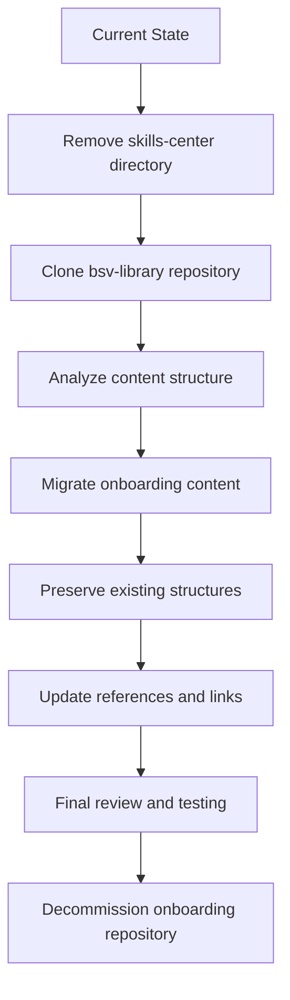

# Migration Plan: Onboarding Repository to BSV Library

## Overview

This plan outlines the process of migrating content from the current onboarding repository to the new bsv-library repository. The bsv-library repository is a renamed version of the skills-center in the new organization with better permissions. The goal is to make the bsv-library the authoritative source for all educational and documentation content.

## Current State

- **Onboarding Repository**: Contains educational content, documentation, and resources for BSV
- **Skills Center**: A directory within the onboarding repository that contains comprehensive documentation
- **BSV Library**: A new repository (https://github.com/bsv-blockchain/bsv-library.git) that is a renamed version of the skills-center in the new organization

## Migration Goals

1. Remove the existing skills-center directory (as its content is already in the bsv-library)
2. Clone the new bsv-library repository to the project root
3. Migrate all relevant content from the onboarding repository to the bsv-library repository
4. Ensure the bsv-library becomes the authoritative source for all content

## Migration Process



### Step 1: Remove the skills-center directory

Since the skills-center content is already in the bsv-library, we'll remove this directory from the onboarding repository.

### Step 2: Clone the bsv-library repository

Clone the new bsv-library repository to the project root:
```bash
git clone https://github.com/bsv-blockchain/bsv-library.git
```

### Step 3: Analyze content structure

Before migrating content, analyze both repositories to:
- Identify unique content in the onboarding repository
- Determine content overlap
- Plan how to integrate onboarding content while preserving both structures

### Step 4: Migrate onboarding content

Copy all relevant content from the onboarding repository to the bsv-library repository:

- **Documentation**: Move all documentation files (markdown, etc.)
- **Educational materials**: Move all educational content
- **Resources**: Move all resource files
- **Configuration files**: Move necessary configuration files

### Step 5: Preserve existing structures

Maintain the architectural integrity of both repositories:

- **Preserve onboarding structure**: Keep the overall architecture and pathways from the onboarding repository
- **Preserve bsv-library structure**: Maintain the existing structure of the bsv-library
- **Focus on integration**: Particularly integrate onboarding content for "getting started" sections

The combined structure should leverage the strengths of both repositories:

- Onboarding's clear learning pathways and user journeys
- BSV Library's comprehensive documentation and resources

### Step 6: Integrate SUMMARY.md files

Pay special attention to integrating the SUMMARY.md files from both repositories:

- The SUMMARY.md file serves as a complex index for the entire documentation
- Carefully merge the content from onboarding's SUMMARY.md into bsv-library's SUMMARY.md
- Ensure all sections are properly categorized and organized
- Maintain a logical flow of topics
- Verify that all links in the merged SUMMARY.md point to the correct locations

### Step 7: Update references and links

Update all internal references and links to ensure they point to the correct locations in the new structure:

- Update relative links in markdown files
- Update references to files and directories
- Update navigation structures (e.g., table of contents)

### Step 8: Final review and testing

Perform a comprehensive review of the migrated content:

- Verify all content has been migrated correctly
- Test all links and references
- Ensure the structure is logical and user-friendly
- Check for any missing content
- Specifically test the integrated SUMMARY.md to ensure it provides proper navigation

### Step 9: Decommission onboarding repository

Once the migration is complete and verified, the onboarding repository can be decommissioned.

## Potential Challenges and Mitigations

| Challenge | Mitigation |
|-----------|------------|
| Content duplication | Identify and remove duplicate content during migration |
| Broken links | Systematically update all internal links and references |
| Structure inconsistencies | Create a consistent structure that preserves the best of both repositories |
| Missing content | Perform thorough verification to ensure all content is migrated |
| Version control history | Consider using git commands to preserve history if needed |

## Timeline

| Phase | Estimated Duration |
|-------|-------------------|
| Preparation and analysis | 1-2 days |
| Content migration | 2-3 days |
| Integration and organization | 2-3 days |
| SUMMARY.md integration | 1 day |
| Link and reference updates | 1-2 days |
| Review and testing | 1-2 days |
| **Total** | **8-13 days** |

## Post-Migration Tasks

1. Update any external references to the onboarding repository
2. Communicate the migration to all stakeholders
3. Set up redirects if necessary
4. Update documentation to reflect the new structure
5. Establish processes for maintaining and updating the bsv-library