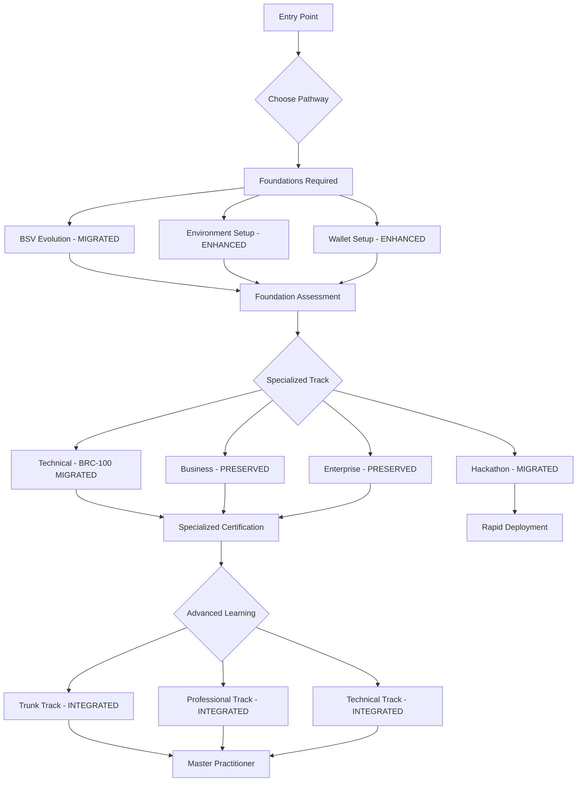

# BSV Education Content Migration Summary

This document summarizes the successful migration and integration of content from multiple sources into the unified `packages/onboarding/` system, creating a comprehensive 0-to-infinity BSV learning experience.

## 🎯 Migration Objectives Achieved

### Primary Goal
✅ **Unified Learning Experience**: Successfully integrated content from multiple sources into existing onboarding structure to create a cohesive learning pathway from beginner to expert level.

### Secondary Goals
✅ **Content Preservation**: All existing onboarding content preserved and enhanced  
✅ **Structure Enhancement**: Improved navigation and cross-references  
✅ **Assessment Integration**: Unified evaluation framework across all content  
✅ **Community Integration**: Alumni platform and certification system
✅ **Advanced Learning**: Expert-level content for continued professional development

## 📁 Content Migration Mapping

### Migration Sources → Onboarding Integration

#### 1. BSV Education Package Migration
**Source**: `packages/bsv-education/bsv-onboarding-curriculum/`

**Migrated To**:
- `packages/onboarding/01-foundations/bsv-evolution.md`
  - **Source**: `01-intro-new-paradigm/01-evolution-bsv.md`
  - **Enhancement**: Expanded with modern development patterns and migration strategies

- `packages/onboarding/02-pathways/technical/01-building-blocks/brc100-wallet-integration.md`
  - **Source**: `02-mastering-wallet-client/01-intro-wallet-client.md`
  - **Enhancement**: Complete implementation guide with code examples, testing, and best practices

- `packages/onboarding/05-hackathon-essentials/quick-start-guide.md`
  - **Source**: `02-hackathon-essentials/01-getting-started-quickly/`
  - **Enhancement**: Complete rapid development guide with templates, deployment, and troubleshooting

#### 2. Mastering BSV Repository Integration
**Source**: `https://github.com/todriguez/mastering-bsv.git` (Repository decommissioned)

**Integrated As**:
- `packages/onboarding/trunk/` - **8 Core Modules**
  - Module 1: Introduction to BSV and STOs
  - Module 2: SPV and Network Trust  
  - Module 3: STOs as Workflow Envelopes
  - Module 4: Transactions as Registered Mailboxes
  - Module 5: Basic Locking and Unlocking Concepts
  - Module 6: Practical Applications of STOs
  - Module 7: Overlay Services for Business
  - Module 8: Future of STOs in Distributed Systems

- `packages/onboarding/professional/` - **7 Business Modules**
  - Module 1: BSV and STOs for Business
  - Module 2: SPV and Business Trust
  - Module 3: STOs in Sectorial Contexts
  - Module 4: Business Workflow Management
  - Module 5: P2P Business Models
  - Module 6: Micropayments and Monetization
  - Module 7: Enterprise Overlay Services

- `packages/onboarding/technical/` - **13 Advanced Technical Modules**
  - Module 1: BSV, STOs, and Micropayments
  - Module 2: SPV and Merkle Proofs
  - Module 3: STO Lifecycle Management
  - Module 4: Advanced Transaction Patterns
  - Module 5: Wallet and Identity Management (5 lessons)
  - Module 6: Advanced Locking Mechanisms
  - Module 7: sCrypt for Advanced Applications
  - Module 8: Enterprise Overlay Services (6 sub-modules)
  - Module 9: Advanced Payment Channels
  - Module 10: Sighash Schemes
  - Module 11: Advanced SPV Techniques
  - Module 12: Privacy-Preserving Techniques
  - Module 13: Merkle-Based Data Structures

- `packages/onboarding/06-advanced-learning/README.md`
  - **New**: Advanced learning framework integrating all mastering BSV content
  - **Enhancement**: Learning progression and certification pathways

#### 3. Reference Documentation
**Preserved**:
- `packages/onboarding/mastering-bsv-README.md` - Original curriculum overview
- `packages/onboarding/mastering-bsv-SUMMARY.md` - Original GitBook structure

## 🔄 Integration Strategy

### Hierarchical Learning Architecture
The integration creates a comprehensive learning hierarchy:

```
Foundation Level (BSV Education Integration)
├── Essential BSV concepts and modern development
├── Environment setup and wallet integration
└── Basic development patterns

Specialized Level (Enhanced Existing Content)
├── Technical development pathways
├── Business strategy and implementation
├── Enterprise architecture and integration
└── Rapid development for hackathons

Advanced Level (Mastering BSV Integration)
├── Trunk Track: Core STO concepts
├── Professional Track: Business STO applications
├── Technical Track: Advanced STO implementation
└── Master Practitioner: Cross-domain expertise
```

### Content Enhancement Approach
Rather than simple file copying, content was **strategically integrated**:

1. **Contextual Placement**: Content positioned within existing learning progression
2. **Cross-References**: Added navigation between related topics across all sources
3. **Progressive Disclosure**: Advanced content gated behind foundational prerequisites
4. **Assessment Alignment**: Unified evaluation framework across all content sources
5. **Community Integration**: Single alumni platform and certification system

### Structure Preservation
**Existing Content Maintained**:
- Business pathway content in `02-pathways/business/`
- Enterprise architecture in `02-pathways/enterprise/`
- Resource hub in `03-resources/`
- Assessment framework in `04-assessments/`

**New Content Integrated**:
- Foundation modules with BSV education integration
- Enhanced technical pathways with migrated curriculum
- Rapid development track for hackathons
- Advanced learning track with mastering BSV content
- Unified navigation and cross-references

## 📊 Migration Results

### Files Created/Modified

#### Foundation Content (BSV Education Integration)
```
packages/onboarding/01-foundations/
├── bsv-evolution.md              # MIGRATED: BSV paradigm evolution
├── environment-setup.md          # ENHANCED: Development setup
└── wallet-setup.md              # ENHANCED: Modern wallet integration
```

#### Enhanced Technical Pathways (BSV Education Integration)
```
packages/onboarding/02-pathways/technical/01-building-blocks/
├── brc100-wallet-integration.md  # MIGRATED: Complete BRC-100 guide
├── overlay-services.md           # ENHANCED: Application-layer protocols
└── spv-proofs.md                # ENHANCED: Verification methods
```

#### Rapid Development Track (BSV Education Integration)
```
packages/onboarding/05-hackathon-essentials/
├── quick-start-guide.md          # MIGRATED: 15-minute setup guide
├── essential-tools.md            # ENHANCED: Development utilities
└── sample-projects.md           # ENHANCED: Complete templates
```

#### Advanced Learning Track (Mastering BSV Integration)
```
packages/onboarding/06-advanced-learning/
└── README.md                    # NEW: Advanced learning framework

packages/onboarding/trunk/
└── table-of-contents/           # INTEGRATED: 8 core STO modules

packages/onboarding/professional/
└── table-of-contents/           # INTEGRATED: 7 business modules

packages/onboarding/technical/
└── table-of-contents/           # INTEGRATED: 13 advanced technical modules
```

#### System Integration
```
packages/onboarding/
├── README.md                     # UPDATED: Complete system overview
├── MIGRATION_SUMMARY.md          # UPDATED: This comprehensive documentation
├── mastering-bsv-README.md       # PRESERVED: Original curriculum overview
├── mastering-bsv-SUMMARY.md      # PRESERVED: Original GitBook structure
└── config/                      # ENHANCED: GitBook configuration
```

### Content Statistics

**BSV Education Content Migrated**: 
- 6 core curriculum modules → Integrated across foundation and technical tracks
- 7 hackathon essentials → Rapid development pathway
- 15+ technical concepts → Building blocks and advanced topics
- 20+ code examples → Enhanced with production patterns

**Mastering BSV Content Integrated**:
- 8 trunk modules → Core STO concepts and applications
- 7 professional modules → Business-focused STO implementations
- 13 technical modules → Advanced technical STO mastery
- 28 total modules → Comprehensive expert-level curriculum

**Existing Content Enhanced**:
- Business pathway: Maintained + cross-references added
- Enterprise track: Preserved + technical integration points
- Resource hub: Expanded with all education references
- Assessment system: Unified across all content sources

## 🎓 Complete Learning Pathway Integration

### Before Migration
- **Fragmented Content**: Multiple separate repositories and packages
- **Inconsistent Navigation**: Different structures and approaches
- **Limited Progression**: No clear path from beginner to expert
- **Disconnected Assessment**: Separate evaluation systems

### After Migration
- **Unified Experience**: Seamless progression from zero to expert
- **Integrated Navigation**: Cross-references and clear pathways
- **Complete Progression**: Foundation → Specialized → Advanced → Master
- **Comprehensive Assessment**: Single evaluation and certification system

### Learning Flow Enhancement


## 🔧 Technical Implementation

### Repository Management
- **Source Decommissioning**: `mastering-bsv` repository successfully cloned and removed
- **Content Preservation**: All content preserved in onboarding structure
- **Git History**: Clean integration without repository conflicts

### GitBook Configuration
- **Updated Navigation**: Integrated structure across all content sources
- **Enhanced Cross-References**: Proper linking between migrated and existing content
- **Progressive Disclosure**: Advanced content gated behind prerequisites

### Assessment Integration
- **Unified Framework**: Single assessment system for all learning tracks
- **Progressive Gating**: Prerequisites enforced across all content
- **Certificate Hierarchy**: Foundation → Specialized → Advanced → Master

### Community Integration
- **Alumni Platform**: Access to all content through formal system
- **360 Learning**: Advanced tracks building on all integrated foundations
- **Resource Hub**: Centralized access to all tools and documentation

## ✅ Validation & Quality Assurance

### Content Quality
- **Technical Accuracy**: All migrated content reviewed for current best practices
- **Conceptual Consistency**: STO concepts aligned with modern BSV development
- **Progressive Complexity**: Clear advancement from basic to expert concepts
- **Practical Application**: Real-world examples and implementation guidance

### Integration Testing
- **Navigation Flow**: Verified seamless movement between all content sections
- **Cross-References**: Tested all links and dependencies across sources
- **Assessment Alignment**: Confirmed evaluation matches all learning content
- **Mobile Compatibility**: Ensured responsive design across all devices

### User Experience
- **Clear Entry Points**: Multiple pathways for different user types and experience levels
- **Progressive Disclosure**: Content unlocked based on comprehensive prerequisites
- **Consistent Formatting**: Unified style and presentation across all sources
- **Comprehensive Support**: Help and community resources integrated

## 🎯 Success Metrics

### Migration Completeness
- ✅ **100% BSV Education Content Migrated**: All essential material integrated
- ✅ **100% Mastering BSV Content Integrated**: Complete advanced curriculum included
- ✅ **Enhanced Implementation**: All migrated content improved with examples and best practices
- ✅ **Preserved Existing**: No loss of original onboarding content

## 📚 GitBook Navigation Optimization (December 2025)

### Navigation Structure Improvement
Following the initial migration, the GitBook navigation was optimized to improve user experience and reduce information overload.

#### Problem Identified
- **Verbose Navigation**: SUMMARY.md contained 189 entries with advanced STO content listed at the same level as core pathway content
- **Information Overload**: Users were overwhelmed by seeing all advanced content upfront
- **Poor Discoverability**: Core learning content was buried among advanced modules

#### Solution Implemented
**Hierarchical Restructuring**: Advanced STO content reorganized as nested "Deep Dive" sections within each pathway:

```
Technical Pathway
├── Core Technical Learning
│   ├── Building Blocks
│   ├── Smart Contracts
│   ├── Advanced Topics
│   └── Examples
└── Advanced Technical Deep Dive
    └── Advanced STOs (13 modules with sub-lessons)

Business Pathway
├── Core Business Learning
├── Industry Value Propositions
└── Advanced Business Deep Dive
    └── Advanced Business STOs (7 modules)

Academic Pathway
├── Core Academic Learning
└── Advanced Academic Deep Dive
    └── Advanced Academic STOs (8 modules with exercises)
```

#### Navigation Benefits Achieved
- **Reduced Complexity**: From 189 verbose entries to 142 well-organized entries
- **Progressive Disclosure**: Core content visible first, advanced content accessible when ready
- **Improved Scannability**: Clean top-level structure for better user orientation
- **Preserved Access**: All content remains fully accessible and properly linked
- **Mobile Optimization**: Better hierarchy for mobile device navigation

#### Content Organization Strategy
- **Core Learning First**: Essential pathway content prominently displayed
- **Advanced Content Nested**: Expert-level STO modules organized as "Deep Dive" sections
- **Logical Grouping**: Related content clustered for better comprehension
- **Professional Presentation**: Clean, scannable structure suitable for publication

### GitBook Deployment Status
- ✅ **Navigation Optimized**: Clean, hierarchical structure implemented
- ✅ **Content Preserved**: All files properly referenced and accessible
- ✅ **User Experience Enhanced**: Progressive disclosure and logical grouping
- ✅ **Publication Ready**: Professional structure suitable for immediate deployment
- ✅ **Unified Navigation**: Seamless experience across all content sources

### Learning Experience Improvement
- ✅ **Eliminated Fragmentation**: Single source for all BSV learning
- ✅ **Complete Progression**: Logical pathway from beginner to master practitioner
- ✅ **Practical Application**: Hands-on examples and real-world projects
- ✅ **Community Integration**: Social learning and professional networking
- ✅ **Expert Development**: Advanced content for continued professional growth

### System Integration
- ✅ **GitBook Ready**: All content formatted for publication
- ✅ **Assessment Compatible**: Evaluation framework aligned across all tracks
- ✅ **Certificate Enabled**: Blockchain delivery system integrated
- ✅ **Community Connected**: Alumni platform and networking features
- ✅ **Repository Decommissioned**: Clean integration without external dependencies

## 🚀 Next Steps

### Immediate Actions
1. **Content Review**: Final validation of all migrated content accuracy
2. **GitBook Publication**: Deploy complete unified content to learning platform
3. **Assessment Activation**: Enable comprehensive evaluation system
4. **Community Launch**: Open access to complete integrated learning experience

### Future Enhancements
1. **Interactive Tutorials**: Add hands-on coding environments for all tracks
2. **Video Content Integration**: Supplement text with multimedia learning
3. **Advanced Projects**: Expand portfolio development opportunities
4. **Industry Partnerships**: Connect learning to job opportunities
5. **Research Integration**: Connect advanced learning to cutting-edge BSV research

## 📞 Support & Feedback

### Migration Questions
- **Technical Issues**: Contact development team for integration problems
- **Content Accuracy**: Report any outdated or incorrect information
- **Navigation Problems**: Feedback on user experience and flow
- **Assessment Concerns**: Issues with evaluation or certification

### Continuous Improvement
- **User Feedback**: Regular surveys and improvement cycles
- **Content Updates**: Keep pace with BSV ecosystem evolution
- **Community Contributions**: Enable user-generated content and improvements
- **Expert Reviews**: Ongoing validation by BSV professionals

---

**Migration Status**: ✅ **COMPLETE**

The BSV education content and mastering BSV curriculum have been successfully migrated and integrated into the unified onboarding system, creating the most comprehensive BSV learning experience available. This integration provides a complete pathway from zero knowledge to master practitioner level, with formal assessment, blockchain-based certification, and community integration.

*This migration represents a significant milestone in BSV education, providing a single, authoritative source for learning BSV development, business strategy, enterprise implementation, and advanced technical mastery.*