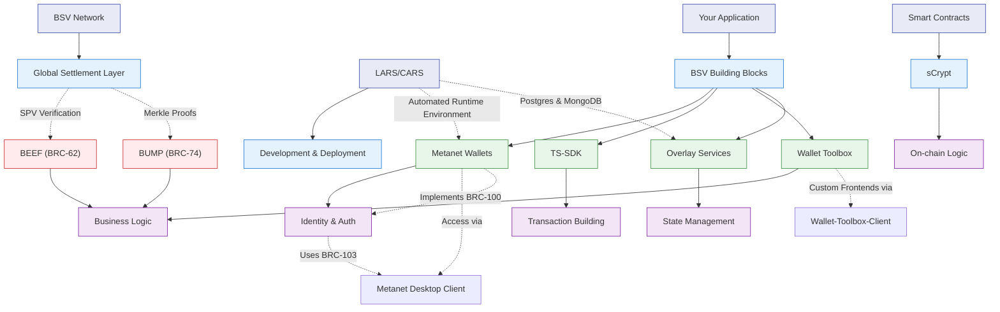

# What is BSV Blockchain?

BSV (Bitcoin Satoshi Vision) is the original Bitcoin protocol, restored to follow the design envisioned in Satoshi Nakamoto's 2008 white paper. It offers unbounded scalability, low and predictable transaction fees, native smart contract functionality, and a commitment to regulatory compliance and enterprise-grade stability.

## Quickstart Guide

https://app.gitbook.com/o/XRhTy6ZTa7k6aGkXcfRv/s/tNK6jixPUQ9s9VayCXYa/technical-pathway/technical

## Key Technical Features

| Feature | Description |
|---------|-------------|
| Protocol Stability | Set-in-stone protocol ensures long-term application viability |
| Unbounded Scalability | Scales to millions of transactions per second (TPS) through massive blocks |
| Low Transaction Fees | Fees measured in fractions of a cent, even at scale |
| Native Smart Contracts | Use Bitcoin Script, sCrypt's embedded DSL within TypeScript, or token protocols like 1Sat Ordinals |
| Real-Time Data Processing | Ideal for IoT, gaming, financial services, and supply chain data |
| Native Tokenisation | Supports NFT and fungible token standards without layer-2 complexity |

## 🚀 Why Build on BSV?

BSV provides a unique development environment that combines:

### ⚡ Unmatched Performance

- 1M+ transactions per second proven capability
- Sub-cent fees (< $0.0001) enable micropayments and high-frequency operations
- Instant settlement for real-time applications
- Predictable costs with no gas auctions or fee volatility

### 🛠️ Developer-Friendly Toolchain

- TypeScript-first development with comprehensive SDK
- Familiar web technologies - build like traditional web apps
- Efficient transaction validation with BEEF (Background Evaluation Extended Format)
- Standardized Merkle proofs with BUMP (BSV Unified Merkle Path)

### 🔐 Identity-Native Architecture

- BRC-100 wallet interface for consistent identity management
- BRC-103 peer-to-peer mutual authentication
- Selective data disclosure for privacy-preserving applications
- Verifiable credentials for trust without centralized authorities
- Cross-app identity with standardized protocols

## 🏗️ Technical Architecture Overview

The BSV ecosystem follows the Mandala Network architecture with three primary layers:

1. **Transaction Processors** (Core): Create blocks, witness transactions, distribute Merkle proofs
2. **Overlay Services** (Middle): Enable specialized tracking and management of tokens and data
3. **Transacting Parties** (Edge): End users with specialized applications that create transactions through wallets

## Tooling and SDKs

| Tool/Library | Use Case |
|-------------|----------|
| bitcoin-sv/ts-sdk | JavaScript/TypeScript SDK for transactions |
| brc103-authentication | Peer-to-peer mutual authentication protocol |
| payment-express-middleware | Real-time payments via HTTP (BRC-41/105) |
| wallet-infrastructure | Express-based server with JSON-RPC endpoint for UTXO management |
| overlay-services | Manage discovery, identity, registry overlays (BRC-22/24/88) |
| metanet-desktop | BRC-100 compliant wallet implementation with JSON-API over TCP/3321 |
| wallet-toolbox | Build, sign, and broadcast wallet transactions |
| beef-transaction-format | Efficient transaction validation with BEEF (BRC-62) |
| bump-merkle-format | Standardized Merkle proofs with BUMP (BRC-74) |
| atomic-beef | Single-transaction focused BEEF variant (BRC-95) |

## Use Cases Across Key Industries

### 1. Gaming and Esports
- Micropayment leaderboards that reward gameplay instantly
- NFT pet games with real digital asset ownership
- AI coding competitions using BSV's computational primitives

### 2. Supply Chain and Authentication
- Luxury goods authentication with blockchain-secured NFC tags
- Construction compliance logs and sensor data validation
- Supply chain communications verification

### 3. Publishing and Media
- Direct publishing platforms that connect authors to readers and track manuscripts on-chain
- Blockchain-powered music platforms that enable artists to monetize their work and engage fans directly through NFT collectibles, free streaming, and micropayment rewards

### 4. Financial Inclusion and Remittances
- Affordable cross-border remittances using BSV tokens
- Blockchain-based financial infrastructure for SMEs

### 5. Sustainability and ESG
- Real-time environmental data monitoring with verifiable logs
- On-chain agricultural monitoring and predictive analytics

## Developer Ecosystem and Support

- **SPV Support**: Efficient, scalable wallet and application design via BEEF, BUMP, and Atomic BEEF
- **Overlay Networks**: Modular services for discovery, identity, and interaction (BRC-22/24/88)
- **Identity Framework**: BRC-100 wallet interface and BRC-103 authentication
- **Compliant Frameworks**: GDPR, MiCA, and IP audit readiness

### Community & Learning Resources:
- Quickstart guide
- Extensive GitHub libraries under bitcoin-sv
- Short courses via 360Learning platform
- Regional Hackathons

## Final Thoughts

BSV is not just a blockchain — it's a data protocol, financial layer, and scalable application infrastructure in one. With its native support for micropayments, data integrity, and efficient computation, BSV is uniquely positioned for developers building the next generation of Web3 and enterprise tools.

The Mandala Network architecture, combined with efficient transaction formats like BEEF and BUMP, enables unprecedented scalability while maintaining security and reliability. The BRC-100 wallet interface and BRC-103 authentication protocol provide a robust identity framework that eliminates password fatigue and enables secure, cross-application authentication.

Join a growing ecosystem of creators, enterprises, and governments choosing performance over hype. Build real-world applications. Build on BSV.