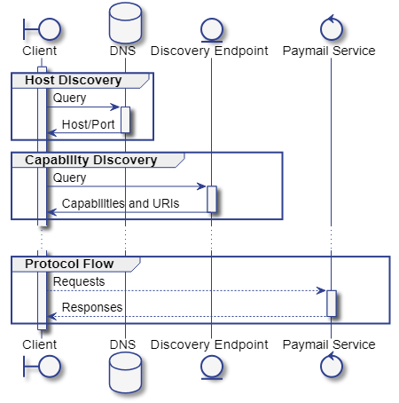

# Service Discovery

| brfc         | title                      | authors                                       | version |
| ------------ | -------------------------- | --------------------------------------------- | ------- |
| b2aa66e26b43 | bsvalias Service Discovery | andy (nChain), Ryan X. Charles (Money Button) | 1       |

Service discovery is separated into two phases:

* [Host Discovery](host-discovery.md) is a DNS based lookup of the responsible host for a given paymail alias
* [Capability Discovery](capability-discovery.md) resolves the paymail service endpoint URIs from the responsible DNS host and describes the capabilities supported by a given paymail service instance

### Service Discovery Process

<figure><figcaption></figcaption></figure>
