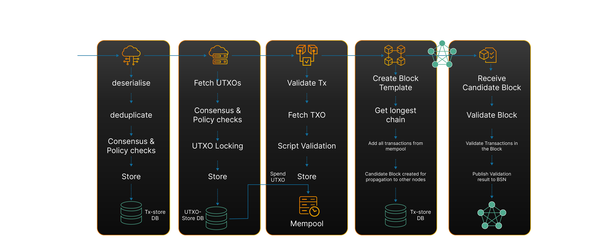
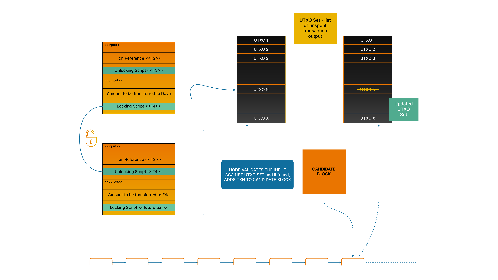

# Transaction Processing

Transactions are grouped in blocks and processed together. Therefore, to understand how transactions are processed, we also need to understand how blocks are created.

As described earlier, every node in the network competes with other nodes to be first to solve the PoW solution, which means that every node has prepared a candidate block to use its header values for the PoW solution. This also means that when a node proposes a candidate block, they send that proposed block to every other node in the network so that they can start building on it and effectively making the proposed block a consensus-approved history in the blockchain.

This process is described in the diagram below. Node A proposes a block. This is done using the Bitcoin server network (BSN) where the node first sends a message informing all the other nodes that a solution to POW has been found and, if they have not found a solution themselves, to take Node A's block. If the validation is successful, nodes can start to build on this block.

<figure><figcaption></figcaption></figure>

The nodes receiving the message from node A will send a response back intimating that they have not yet found a solution and are willing to receive the full block message from node A. Node A then propagates the full block to these nodes.

When these nodes receive the block from node A, they validate the block (perform a block validation process), and if they find the block to be valid, they signal their acceptance by restarting their POW process to find the block next to the block received from node A.

1. Node A proposes a block by sending a message on the Bitcoin server network (BSN) informing all of the other nodes that they have found a solution to PoW, and requesting them to take their block.
2. The nodes receiving the message from node A send a response back informing that they have not yet found a solution and are willing to receive the full block message from node A.
3. Node A then propagates the full block to these nodes.
4. When these nodes receive the block from node A, they validate the block (perform a block validation process).
5. If they find the block to be valid, they signal their acceptance by restarting their PoW process to find the block next to the block received from node A.

The block validation process will also have a step where all of the transactions present in the block are validated. These transactions then become part of the block proposed by Node A and will become common history, timestamped with the time node A built the block.

The following diagram shows the complete end-to-end flow for this process and simulates a client-server model. In this, the users who create transactions are the clients, and the node network acts as a server receiving transactions from their clients.

<figure><figcaption></figcaption></figure>

These server nodes then compete and cooperate with each other to come to a consensus on a common history of accepting a candidate block.

This process is repeated on average every 10 minutes. This interval is configuration-controlled and maintained by the difficulty adjustment algorithm. This number of 10 mins is something that is a guess in terms of it being the optimal interval, but the guess is based on mathematical calculations.

The validation of a transaction can be seen as a set of steps that happen when a node receives a new transaction.

<figure><figcaption>
Validation of a Transaction Flow
</figcaption></figure>

## Transaction Storage

When transactions are received by a node, they are first parsed and then checked to ensure the input/output script size are within limits and the tx size is acceptable. A check is also made to see whether the transaction has not already been seen by the node. Once all these steps are complete, the transaction is stored in a key-value database.

## UTXO Storage

Every transaction on the blockchain changes the state of the blockchain due to the UTXO set that each node stores. These UTXOs are first stripped from the stored transaction, and then various checks are made. If everything is ok, these UTXOs are locked to be spent and stored in another database (key-value) with a status of ‘locked’. This means that the change of state caused by the block this node will propose will consider the change made by this transaction as an update to the UTXO state of the blockchain.

## Transaction Validation

Validating a transaction requires a series of steps to validate various consensus and policy checks, execute the scripts present in the inputs and outputs and, based on the result of execution, store the final state of UTXO.

The validated transactions are then stored in a cache database, which is called mempool.

## Block Assembly

When a block is to be proposed by a node, they will collect all the transactions present in the mempool and create a candidate block. The various steps in this process are as follows:

* Preparation of a block template with current network parameters
* Identification of the longest chain on which the candidate block needs to be built
* Collecting all of the transactions from the mempool
* Adding the Coinbase transaction
* Transactions Merkalised
* Creating candidate block header
* Passing the candidate block header to the mining pool component to perform the PoW

## Block Validation

Once the PoW solution is found, the node will propose the candidate block to all of the participating nodes in the network. If the the PoW solution remains undiscovered by the other nodes, they will accept the proposed block and validate it. As well as the validation of block parameters, the validation process will also include validating the transactions that are proposed in the block. If the validation of the block is successful, they will treat this block as the chain-tip (so called as it is the latest block in the blockchain) and start to build their own new candidate block on top of this tip. This effectively means that they have voted to choose this block as a valid block.

Once the majority of nodes which are building the next block on the chain-tip find the PoW solution built on this chain-tip, this will effectively finalise all of the transactions present in the block as valid history. This point marks the conclusion of the transaction processing lifecycle.

It's possible that a transaction can be marked as double spent. This happens when the same funds are being spent twice. This should be caught during the transaction validation done by the node and is decided based on the first-seen rule. See the [First Seen Rule ](../../bsv-skills-center/bsv-protocol-documentation/network-policies/consensus-rules.md#first-seen-rule)for further details.

<figure><figcaption></figcaption></figure>

As shown in the diagram, the UTXO N-1 is spent in Input, transferring funds to a new owner, in this case, Dave, as shown in Tx3. Dave creates Tx4 to spend the funds he received in Tx3 shown as UTXO N . When Dave submits Tx4 to a node, and the node accepts it, the UTXO N is marked as spent in the UTXO database of every node. So, if Dave tries to spend the same funds (UTXO N) again to Charlie in Tx5, it will fail validation as the UTXO is already marked spent due to Tx4. This is known as First Seen Rule in the network and it means that once a UTXO is spent, any other transaction received by the network spending the same funds again (i.e. double spend) is rejected.

## Block Confirmations and Merkle Proof

Once a block is accepted by the node network, all of the transactions in that block get their own Merkle proof. A Merkle proof is a set of values in the Merkle tree which, along with the transaction id, can provide for the independent calculation of the Merkle root present in the block header. Once a block is confirmed the node can provide the values known as Merkle proof (standardised format for Merkle proof along with block and transactions details) for a transaction.

This is the last piece in the transaction lifecycle. The diagram shows this process.

<figure><figcaption>
Block Confirmations and Merkle Proof
</figcaption></figure>

Each transaction has its own Merkle proof. This can be thought of as a Blockchain certificate for that transaction.

## **Transaction Finality**

Transaction finality is an important attribute which means that the funds are locked to the new owner, and the record is frozen. In financial terms, this is known as settlement. In an account-based system offered by financial institutions, all individual transactions are collated, and a final amount to be exchanged between two financial institutions is calculated. This process is called netting/clearing. The final settlement happens when this netting amount is exchanged between the two institutions.

The decentralised component of blockchain occurs when Alice and Bob exchange (P2P). Alice and Bob exchange a transaction between themselves, not via node as intermediary. Details including digital goods can be incorporated into the exchange. Invoices, digital asset files, and things can be directly exchanged between Alice and Bob. Bob then registers the exchange receipt and finalises it by sending it to the node (via transaction).

In the UTXO-based model, clearing and reconciliation (for example this is done by banks when they do payment transactions) is not required as every transaction is a full and final exchange between the two transacting entities and not the financial institutions. This is a vital aspect of why a UTXO-based payment system is more scalable than an account-based system. As soon as it is accepted by one or more nodes, the transaction is considered to be in a 0-conf (or zero-confirmation) state. In other words, it is still regarded as unconfirmed as it is not yet part of a confirmed block but is now seen by a node and is part of the mempool of that node.

As we have explained, transactions are not always used for exchanging value in the blockchain. Still, the primary use case is for transactions carrying information (data) which involves an extremely low value associated with the transaction, most times just enough to pay the fees for the transaction. These low-value transactions, when accepted by a node as part of 0-conf, are considered economically safe to be assumed Final. This is because the economic incentive to double-spend on such low-value transactions is largely negative. In fact, in most realistic scenarios, close to no possibility. We will discuss this more in the Security section, where various attack scenarios are explained and, with that, why as soon as a transaction is accepted by a node or 0-conf, it is considered final.


Once a transaction is processed by node and added to a block, it becomes a timestamped recording of information on the global immutable ledger

